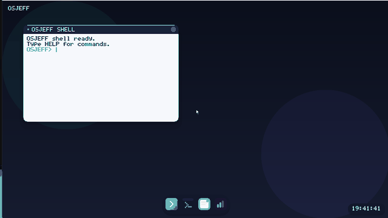
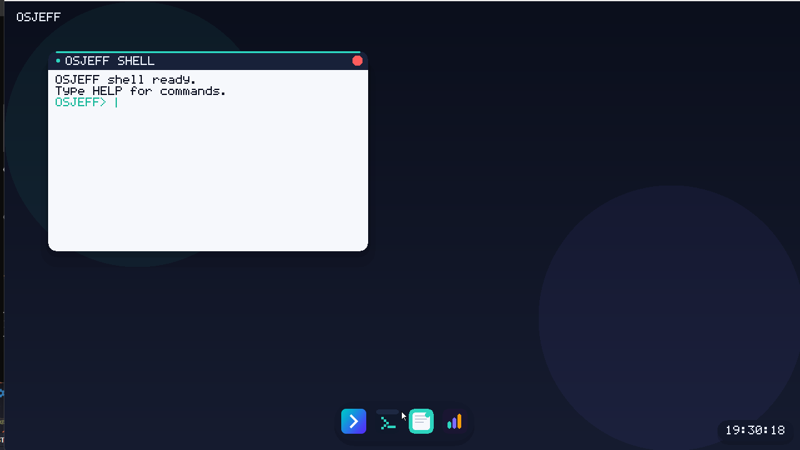
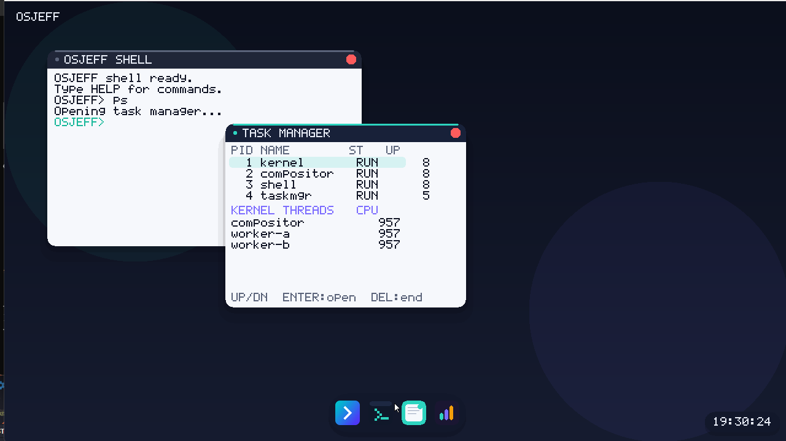
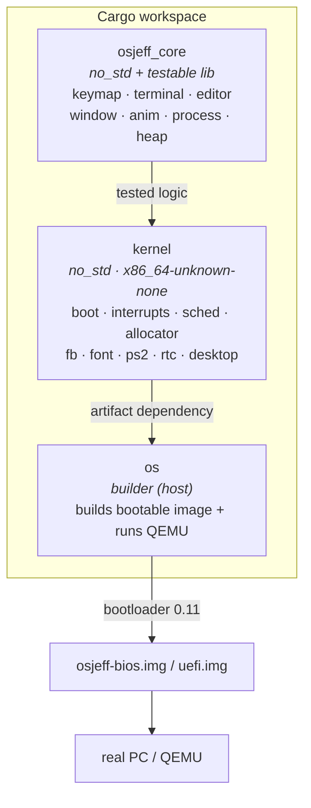
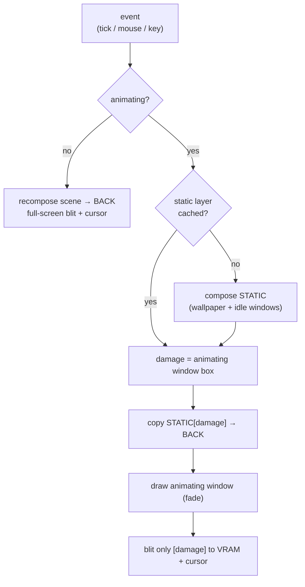
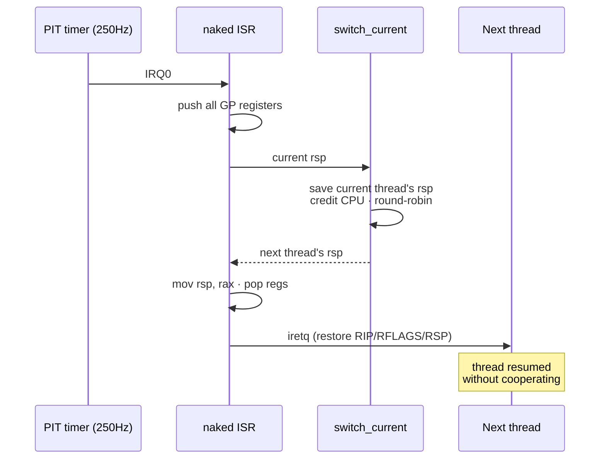

<div align="center">

# 🦀 OSJeff

### An x86_64 operating system written **from scratch in Rust** — bare metal, no Linux underneath.


[🇧🇷 Português](README.md) · **🇺🇸 English**



<sub>Boot → open the editor (animation) → type → close (animation) — all on a hand-built kernel.</sub>

</div>

> Portfolio project by **Jeferson Reis Almeida**.
> From boot to desktop, built by hand: a **preemptive scheduler**, a **heap
> allocator**, **hardware interrupts**, a **damage-tracking compositor** and
> three apps — all in Rust plus a little Assembly, with **no operating system
> underneath**. The generated image boots on real hardware (or QEMU).

---

## ✨ Why this is advanced

It isn't an app running on top of an OS — it *is* the OS. Every piece below was
built from scratch:

| Technique | Where | Why it's hard |
|---|---|---|
| **Preemptive scheduler** | [`kernel/src/sched.rs`](kernel/src/sched.rs) · [`interrupts.rs`](kernel/src/interrupts.rs) | Context switch **inside the timer ISR** (naked ASM + `iretq`); preempts any thread without it cooperating |
| **Heap allocator** | [`kernel/src/allocator.rs`](kernel/src/allocator.rs) | Linked free-list + spin lock as `#[global_allocator]` → enables `Vec`/`String`/`Box` |
| **Hardware interrupts** | [`kernel/src/interrupts.rs`](kernel/src/interrupts.rs) | IDT, exception handlers, remapped 8259 PIC, PIT timer, IRQ-driven input |
| **Damage-tracking compositor** | [`kernel/src/desktop.rs`](kernel/src/desktop.rs) | Caches the static layer and only repaints the damaged rectangle — O(window) cost |
| **Pure, testable logic** | [`osjeff_core/`](osjeff_core/) | Every decision (parser, editor, keymap, geometry, allocator) tested on the host: **99 tests, ~98% coverage** |

---

## 🖼️ Screenshots

| Desktop | Task manager (real threads) |
|:---:|:---:|
|  |  |

> In the task manager, **`compositor`, `worker-a` and `worker-b`** accrue CPU
> time identically: the workers are infinite loops with **no `yield`** — they run
> only because the timer preempts them. Visual proof of real preemption.

---

## 🧩 Architecture

Pure logic is kept separate from hardware so it can be **tested on the host** — a
`no_std`/`no_main` kernel can't run `cargo test`, so every decision lives in a
library that compiles against `std` under test and `no_std` in production.



### Boot flow


### Render pipeline (damage tracking)



### Preemptive scheduler



---

## 📦 Features

- **Bare-metal kernel** with its own visual identity (floating dock, mesh
  wallpaper, shadows, logo) and an **animated boot splash**
- **Hardware interrupts**: IDT + exceptions, 8259 PIC, PIT timer; fatal
  exceptions freeze visibly instead of triple-faulting (silent reboot)
- **IRQ-driven input**: keyboard (IRQ1) and mouse (IRQ12) via an SPSC ring buffer
- **Heap allocator** (`alloc`): `Vec`/`String`/`Box` in the kernel
- **Preemptive scheduler**: real threads with their own stacks, context switch in
  the timer ISR, per-thread CPU in the task manager
- **Window manager**: multiple windows, focus, z-order, dragging, right-click
  context menu, open/close animations with damage tracking
- **3 apps**: **Terminal** (history, commands), **Editor** (multi-line text, 2D
  cursor) and **Task Manager**
- **PS/2 mouse + keyboard** (Shift, Caps, arrows), RTC clock in local time
- **Double buffering** + cursor dirty-rect → flicker-free rendering
- Own 8×8 bitmap font; hand-drawn icons; logo embedded as RGBA

---

## 🚀 Running

### Windows (recommended — WHPX acceleration)

`run.ps1` does everything: builds release inside WSL, copies the image, runs QEMU.

```powershell
cd C:\...\OSjeff
.\run.ps1              # build release + boot (WHPX, fast)
.\run.ps1 -NoAccel    # build release + boot (TCG, software)
.\run.ps1 -SkipBuild  # just boot the existing image
```

### Linux / WSL

```bash
cd OSjeff
cargo run --package os            # BIOS
cargo run --package os -- uefi    # UEFI (needs OVMF)
```

### Flash to real hardware (USB stick)

> **Warning:** `dd` erases the target disk. Double-check the device first.

```bash
sudo dd if=osjeff-bios.img of=/dev/sdX bs=4M status=progress && sync
```

---

## 🧪 Quality

All logic lives in `osjeff_core` and is tested on the host:

```bash
cargo test-core                          # 99 tests
cargo llvm-cov -p osjeff_core --summary-only  # coverage (~98%)
cargo lint-kernel                        # bare-metal clippy, -D warnings
cargo lint-host                          # host clippy, -D warnings
```

| Module (core) | Coverage |
|---|---|
| keymap · window · anim · heap | 100% |
| terminal | 97% |
| editor | 96% |
| process | 99% |

> Plain `cargo clippy` fails **on purpose**: the `no_std` kernel can't build on
> the host (no unwinding). The aliases above scope the correct target.

---

## 🗺️ Roadmap

- [x] BIOS/UEFI boot + framebuffer
- [x] Compositor, window manager and animations
- [x] Terminal, editor and task manager
- [x] IDT + PIC + PIT + exception handlers
- [x] IRQ-driven input
- [x] Heap allocator (`alloc`)
- [x] **Preemptive** scheduler
- [x] Damage-tracking compositor
- [ ] Disk driver + filesystem (persistence)
- [ ] Copy/paste between apps
- [ ] Network stack

---

## 📖 Deep dive

See [`docs/ARCHITECTURE.md`](docs/ARCHITECTURE.md) (Portuguese) for a subsystem-by-subsystem
technical breakdown with diagrams.

## 👤 Author

**Jeferson Reis Almeida** — a portfolio project exploring low-level systems
programming, kernel development and bare-metal Rust.

## 📄 License

[MIT](LICENSE) © 2026 Jeferson Reis Almeida
