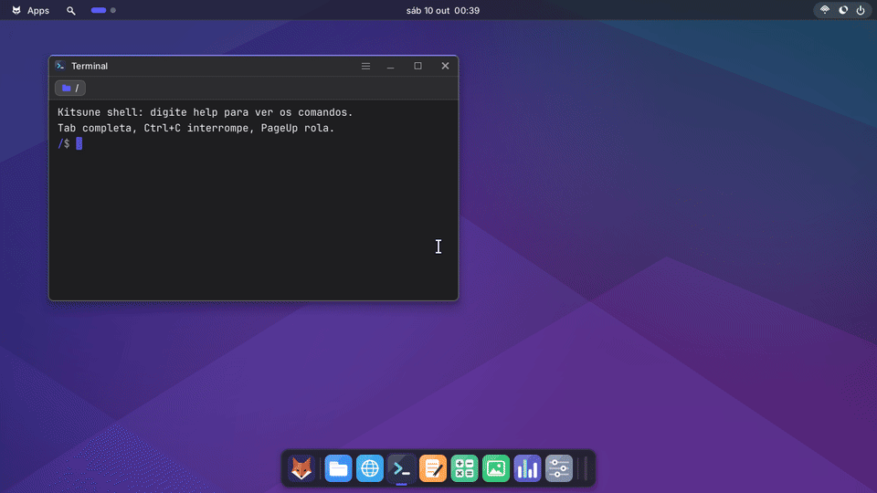
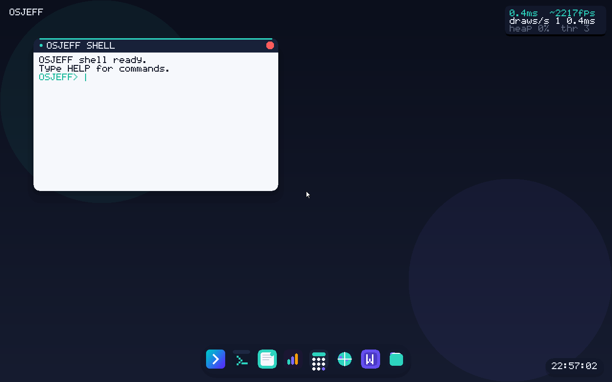
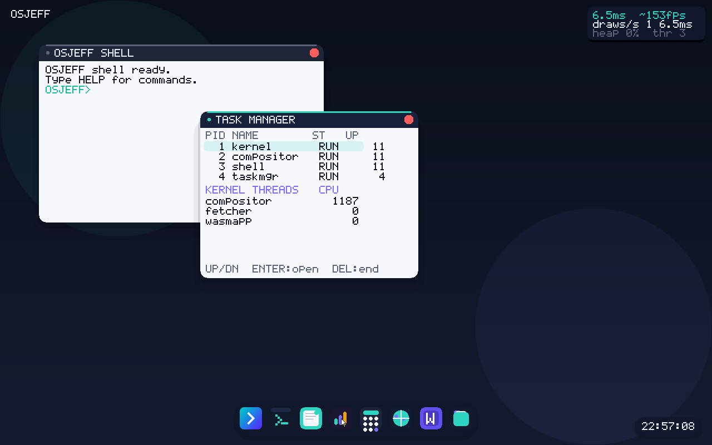
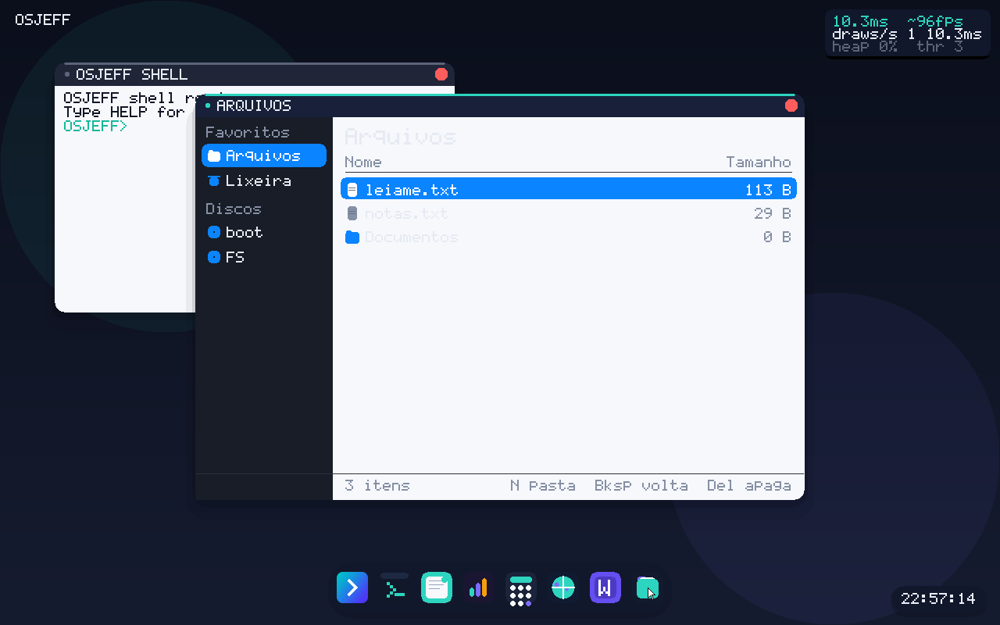
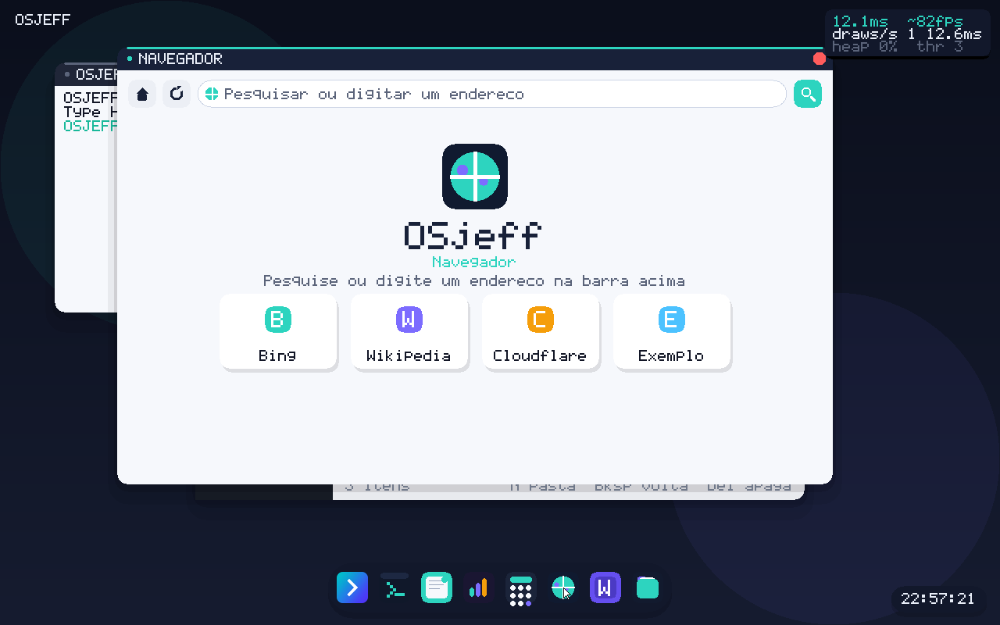
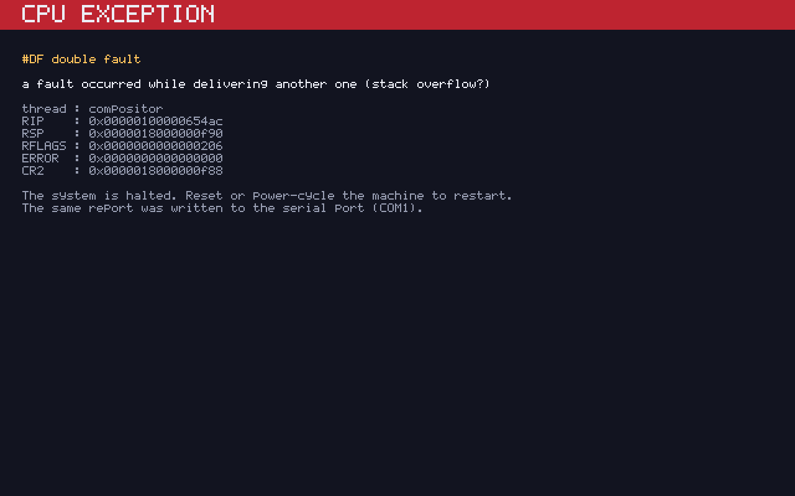
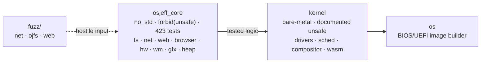

<div align="center">

# 🦀 OSJeff

### An x86_64 operating system written **from scratch in Rust**: bare metal, no Linux underneath.

*Um sistema operacional x86_64 escrito do zero em Rust: bare metal, sem Linux por baixo.*


[🇧🇷 Português](README.md) · **🇺🇸 English**



</div>

OSJeff is a `no_std` x86_64 kernel that boots straight from firmware (BIOS or UEFI)
and brings up a full desktop: a preemptive scheduler, its own heap, interrupts, a
compositor, a persistent filesystem, a TCP/IP stack with TLS, an HTML/CSS browser and
a WebAssembly runtime for applications. It is a **study project** that has been
treated like a product: every change comes with a test or a QEMU proof, the parsers
for everything that comes from outside are fuzzed, and the project went through a
[full security and performance audit](docs/audit/RELATORIO.md) whose findings are
fixed or documented. (Audit documents are in Portuguese.)

> **Honesty first.** Everything runs in ring 0 with no isolation; HTTPS **does not
> verify certificates**; nothing has been tested on real hardware. See
> the "Known limits" section below and the [security model](docs/SECURITY-MODEL.md).

---

## 🖼️ Screenshots

| Desktop | Task manager (real per-thread CPU) |
|:---:|:---:|
|  |  |
| **File manager (folders, trash, persistent)** | **Browser (HTTPS flagged "not verified")** |
|  |  |

When the kernel fails it **says what happened**, on screen and on serial (here, a
stack overflow handled on a dedicated IST stack, no triple fault):



---

## 🚀 Getting started

```bash
git clone https://github.com/Jeffinp/OSjeff && cd OSjeff
rustup show                  # installs the pinned nightly and targets
sudo apt install qemu-system-x86 ovmf    # or your distro's equivalent
tools/run.sh                 # build and open QEMU (BIOS)
tools/run.sh uefi            # same, UEFI
```

Windows with acceleration: `.\run.ps1`. Headless (CI): `tools/qemu-headless.sh bios /tmp/osj 25`.
USB stick and real hardware: [`docs/BOOT-USB.md`](docs/BOOT-USB.md). Full guide,
variants (DOOM) and troubleshooting: [`docs/BUILDING.md`](docs/BUILDING.md) (Portuguese).

---

## 📦 What is inside

| Layer | What was built | Where |
|---|---|---|
| **Boot and CPU** | BIOS/UEFI boot (`bootloader 0.11`), own GDT/TSS with an IST stack for #DF, full IDT, 8259 PIC, 250 Hz PIT, every CPU exception and spurious IRQ handled, error screen | `kernel/src/{gdt,interrupts,crash}.rs` |
| **Scheduler** | Timer-preemptive (context switch in the ISR, assembly), **ready/blocked** threads, yield via `int 0x81`, `hlt` without lost wakeups, **guard-page stacks**, **a failing thread dies alone**, real per-thread CPU | `sched.rs`, `switch.s` |
| **Memory** | `GlobalAlloc` heap (free list with coalescing, spin lock with IRQs off), alignment math tested on the host | `allocator.rs`, `osjeff_core/src/heap.rs` |
| **Graphics** | Damage-tracking compositor, double buffering, own 8×8 font, alpha shadows, animations; performance HUD | `fb.rs`, `desktop/` |
| **Apps** | Terminal, Editor, Task manager, Calculator, File manager, Browser, WebAssembly app | `desktop/`, `osjeff_core` |
| **Storage** | Own **OJFS** filesystem (48 files, folders, trash) over ATA PIO, persistent across boots | `osjeff_core/src/fs.rs`, `ata.rs` |
| **Network** | `virtio-net` and NE2000 (`Nic` trait), own ARP/IPv4/ICMP/DHCP (renews the lease, answers and sends `ping`), DNS with a cache and several servers, `smoltcp` for TCP, **TLS 1.3** (`embedded-tls`) | `nic.rs`, `virtio_net.rs`, `ne2000.rs`, `netd.rs`, `netstack.rs`, `osjeff_core/src/{net,lease,dns,icmp}.rs` |
| **Browser** | HTML parser, CSS (cascade), layout, redirects, resource limits, connection indicator | `osjeff_core/src/{web,browser,redirect}` |
| **WebAssembly** | `wasmi` as the native app format: own ABI + a WASI subset, per-call *fuel*, 24 MiB memory cap, real app termination. Runs Snake; **DOOM** via `wasi-sdk` | `kernel/src/wasm/`, `wasm-apps/` |
| **Devices** | PS/2 (keyboard, mouse), RTC, PCI, virtio-gpu (2D), ATA IDENTIFY | `ps2.rs`, `pci.rs`, `virtio*.rs` |

---

## 🧪 Why it can be trusted

A `no_std` binary can't run `cargo test`. The fix is structural: **every decision
that doesn't need hardware lives in `osjeff_core`** (`#![forbid(unsafe_code)]`), which
builds with `std` under test. The kernel only wires hardware to it.


```mermaid
flowchart LR
    CORE["osjeff_core<br/>no_std · forbid(unsafe) · 423 tests<br/>fs · net · web · browser · hw · wm · gfx · heap"]
    KERNEL["kernel<br/>bare-metal · documented unsafe<br/>drivers · sched · compositor · wasm"]
    OS["os<br/>BIOS/UEFI image builder"]
    FUZZ["fuzz/<br/>net · ojfs · web"]
    CORE -->|tested logic| KERNEL --> OS
    FUZZ -.->|hostile input| CORE
```

| Verification | Status |
|---|---|
| Unit tests | **423** in `osjeff_core`; 96% line coverage (raw, includes the test modules) |
| Fuzzing | 3 targets (network, disk, HTML/CSS/HTTP); **9 bugs found and fixed**, each with a minimal input and a test |
| `unsafe` | **100%** of kernel blocks carry `// SAFETY:`, enforced by `clippy::undocumented_unsafe_blocks` |
| QEMU boot | BIOS **and** UEFI on every kernel commit, desktop compared pixel by pixel to a baseline (`tools/verify-boot.sh`) |
| Lint and format | `cargo lint-kernel`, `cargo lint-host`, `cargo fmt --check`, all `-D warnings` |
| Supply chain | `cargo deny check` (advisories, licenses, bans, sources) and `cargo audit` |
| CI | `.github/workflows/ci.yml` (every command was run locally; the workflow has not run on GitHub yet) |

More in [`docs/TESTING.md`](docs/TESTING.md) (Portuguese).

### The audit in numbers (QEMU without KVM; ratios, not absolute values)

| | Before | After |
|---|---|---|
| `master` build | did not compile | compiles, pinned toolchain |
| Tests | 189 (old README: 152) | **423** |
| `unsafe` without justification | 100 | **0** |
| Fatal failure | silent `hlt` or reboot | **error screen + serial** |
| Stack overflow | triple fault; in a secondary thread, silent heap corruption | guard page: `#PF` reported, only that thread dies |
| Compositor at idle | 83 iterations/s | **250** |
| Key IRQ → pickup latency | ~11 ms | **~0.4 ms** |
| Clock tick | 15.6 ms | **0.2 ms** |
| Terminal keystroke frame | 26 ms | **13 ms** |
| Disk after a read error | formatted | **untouched** |
| Parsers vs hostile input | 3 trivial remote hangs | caps and fuzz |

Full report, with proof for each item and what was **not** worth doing:
[`docs/audit/RELATORIO.md`](docs/audit/RELATORIO.md).

---

## 🛡️ Security in two lines

Defence is at the input: everything from the network, disk, HTML/CSS or `.wasm` goes
through `unsafe`-free code with limits and fuzzing. What does **not** exist: isolation
between apps and kernel (single ring 0) and TLS certificate verification. Details, attack scenarios and how to report:
[`docs/SECURITY-MODEL.md`](docs/SECURITY-MODEL.md) · [`SECURITY.md`](SECURITY.md).

---

## ⚠️ Known limits

- **Single ring 0**: a bug anywhere is a bug in the whole kernel. The evolution path
  (WebAssembly as the boundary, ring 3 only with a trigger) is in the
  [isolation ADR](docs/audit/adr-isolamento.md).
- **HTTPS does not verify certificates.** The UI says so ("Conexao nao verificada").
- **Network is NE2000 only** (a rare ISA card, QEMU only): IP, gateway and DNS come from DHCP (tested on another subnet), but there is no common-NIC driver and the lease is not renewed.
- **No real-hardware testing.** BIOS gives 1280×720 at 24 bpp and UEFI needs at least
  192 MB of RAM (the kernel BSS is ~91 MiB).
- A failing secondary thread dies alone (the rest keeps running) but is **not restarted** and its resources are not freed; a fault in the compositor or inside an interrupt still halts everything.

Prioritised list of what comes next: [`docs/ROADMAP.md`](docs/ROADMAP.md).

---

## 📚 Documentation

Most documents are in Portuguese.

| | |
|---|---|
| [`docs/ARCHITECTURE.md`](docs/ARCHITECTURE.md) | Technical deep dive into each subsystem |
| [`docs/BUILDING.md`](docs/BUILDING.md) | Build, run, DOOM, common problems |
| [`docs/TESTING.md`](docs/TESTING.md) | Tests, coverage, fuzzing, QEMU, performance |
| [`docs/SECURITY-MODEL.md`](docs/SECURITY-MODEL.md) | Trust boundaries, what is and isn't protected |
| [`docs/ROADMAP.md`](docs/ROADMAP.md) | Next steps with acceptance criteria |
| [`docs/audit/`](docs/audit/README.md) | Full audit, isolation ADR |
| [`CONTRIBUTING.md`](CONTRIBUTING.md) · [`CHANGELOG.md`](CHANGELOG.md) · [`SECURITY.md`](SECURITY.md) | How to contribute, history, how to report |

---

## 📁 Layout

```
OSjeff/
├── osjeff_core/   # pure no_std logic, tested on the host (forbid(unsafe_code))
├── kernel/        # bare-metal x86_64-unknown-none: drivers, scheduler, compositor, wasm
├── os/            # builder: embeds the kernel and produces the BIOS/UEFI images
├── fuzz/          # cargo-fuzz: net_parse, ojfs_parse, web_parse + regressions
├── bench/         # microbenchmarks (criterion), outside the workspace
├── wasm-apps/     # WebAssembly apps (snake default; plasma; cdemo; doom)
├── tools/         # run.sh, qemu-headless.sh, verify-boot.sh, perf harness
└── docs/          # architecture, guides, security, audit
```

---

## 👤 Author and license

**Jeferson Reis Almeida**: [MIT](LICENSE) © 2026.
