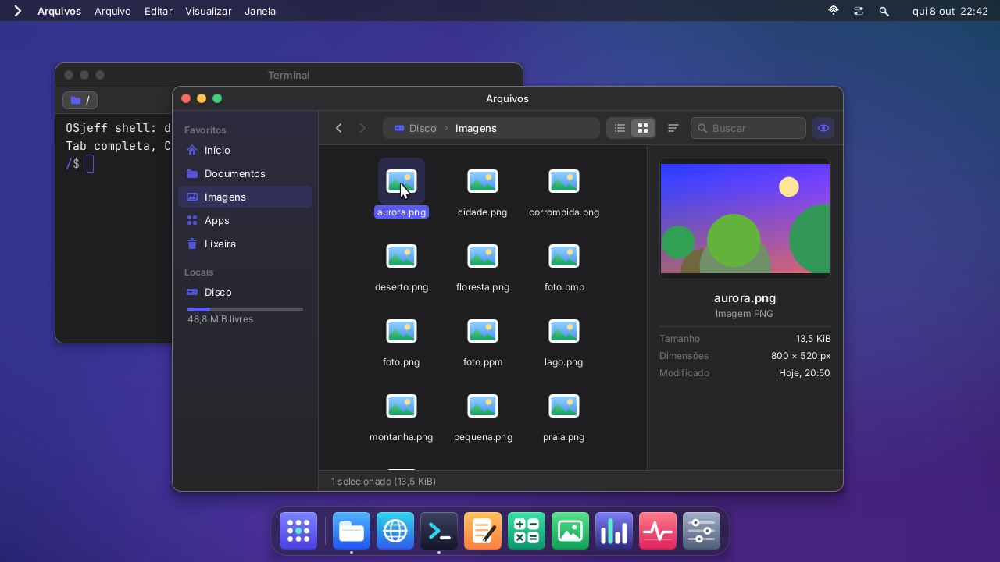
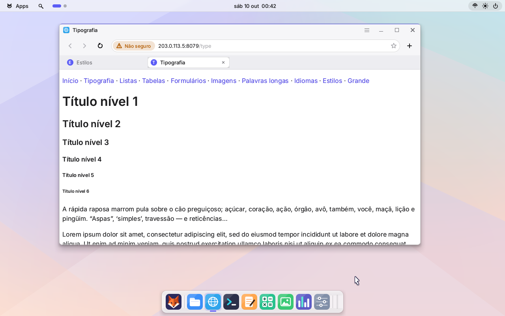
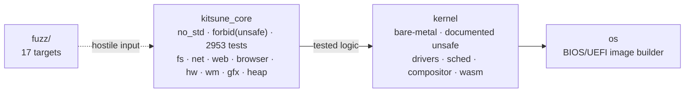

<div align="center">


# Kitsune™

### A complete x86_64 operating system, from firmware to desktop.

**It boots straight from BIOS or UEFI into an animated desktop, in Portuguese and English. It stays quiet when you do nothing.
Every app runs in a sandbox with memory and CPU limits, and the browser only says "secure connection" after it has verified the certificate.**

*[Versão em português](README.md)*


[🇧🇷 Português](README.md) · **🇺🇸 English**


</div>

---

## What Kitsune is

Kitsune is our own operating system, written from scratch: the bootloader hands the machine to the kernel and the
kernel brings up everything a computer needs to be used. A preemptive scheduler, its own memory management, a
compositor, a persistent journalled filesystem, a network stack with TLS, a browser, a terminal, an editor, a file
manager and an app platform with a sandbox. Nothing is borrowed from another system: the code is ours, from the first
instruction to the last pixel.

It was built like a product. Every change comes with a test or a QEMU proof, everything that comes from outside
(network, disk, HTML, images, apps) goes through a fuzzed parser, and the project went through a
[full security and performance audit](docs/audit/RELATORIO.md) whose findings are fixed or documented. (The audit
documents and most of the technical docs are in Portuguese.)

> **Honesty first.** What is said here is what the repository proves. Every number has the command that reproduces
> it in [`docs/BENCHMARKS.md`](docs/BENCHMARKS.md) (Portuguese), and what is still in progress is in
> [Project status](#-project-status).

---

## ✨ Highlights

| | What Kitsune does | Proof |
|---|---|---|
| **Boot** | From kernel entry to the first desktop frame in **about 8 s** on QEMU **without KVM** (software emulation); 5 s of that is the opening vignette, a fixed minimum length. Firmware and bootloader add ~6 s (UEFI) or ~11 s (BIOS) in the same emulation | [`BENCHMARKS.md`](docs/BENCHMARKS.md#boot) |
| **Small** | **8.9 MB** image (BIOS) or **8.5 MB** (UEFI), a complete desktop with 13 apps. Idle, it uses **2.2 MiB** of its 64 MiB heap | [`BENCHMARKS.md`](docs/BENCHMARKS.md#tamanho-e-memória) |
| **Quiet** | Idle desktop: **0 % busy CPU** and a single frame per second, the clock's (0.5 ms). The compositor sleeps until there is something to draw | [`BENCHMARKS.md`](docs/BENCHMARKS.md#desktop-ocioso) |
| **Fluid** | Animated interface with springs, shadows and translucency: **~6 ms per frame** while dragging a window, measured under software emulation | [`BENCHMARKS.md`](docs/BENCHMARKS.md#quadros) |
| **Apps with limits** | Each WebAssembly app runs in a sandbox with ceilings on memory (up to 24 MiB), instructions per call, disk and open files, and permissions declared in its manifest | [`docs/design/apps.md`](docs/design/apps.md) |
| **Verified network** | TLS 1.3 with the certificate chain, server name and handshake signature verified against 46 embedded roots; the address bar says "Conexão segura" only in that case | [`docs/design/tls-browser.md`](docs/design/tls-browser.md) |
| **Intact data** | **OJFS v3**: metadata journal, copy-on-write data, CRC32 and an `fsck` at every boot | [`docs/design/ojfs3.md`](docs/design/ojfs3.md) |
| **Two languages, live** | Brazilian Portuguese and English, switched in *Settings > Language & region* without a restart | [`docs/design/i18n.md`](docs/design/i18n.md) |
| **Accessible** | Light, dark or automatic appearance, 8 accent colours, text contrast of 15.6:1 (light) and 12.8:1 (dark), a reduce-motion switch | [`docs/design/ui-design.md`](docs/design/ui-design.md) |
| **Verified** | **2953 tests**, **17 fuzz targets**, 100 % of the kernel's `unsafe` blocks justified and enforced by lint, BIOS and UEFI boot compared pixel by pixel on every kernel change | [`docs/TESTING.md`](docs/TESTING.md) |

---

## 🖼️ Screenshots

| Desktop (dark, around 7 pm) | Desktop (light) |
|:---:|:---:|
|  |  |
| **Apps: every application, by category, with search** | **Search: apps, files and sums (`Ctrl+Space`)** |
|  |  |
| **Files: sidebar, icons, preview, trash, all persistent** | **Browser: verified HTTPS ("Conexão segura")** |
|  |  |
| **Settings: appearance, accent, notifications** | **Quick settings: network, appearance, accent** |
|  |  |
| **Activity monitor: CPU, memory, disk, network and processes live** | **Components (`Ctrl+Alt+G`): the toolkit showcase** |
|  |  |

When the kernel fails it **says what happened**, on screen and on serial (here, a stack overflow handled on a
dedicated stack, with no reboot and no black screen):


---

## 🚀 Getting started

```bash
git clone https://github.com/Jeffinp/OSjeff && cd OSjeff
rustup show                  # installs the pinned toolchain and targets
sudo apt install qemu-system-x86 ovmf    # or your distro's equivalent
tools/run.sh                 # build and open QEMU (BIOS)
tools/run.sh uefi            # same, UEFI
tools/run.sh bios -- -accel kvm          # with KVM, when the host offers it
```

> The repository is still named `OSjeff` on GitHub; the clone URL may change when it is renamed to `Kitsune` (GitHub redirects the old one).

**Windows, native or WSL.** With Rust and QEMU installed on Windows, `.\run.ps1` builds right there; without `cargo`
on Windows it builds in WSL and runs QEMU on Windows. Flags:

| Flag | Effect |
|---|---|
| `.\run.ps1` | build (release) and open with WHPX acceleration |
| `-NoAccel` | software CPU emulation |
| `-SkipBuild` | just open the existing image |
| `-Native` / `-Wsl` | force the build on Windows / in WSL |
| `-Usb` | produce `kitsune-uefi.img` to write to a USB stick (does not open QEMU) |
| `-Doom` | the DOOM variant (see the guide) |
| `-Gl`, `-SoftwareGfx` | choice of QEMU's video backend |
| `-NoRng` | no entropy device (tests the timing-jitter path) |

Headless (CI): `tools/qemu-headless.sh bios /tmp/kit 25` saves `serial.log` and `screen.png`.
USB stick and real hardware: [`docs/BOOT-USB.md`](docs/BOOT-USB.md). Full guide, how to write an app and
troubleshooting: [`docs/BUILDING.md`](docs/BUILDING.md) (Portuguese).

---

## 📦 What's inside

| Area | What Kitsune has | Details |
|---|---|---|
| **Boot and CPU** | BIOS and UEFI boot, GDT/TSS with a dedicated #DF stack, full IDT, every exception and spurious IRQ handled, an error screen | [`ARCHITECTURE.md`](docs/ARCHITECTURE.md) |
| **Scheduler** | Preemptive at 250 Hz, ready/blocked threads, **guard-page stacks**, **a thread that fails dies alone**, real CPU per thread | [`ARCHITECTURE.md`](docs/ARCHITECTURE.md) |
| **Memory** | Own heap with coalescing, alignment maths tested on the host | [`ARCHITECTURE.md`](docs/ARCHITECTURE.md) |
| **Interface** | Top panel, floating taskbar, **Apps** with categories, **Search**, window snapping, 2 to 4 **workspaces**, quick settings, notification centre, Alt+Tab, light/dark | [`ui-identity.md`](docs/design/ui-identity.md), [`ui-design.md`](docs/design/ui-design.md), [`compositor.md`](docs/design/compositor.md) |
| **Graphics** | Compositor with damage tracking, vector fonts with kerning, shadows, blur, animations; a performance HUD (`Ctrl+Alt+H`) | [`compositor.md`](docs/design/compositor.md) |
| **System apps** | Terminal (a shell with dozens of commands, pipes, scripts, `ping`/`nslookup`/`curl`), Editor (find and replace, undo, 16 MiB files), Files (copy/move with progress, trash), Images, Browser, Activity monitor, Log, Settings, Calculator | [`editor-shell.md`](docs/design/editor-shell.md), [`sysmgmt.md`](docs/design/sysmgmt.md), [`image.md`](docs/design/image.md) |
| **Storage** | **OJFS v3**: journal, copy-on-write, extents, CRC32, `fsck` at boot, automatic migration from v2, block cache; a single VFS layer for the desktop | [`ojfs3.md`](docs/design/ojfs3.md) |
| **Network** | `virtio-net` and NE2000, ARP/IPv4/ICMP/DHCP with renewal, cached DNS, TCP, **verified TLS 1.3**, time by SNTP | [`tls-browser.md`](docs/design/tls-browser.md) |
| **Browser** | HTML, CSS (cascade), layout, PNG/BMP/PPM images, GET forms, bookmarks, find in page, zoom, redirects, gzip/deflate, resource limits | [`tls-browser.md`](docs/design/tls-browser.md) |
| **WebAssembly apps** | A runtime with its own ABI and a WASI subset, a manifest with permissions and quotas, installation in `/apps`, data in `/data/<id>`. Bundled: Clock, Notes, Paint and Snake; DOOM runs as an app | [`apps.md`](docs/design/apps.md) |
| **Languages** | Brazilian Portuguese and English, live, plurals, date and number formats | [`i18n.md`](docs/design/i18n.md) |
| **System** | Persistent settings (`/etc/kitsune.conf`), a ring-buffer kernel log (`/var/log`), notifications, entropy with reseeding and per-source health | [`sysmgmt.md`](docs/design/sysmgmt.md), [`entropy.md`](docs/design/entropy.md) |
| **Devices** | PS/2, RTC, PCI, ATA, virtio (network, 2D video, entropy) | [`ARCHITECTURE.md`](docs/ARCHITECTURE.md) |

---

## 🧭 How it works

A kernel binary cannot run `cargo test`. So the split is structural: **every decision that does not need to touch
hardware lives in `kitsune_core`**, a library with `#![forbid(unsafe_code)]` that builds with `std` under test. The
kernel only connects the hardware to it. The code is Rust.


```mermaid
flowchart LR
    CORE["kitsune_core<br/>no_std · forbid(unsafe) · 2953 tests<br/>fs · net · web · browser · hw · wm · gfx · heap"]
    KERNEL["kernel<br/>bare-metal · documented unsafe<br/>drivers · sched · compositor · wasm"]
    OS["os<br/>BIOS/UEFI image builder"]
    FUZZ["fuzz/<br/>17 targets"]
    CORE -->|tested logic| KERNEL --> OS
    FUZZ -.->|hostile input| CORE
```

The kernel boots, calibrates the clock, mounts OJFS (with `fsck`), starts the service threads (`fetcher` for the
network, `appd` for the WebAssembly apps, `shelld` for terminal commands, `logd` for the log) and hands the frame to
the compositor, which only draws when something changes. Each subsystem is described in
[`docs/ARCHITECTURE.md`](docs/ARCHITECTURE.md) (Portuguese).

---

## 🧪 Quality

| Check | State |
|---|---|
| Unit tests | **2953** in `kitsune_core` (`cargo test -p kitsune_core`) |
| Fuzzing | **17 targets**: network, OJFS v2/v3 disks, HTML/CSS/images/forms, shell, editor, X.509 certificates, app manifest and sandbox, compositor; bugs found become a minimal input and a regression test |
| `unsafe` | **100 %** of the kernel's blocks carry `// SAFETY:`, enforced by `clippy::undocumented_unsafe_blocks` |
| QEMU boot | BIOS **and** UEFI on every kernel change, desktop compared pixel by pixel to a baseline (`tools/verify-boot.sh`) |
| Lint and format | `cargo lint-kernel`, `cargo lint-host`, `cargo fmt --check`, all `-D warnings` |
| Supply chain | `cargo deny check` (advisories, licences, bans, sources) and `cargo audit` |
| CI | `.github/workflows/ci.yml` (every command was run locally; the workflow has not run on GitHub yet) |

More in [`docs/TESTING.md`](docs/TESTING.md). The audit behind much of this measured, on QEMU without KVM
(proportions, not absolute values):

| | Before the audit | After |
|---|---|---|
| Tests | 189 | 423 (today: 2953) |
| `unsafe` without justification | 100 | **0** |
| Fatal failure | silent `hlt` or reboot | **error screen + serial** |
| Stack overflow | triple fault | guard page: only the thread dies |
| Compositor at idle | 83 iterations/s | **250** |
| Key→capture latency | ~11 ms | **~0.4 ms** |
| Clock tick | 15.6 ms | **0.2 ms** |
| Disk after a read error | formatted | **untouched** |
| Parser with hostile input | 3 trivial remote hangs | ceilings and fuzzing |

Full report: [`docs/audit/RELATORIO.md`](docs/audit/RELATORIO.md) (Portuguese).

---

## 🛡️ Security

Kitsune's defence is at the entrance and at the limits. Everything that arrives from outside (network frames, HTTP
responses, HTML and CSS, disk images, `.wasm` modules) goes through code without `unsafe`, with explicit ceilings and
fuzzing. WebAssembly apps run with per-call fuel, a memory ceiling, a disk quota, paths confined to their own
folder, and network access only with permission and to public destinations. HTTPS verifies the chain, the name and
the signature; certificate failures block the page.

Today the whole system runs at a single privilege level (ring 0), so the boundary between apps and the kernel is
WebAssembly with limits, and HTTPS does not yet do revocation (CRL/OCSP) or HSTS. Per-process isolation is one of
the next steps on the [roadmap](docs/ROADMAP.md). Attack scenarios, what is and is not protected and how to report a
problem: [`docs/SECURITY-MODEL.md`](docs/SECURITY-MODEL.md) · [`SECURITY.md`](SECURITY.md) (Portuguese).

---

## 🗺️ Project status

Kitsune runs end to end on QEMU, in BIOS and UEFI, and that is where everything is measured and tested. What comes
next, in order, with an acceptance criterion for each item, is in [`docs/ROADMAP.md`](docs/ROADMAP.md):

- **Real-hardware drivers**: a PC network card (`e1000`, `rtl8139`), and the first boot on a physical computer with
  frame-cost measurement.
- **GPU acceleration**, after sending only what changed to the screen.
- **Per-process isolation** (ring 3) and **multiple users**.
- **Restarting and cleaning up service threads** that fail; resumable fuel for WebAssembly apps.
- **Complete HTTPS**: revocation, HSTS; in the browser, POST, `<select>`/`<textarea>`, JPEG/GIF.

---

## 📚 Documentation

Most technical documents are in Portuguese.

| | |
|---|---|
| [`docs/ARCHITECTURE.md`](docs/ARCHITECTURE.md) | Technical deep dive into each subsystem |
| [`docs/BUILDING.md`](docs/BUILDING.md) | Build, run, DOOM, writing an app, common problems |
| [`docs/BOOT-USB.md`](docs/BOOT-USB.md) | Writing the image to a USB stick |
| [`docs/TESTING.md`](docs/TESTING.md) | Tests, coverage, fuzzing, QEMU, performance |
| [`docs/BENCHMARKS.md`](docs/BENCHMARKS.md) | Every number in this README, the command that reproduces it and the date |
| [`docs/SECURITY-MODEL.md`](docs/SECURITY-MODEL.md) | Trust boundaries, what is and is not protected |
| [`docs/ROADMAP.md`](docs/ROADMAP.md) | Next steps with acceptance criteria |
| [`docs/design/`](docs/design/code-structure.md) | The decisions behind each part: interface, compositor, OJFS, network, apps, languages |
| [`docs/brand/`](docs/brand/README.md) | The mark, the palette and the name |
| [`docs/audit/`](docs/audit/README.md) | The full audit, the isolation ADR |
| [`CONTRIBUTING.md`](CONTRIBUTING.md) · [`CHANGELOG.md`](CHANGELOG.md) · [`SECURITY.md`](SECURITY.md) | How to contribute, history, how to report |

---

## 📁 Structure

Source of truth and checklists (new app, new driver, new module): [`docs/design/code-structure.md`](docs/design/code-structure.md).

```
Kitsune/
├── kitsune_core/src/  # pure no_std logic, host-tested (forbid(unsafe_code)), one folder per responsibility:
│   ├── ui/            #   drawing and visual identity (gfx, fonts, icons, brand, animation, widgets)
│   ├── storage/       #   block device, cache, OJFS v2/v3, VFS
│   ├── network/       #   DHCP, DNS, ICMP, SNTP, X.509, TLS verification
│   ├── browsing/      #   HTML/CSS engine, browser model, redirects
│   ├── format/        #   PNG, BMP, PPM, deflate/gzip, base64, Unix time, search
│   ├── platform/      #   the WebAssembly app platform: ABI, manifest, installation, sandbox
│   ├── system/        #   log, monitor, notifications, processes, heap, entropy, settings, input
│   ├── windowing/     #   windows, snapping, compositor (damage engine), taskbar, launcher
│   ├── apps/          #   app logic (files, images, editor, terminal, calculator, activity)
│   ├── hw/            #   device-independent driver logic
│   └── i18n/          #   catalogs, plurals, per-language formats
├── kernel/src/        # bare-metal x86_64: drivers, scheduler, WebAssembly, desktop
│   └── desktop/       #   windows/ shell/ input/ kit/ services/ apps/<app>/ compositor/
├── os/                # builder: embeds the kernel and produces the BIOS/UEFI images
├── fuzz/              # cargo-fuzz: 17 targets + regressions
├── bench/             # microbenchmarks (criterion), outside the workspace
├── wasm-apps/         # WebAssembly apps (clock, notes, paint, snake; examples/, cdemo, doom) and the SDK
├── assets/            # fonts, icons, language catalogs (assets/i18n)
├── tools/             # run.sh, qemu-headless.sh, verify-boot.sh, performance harness
└── docs/              # architecture, guides, security, audit, brand
```

---

## 👤 Author, licence and contributing

**Jeferson Reis Almeida**: [PolyForm Strict 1.0.0](LICENSE) © 2026. The source is available to read and to use
non-commercially, with no redistribution or derivative works. Contributions are welcome under the terms of
[`LICENSE-CONTRIBUTORS.md`](LICENSE-CONTRIBUTORS.md) (read it before the first pull request; every commit carries
`Signed-off-by`); the workflow is in [`CONTRIBUTING.md`](CONTRIBUTING.md). Third-party notices in
[`NOTICE.md`](NOTICE.md) and [`THIRD-PARTY.md`](THIRD-PARTY.md).
