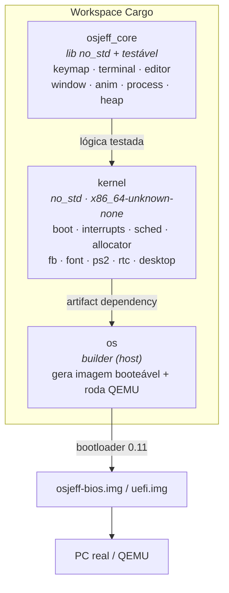
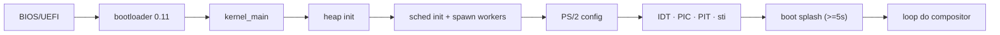
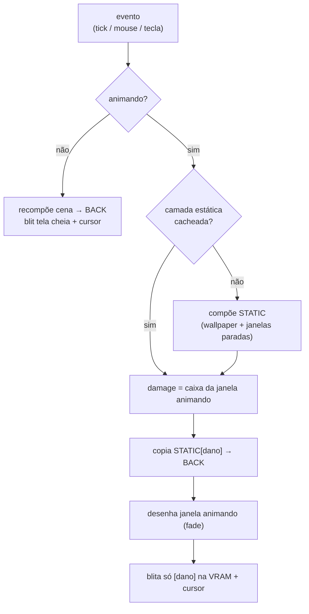
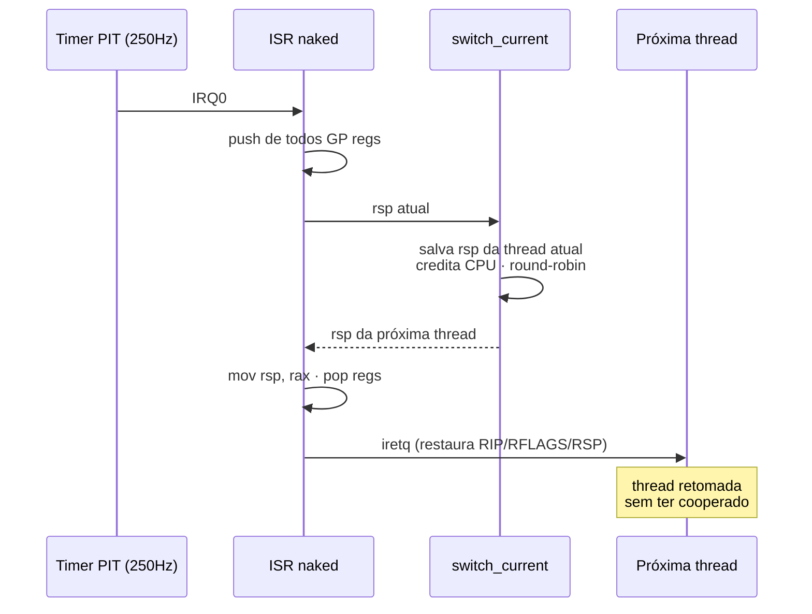

<div align="center">

# 🦀 OSJeff

### Um sistema operacional x86_64 escrito **do zero em Rust** — bare metal, sem Linux por baixo.

*An x86_64 operating system written from scratch in Rust — bare metal, no Linux underneath.*


**🇧🇷 Português** · [🇺🇸 English](README.en.md)


<sub>Boot → abrir o editor (animação) → digitar → fechar (animação) — tudo num kernel próprio.</sub>

</div>

> Projeto de portfólio por **Jeferson Reis Almeida**.
> Do boot ao desktop, escrito à mão: **scheduler preemptivo**, **heap allocator**,
> **interrupções de hardware**, **compositor com damage tracking** e três
> aplicativos — tudo em Rust + um mínimo de Assembly, **sem nenhum sistema
> operacional por baixo**. A imagem gerada boota num PC real (ou no QEMU).

---

## ✨ Por que isso é avançado

Não é um app rodando sobre um SO — é o SO. Cada peça abaixo foi construída do zero:

| Técnica | Onde | Por que é difícil |
|---|---|---|
| **Scheduler preemptivo** | [`kernel/src/sched.rs`](kernel/src/sched.rs) · [`interrupts.rs`](kernel/src/interrupts.rs) | Troca de contexto **dentro do ISR do timer** (ASM naked + `iretq`); preempta qualquer thread sem ela cooperar |
| **Heap allocator** | [`kernel/src/allocator.rs`](kernel/src/allocator.rs) | Free-list linkada + spin lock como `#[global_allocator]` → habilita `Vec`/`String`/`Box` |
| **Interrupções de hardware** | [`kernel/src/interrupts.rs`](kernel/src/interrupts.rs) | IDT, handlers de exceção, PIC 8259 remapeado, timer PIT, input por IRQ |
| **Compositor por damage tracking** | [`kernel/src/desktop.rs`](kernel/src/desktop.rs) | Cacheia a camada estática e só redesenha o retângulo danificado — custo O(janela) |
| **Lógica pura testável** | [`osjeff_core/`](osjeff_core/) | Toda decisão (parser, editor, keymap, geometria, allocator) testada no host: **99 testes, ~98% de cobertura** |

---

## 🖼️ Capturas

| Desktop | Gerenciador de tarefas (threads reais) |
|:---:|:---:|
|  |  |

> No gerenciador, **`compositor`, `worker-a` e `worker-b`** acumulam CPU de forma
> idêntica: os workers são loops infinitos **sem `yield`** — só rodam porque o
> timer os preempta. Prova visual de preempção real.

---

## 🧩 Arquitetura

A lógica pura é separada do hardware para ser **testável no host** — um kernel
`no_std`/`no_main` não roda `cargo test`, então toda decisão vive numa lib que
compila com `std` sob teste.



### Fluxo de boot



### Pipeline de render (damage tracking)



### Scheduler preemptivo



---

## 📦 Recursos

- **Kernel bare-metal** com identidade visual própria (dock flutuante, mesh
  wallpaper, sombras, logo) e **boot splash animado**
- **Interrupções de hardware**: IDT + exceções, PIC 8259, timer PIT; exceções
  fatais travam visível em vez de triple-fault (reboot silencioso)
- **Input por IRQ**: teclado (IRQ1) e mouse (IRQ12) via ring buffer SPSC
- **Heap allocator** (`alloc`): `Vec`/`String`/`Box` no kernel
- **Scheduler preemptivo**: threads reais com stacks próprias, troca de contexto
  no ISR do timer, CPU por thread no gerenciador
- **Window manager**: múltiplas janelas, foco, z-order, arrastar, menu de
  contexto (botão direito), animações de abre/fecha com damage tracking
- **4 apps**: **Terminal** (histórico, comandos), **Editor** (texto multi-linha,
  cursor 2D), **Gerenciador de tarefas** e **Calculadora** (4 operações, mouse +
  teclado)
- **Painel iniciar**: o ícone do sistema abre um menu com todos os apps e botões
  de **Reiniciar** e **Desligar** (reset via 8042/PCI, poweroff via portas ACPI)
- **Mouse + teclado PS/2** (Shift, Caps, setas), relógio RTC em hora local
- **Double buffering** + dirty-rect do cursor → render sem flicker
- Fonte bitmap 8×8 própria; ícones desenhados; logo embutido como RGBA

---

## 🚀 Rodando

### Windows (recomendado — aceleração WHPX)

`run.ps1` faz tudo: compila o release no WSL, copia a imagem e sobe o QEMU.

```powershell
cd C:\...\OSjeff
.\run.ps1              # build release + boot (WHPX, rápido)
.\run.ps1 -NoAccel    # build release + boot (TCG, software)
.\run.ps1 -SkipBuild  # só boota a imagem existente
```

### Linux / WSL

```bash
cd OSjeff
cargo run --package os            # BIOS
cargo run --package os -- uefi    # UEFI (precisa OVMF)
```

### Gravar em hardware real (pen drive)

> **Atenção:** `dd` apaga o disco de destino. Confira o device antes.

```bash
sudo dd if=osjeff-bios.img of=/dev/sdX bs=4M status=progress && sync
```

---

## 🧪 Qualidade

Toda a lógica vive em `osjeff_core` e é testada no host:

```bash
cargo test-core                          # 99 testes
cargo llvm-cov -p osjeff_core --summary-only  # cobertura (~98%)
cargo lint-kernel                        # clippy bare-metal, -D warnings
cargo lint-host                          # clippy host, -D warnings
```

| Módulo (core) | Cobertura |
|---|---|
| keymap · window · anim · heap | 100% |
| terminal | 97% |
| editor | 96% |
| process | 99% |

> `cargo clippy` puro falha **de propósito**: o kernel `no_std` não compila no
> host (sem unwinding). Por isso os aliases acima escopam o alvo correto.

---

## 📁 Estrutura

```
OSjeff/
├── osjeff_core/        # lib no_std + testável (cargo test)
│   └── src/{keymap,terminal,editor,window,anim,process,heap}.rs
├── kernel/             # no_std, x86_64-unknown-none
│   └── src/
│       ├── main.rs        # entry point + loop do compositor
│       ├── interrupts.rs  # IDT · exceções · PIC · PIT · input IRQ
│       ├── sched.rs       # scheduler preemptivo + context switch (asm)
│       ├── allocator.rs   # heap (GlobalAlloc) + spin lock
│       ├── desktop.rs     # window manager + compositor + apps
│       ├── fb.rs · font.rs · icons.rs · logo.rs · boot.rs
│       └── io.rs · ps2.rs · rtc.rs · theme.rs
├── os/                 # builder: gera imagem + roda QEMU
├── tools/gen-icons.py  # converte o logo PNG -> RGBA embutido
├── assets/             # logo de marca (fonte + raws)
└── docs/               # documentação e imagens
```

📖 **Mergulho técnico:** [`docs/ARCHITECTURE.md`](docs/ARCHITECTURE.md)

---

## 🗺️ Roadmap

- [x] Boot BIOS/UEFI + framebuffer
- [x] Compositor, window manager e animações
- [x] Terminal, editor e gerenciador de tarefas
- [x] IDT + PIC + PIT + handlers de exceção
- [x] Input dirigido por IRQ
- [x] Heap allocator (`alloc`)
- [x] Scheduler **preemptivo**
- [x] Compositor por damage tracking
- [x] Heap com coalescência de blocos livres
- [x] Render com fast-path de 32 bits + idle `hlt`
- [x] Salvar estado FPU/SSE (`fxsave`/`fxrstor`) na troca de contexto
- [x] Calculadora + painel iniciar (apps, reiniciar, desligar)
- [x] Copy/paste entre apps (Ctrl+C / Ctrl+V)
- [ ] Driver de disco + sistema de arquivos (persistência)
- [ ] Pilha de rede

---

## 👤 Autor

**Jeferson Reis Almeida**
Projeto de portfólio explorando programação de sistemas de baixo nível, kernel
development e Rust bare-metal.

## 📄 Licença

[MIT](LICENSE) © 2026 Jeferson Reis Almeida
