<div align="center">

# 🦀 OSJeff

### Um sistema operacional x86_64 escrito **do zero em Rust**: bare metal, sem Linux por baixo.

*An x86_64 operating system written from scratch in Rust: bare metal, no Linux underneath.*


**🇧🇷 Português** · [🇺🇸 English](README.en.md)


</div>

OSJeff é um kernel x86_64 `no_std` que sobe direto do firmware (BIOS ou UEFI) e
entrega um desktop completo: scheduler preemptivo, heap próprio, interrupções,
compositor, sistema de arquivos persistente, pilha TCP/IP com TLS, navegador
HTML/CSS e um runtime WebAssembly para aplicativos. É um projeto de **estudo**, e
foi tratado como produto: toda mudança tem teste ou prova em QEMU, o parser de tudo
que vem de fora é fuzzado, e o projeto passou por uma
[auditoria completa de segurança e desempenho](docs/audit/RELATORIO.md) cujos achados
estão corrigidos ou documentados.

> **Honestidade primeiro.** Tudo roda em ring 0, sem isolamento; o HTTPS **verifica a cadeia de certificado**
> (sem revogação nem HSTS); nada foi testado em hardware real. Veja
> a seção "Limites conhecidos" abaixo e o [modelo de segurança](docs/SECURITY-MODEL.md).

---

## 🖼️ Capturas

| Desktop (escuro, por volta das 19h) | Desktop (claro) |
|:---:|:---:|
| 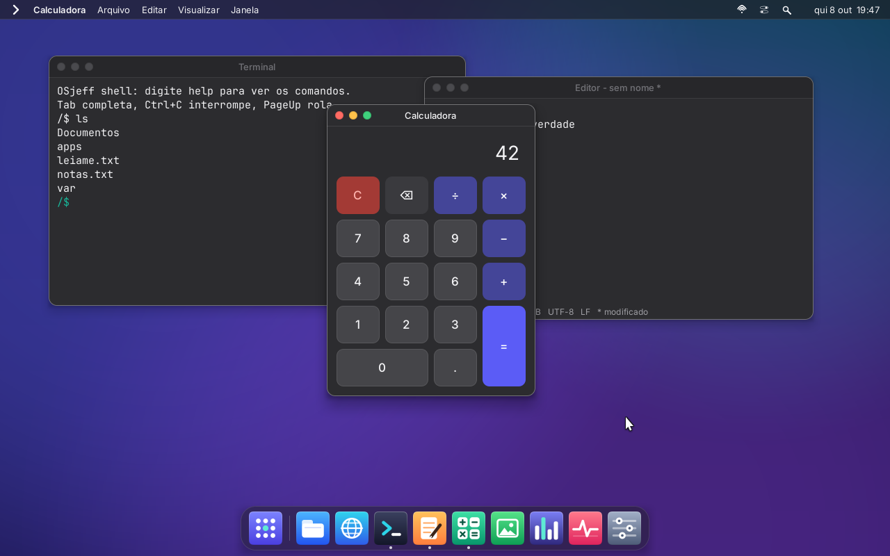 | 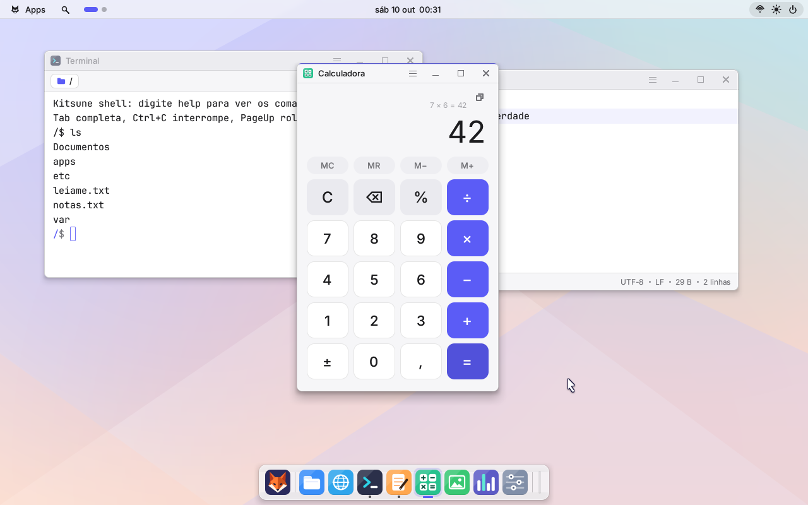 |
| **Apps (todos os aplicativos, com busca)** | **Busca: apps, arquivos e contas (`Ctrl+Space`)** |
| 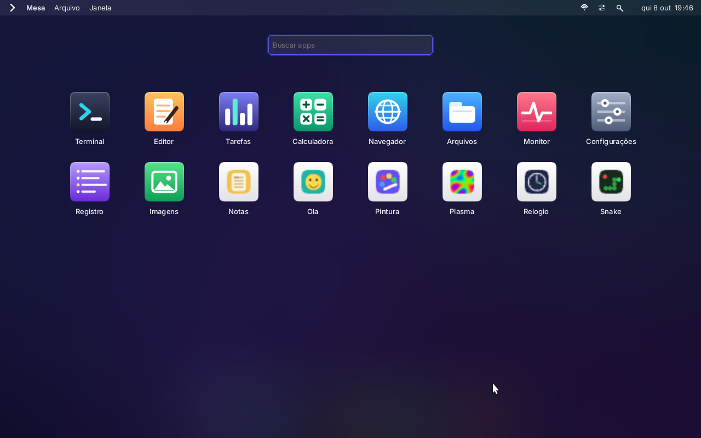 | 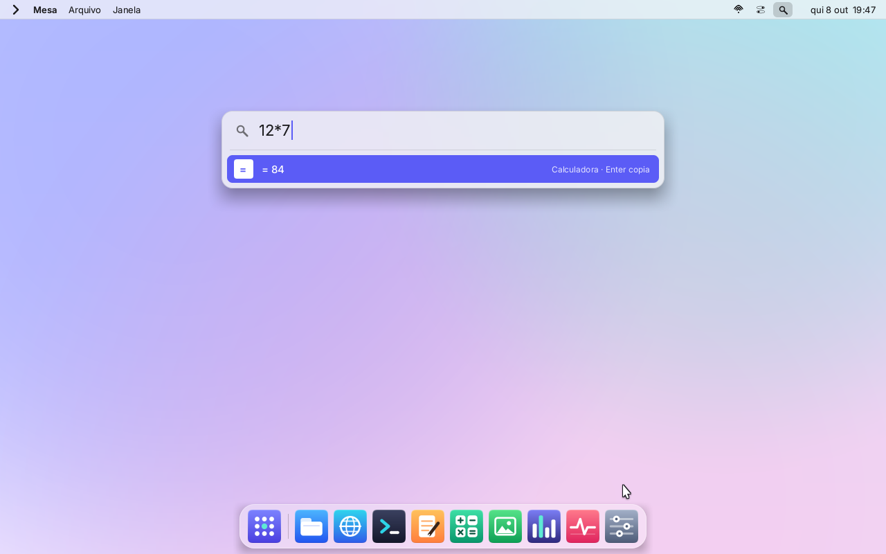 |
| **Gerenciador de arquivos (pastas, lixeira, persistente)** | **Navegador (HTTPS verificado: "Conexão segura")** |
| 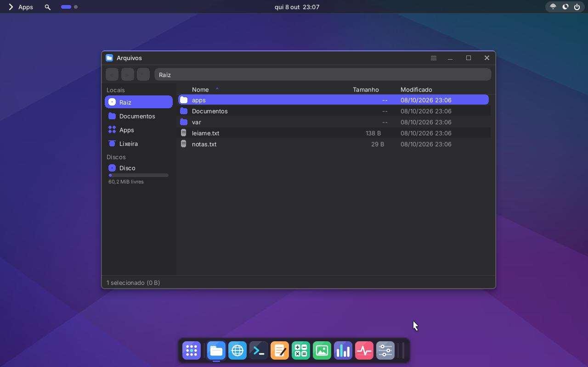 | 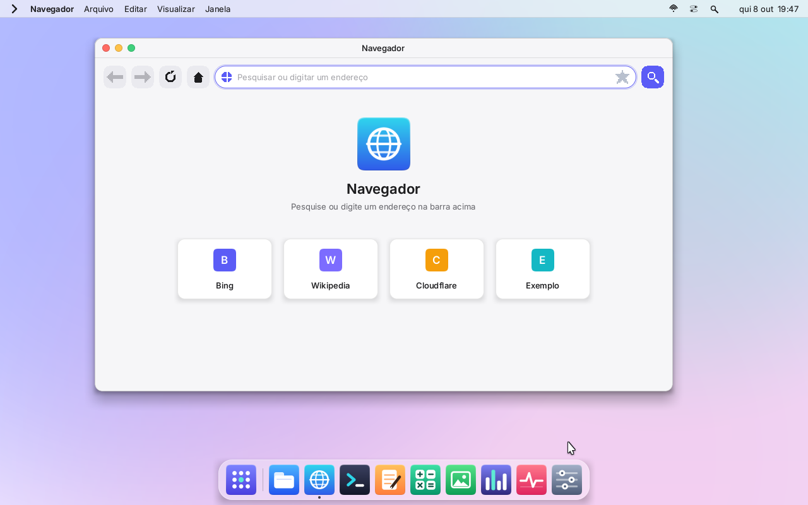 |
| **Ajustes (aparência, destaque, notificações)** | **Controles (rede, aparência, destaque)** |
| 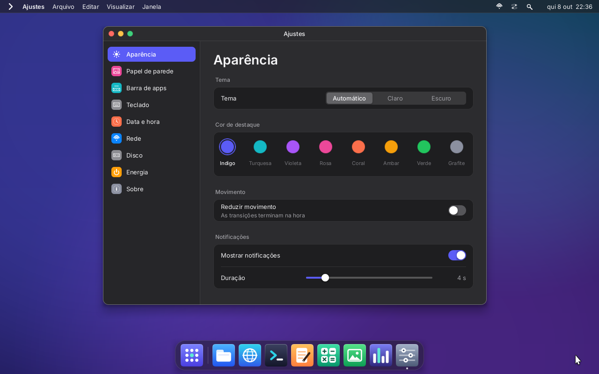 | 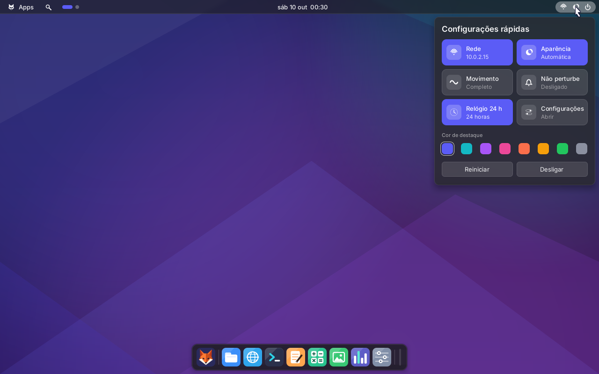 |
| **Tarefas (CPU, memória, disco, rede, processos)** | **Componentes (`Ctrl+Alt+G`): a vitrine do toolkit** |
| 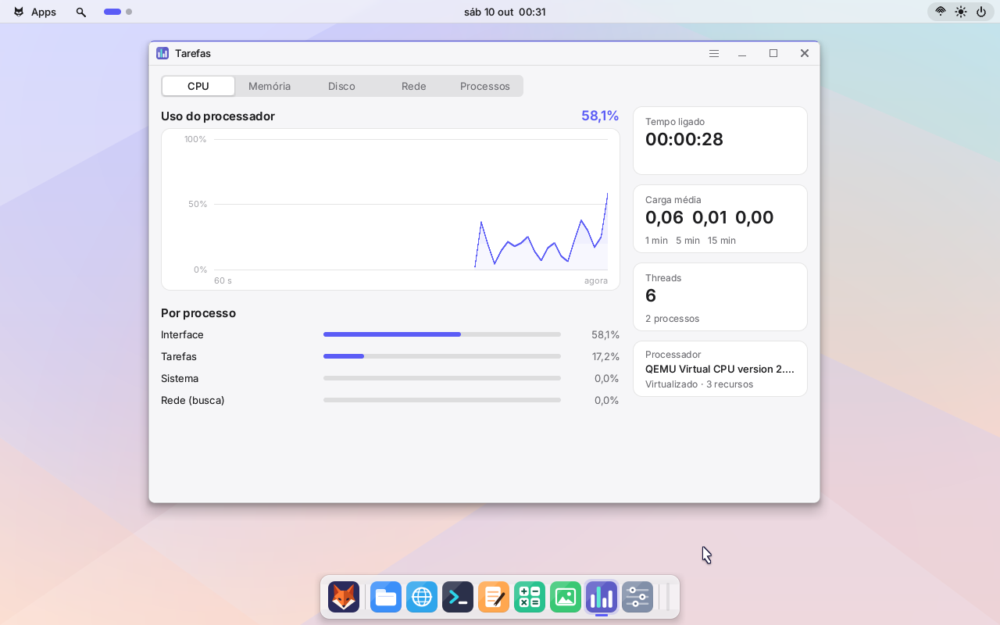 | 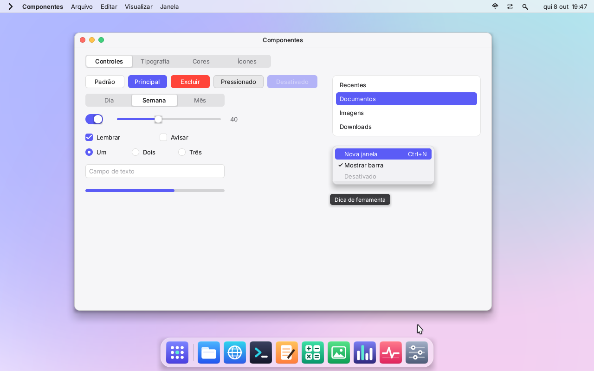 |

Quando o kernel falha, ele **diz o que aconteceu**, na tela e na serial (aqui, um
estouro de pilha tratado em pilha IST própria, sem triple fault):


---

## 🚀 Começando

```bash
git clone https://github.com/Jeffinp/OSjeff && cd OSjeff
rustup show                  # instala o nightly fixado e os alvos
sudo apt install qemu-system-x86 ovmf    # ou o equivalente da sua distro
tools/run.sh                 # compila e abre o QEMU (BIOS)
tools/run.sh uefi            # idem em UEFI
```

Windows com aceleração: `.\run.ps1`. Sem tela (CI): `tools/qemu-headless.sh bios /tmp/osj 25`.
Pendrive e hardware real: [`docs/BOOT-USB.md`](docs/BOOT-USB.md). Guia completo,
variantes (DOOM) e solução de problemas: [`docs/BUILDING.md`](docs/BUILDING.md).

---

## 📦 O que tem dentro

| Camada | O que foi construído | Onde |
|---|---|---|
| **Boot e CPU** | Boot BIOS/UEFI (`bootloader 0.11`), GDT/TSS próprias com pilha IST para #DF, IDT completa, PIC 8259, PIT 250 Hz, tratamento de todas as exceções e IRQs espúrias, tela de erro | `kernel/src/{gdt,interrupts,crash}.rs` |
| **Scheduler** | Preemptivo por timer (troca de contexto no ISR, assembly), threads **prontas/bloqueadas**, yield por `int 0x81`, `hlt` sem perder wakeups, **pilhas com página de guarda**, **uma thread que falha morre sozinha**, CPU real por thread | `sched.rs`, `switch.s` |
| **Memória** | Heap `GlobalAlloc` (free-list com coalescência, spin lock com IRQs desligadas), matemática de alinhamento testada no host | `allocator.rs`, `osjeff_core/src/heap.rs` |
| **Gráficos** | Compositor com damage tracking, double buffer, fonte 8×8 própria, sombras alpha, animações; HUD de desempenho | `fb.rs`, `desktop/` |
| **Apps** | Terminal (shell com ~55 comandos, pipes, scripts, scrollback, histórico, Tab, `ping`/`nslookup`/`curl`), Editor (busca/substituição, desfazer, arquivos de 16 MiB, diálogos Abrir/Salvar), Gerenciador de arquivos (copiar/mover com progresso, lixeira, Apps), Visualizador de imagens, Navegador, Tarefas (monitor de atividade), Registro, Ajustes, Calculadora, apps WebAssembly | `desktop/`, `osjeff_core` |
| **Armazenamento** | **OJFS v3**: journal de metadados + dados *copy-on-write*, extents, CRC32, `fsck` no boot, migração automática do v2, cache de blocos, ATA com `FLUSH`; o desktop inteiro fala com o disco por uma camada VFS (com volume em RAM quando não há disco v3) | `osjeff_core/src/{fs3,vfs,blockcache}`, `ata.rs`, `storage.rs` |
| **Sistema** | Configurações persistentes (`/etc/osjeff.conf`: cor de destaque, papel de parede, teclado ABNT2, fuso, relógio), log do kernel em anel (`/var/log`), monitor de atividade, notificações, apps instalados em `/apps` com dados em `/data/<id>` | `osjeff_core/src/{settings,klog,sysmon,notify}.rs`, `kernel/src/desktop/` |
| **Rede** | `virtio-net` e NE2000 (trait `Nic`), ARP/IPv4/ICMP/DHCP próprios (renova o lease, responde e envia `ping`), DNS com cache e vários servidores, `smoltcp` para TCP, **TLS 1.3** (`embedded-tls`) **com cadeia de certificados verificada** (`rustls-webpki`, 46 raízes embutidas) e hora por SNTP | `nic.rs`, `virtio_net.rs`, `ne2000.rs`, `netd.rs`, `netstack.rs`, `osjeff_core/src/{net,lease,dns,icmp}.rs` |
| **Navegador** | Parser HTML, CSS (cascata), layout, imagens PNG/BMP/PPM, formulários GET, favoritos e sugestões, busca na página, zoom, redirects, gzip/deflate, limites de recurso, indicador de conexão ("Conexao segura" só com certificado verificado); roda do mouse no sistema | `osjeff_core/src/{web,browser,redirect}`; favoritos persistentes em `/home/.bookmarks` |
| **WebAssembly** | Runtime `wasmi` como formato nativo de apps: ABI própria + subconjunto WASI, *fuel* por chamada, 24 MiB de memória, término real do app. Roda Snake; **DOOM** via `wasi-sdk` | `kernel/src/wasm/`, `wasm-apps/` |
| **Dispositivos** | PS/2 (teclado, mouse), RTC, PCI, virtio-gpu (2D), ATA IDENTIFY | `ps2.rs`, `pci.rs`, `virtio*.rs` |

---

## 🧪 Por que dá para confiar nele

Um binário `no_std` não roda `cargo test`. A solução é estrutural: **toda decisão
que não precisa tocar hardware mora em `osjeff_core`** (`#![forbid(unsafe_code)]`),
que compila com `std` sob teste. O kernel só liga o hardware a ela.

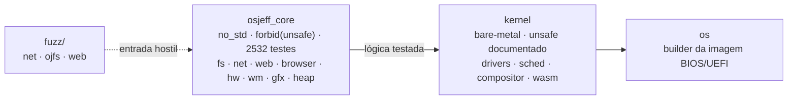
```mermaid
flowchart LR
    CORE["osjeff_core<br/>no_std · forbid(unsafe) · 2532 testes<br/>fs · net · web · browser · hw · wm · gfx · heap"]
    KERNEL["kernel<br/>bare-metal · unsafe documentado<br/>drivers · sched · compositor · wasm"]
    OS["os<br/>builder da imagem BIOS/UEFI"]
    FUZZ["fuzz/<br/>net · ojfs · web"]
    CORE -->|lógica testada| KERNEL --> OS
    FUZZ -.->|entrada hostil| CORE
```

| Verificação | Estado |
|---|---|
| Testes unitários | **2532** no `osjeff_core`; cobertura de linhas 96,6% (bruta, inclui os módulos de teste; medida com `cargo llvm-cov`) |
| Fuzzing | 15 alvos (rede, discos OJFS v2/v3, HTML/CSS/imagens/formulários, shell, editor, certificados X.509, manifesto e sandbox de apps); bugs achados são corrigidos com entrada mínima e teste de regressão |
| `unsafe` | **100%** dos blocos do kernel com `// SAFETY:`, imposto por `clippy::undocumented_unsafe_blocks` |
| Boot em QEMU | BIOS **e** UEFI em todo commit de kernel, desktop comparado pixel a pixel com a baseline (`tools/verify-boot.sh`) |
| Lint e formato | `cargo lint-kernel`, `cargo lint-host`, `cargo fmt --check`, todos `-D warnings` |
| Supply chain | `cargo deny check` (advisories, licenças, bans, fontes) e `cargo audit` |
| CI | `.github/workflows/ci.yml` (cada comando foi rodado localmente; o workflow ainda não executou no GitHub) |

Mais em [`docs/TESTING.md`](docs/TESTING.md).

### A auditoria, em números (QEMU sem KVM; proporções, não valores absolutos)

| | Antes | Depois |
|---|---|---|
| Build do `master` | não compilava | compila, toolchain fixado |
| Testes | 189 (README antigo: 152) | **423** |
| `unsafe` sem justificativa | 100 | **0** |
| Falha fatal | `hlt` mudo ou reinício | **tela de erro + serial** |
| Estouro de pilha | triple fault; em thread secundária, corrupção silenciosa do heap | página de guarda: `#PF` reportado, só a thread morre |
| Compositor em idle | 83 iterações/s | **250** |
| Latência tecla→captura | ~11 ms | **~0,4 ms** |
| Tick do relógio | 15,6 ms | **0,2 ms** |
| Quadro de tecla no terminal | 26 ms | **13 ms** |
| Disco após erro de leitura | formatado | **intocado** |
| Parser com entrada hostil | 3 travamentos remotos triviais | tetos e fuzz |

Relatório completo, com a prova de cada item e o que **não** valia a pena fazer:
[`docs/audit/RELATORIO.md`](docs/audit/RELATORIO.md).

---

## 🛡️ Segurança em duas linhas

A defesa é na entrada: tudo que vem da rede, do disco, de HTML/CSS ou de `.wasm`
passa por código sem `unsafe`, com limites e fuzz. O que **não** existe: isolamento
entre apps e kernel (ring 0 único), revogação de certificados (CRL/OCSP) e HSTS. Detalhes, cenários de ataque e como relatar:
[`docs/SECURITY-MODEL.md`](docs/SECURITY-MODEL.md) · [`SECURITY.md`](SECURITY.md).

---

## ⚠️ Limites conhecidos

- **Ring 0 único**: um bug em qualquer parte é um bug do kernel todo. O caminho de
  evolução (WebAssembly como fronteira, ring 3 só com gatilho) está no
  [ADR de isolamento](docs/audit/adr-isolamento.md).
- **HTTPS verificado, mas sem revogação (CRL/OCSP), *pinning* nem HSTS**; a hora vem do RTC corrigido por SNTP (não autenticado). Erro de certificado bloqueia a página, com "continuar mesmo assim" por site e por sessão. Veja [`docs/design/tls-browser.md`](docs/design/tls-browser.md).
- **Rede só em QEMU/VMs** (`virtio-net` e NE2000 ISA): o IP, o gateway e os DNS vêm do DHCP, que é renovado (T1/T2/expiração, provado contra o servidor da SLIRP), mas não há driver para a NIC de um PC comum (`e1000`/`rtl8139`) e o DHCP e o DNS não são autenticados.
- **Sem teste em hardware real.** BIOS entrega 1280×720 em 24 bpp e UEFI precisa de
  ≥ 192 MB de RAM (o BSS do kernel tem ~91 MiB).
- Uma thread secundária que falha morre sozinha (o resto segue), mas **não é reiniciada** e seus recursos não são liberados; falha no compositor ou dentro de uma interrupção ainda para tudo.

Lista priorizada do que vem a seguir: [`docs/ROADMAP.md`](docs/ROADMAP.md).

---

## 📚 Documentação

| | |
|---|---|
| [`docs/ARCHITECTURE.md`](docs/ARCHITECTURE.md) | Mergulho técnico em cada subsistema |
| [`docs/BUILDING.md`](docs/BUILDING.md) | Compilar, rodar, DOOM, problemas comuns |
| [`docs/TESTING.md`](docs/TESTING.md) | Testes, cobertura, fuzzing, QEMU, desempenho |
| [`docs/SECURITY-MODEL.md`](docs/SECURITY-MODEL.md) | Fronteiras de confiança, o que é e não é protegido |
| [`docs/ROADMAP.md`](docs/ROADMAP.md) | Próximos passos com critério de aceite |
| [`docs/audit/`](docs/audit/README.md) | Auditoria completa, ADR de isolamento |
| [`CONTRIBUTING.md`](CONTRIBUTING.md) · [`CHANGELOG.md`](CHANGELOG.md) · [`SECURITY.md`](SECURITY.md) | Como contribuir, histórico, como relatar |

---

## 📁 Estrutura

```
OSjeff/
├── osjeff_core/   # lógica pura no_std, testada no host (forbid(unsafe_code))
├── kernel/        # bare-metal x86_64-unknown-none: drivers, scheduler, compositor, wasm
├── os/            # builder: embute o kernel e gera as imagens BIOS/UEFI
├── fuzz/          # cargo-fuzz: 15 alvos (entropia, rede, OJFS, web, shell, editor, X.509, apps) + regressões
├── bench/         # microbenchmarks (criterion), fora do workspace
├── wasm-apps/     # apps WebAssembly (snake padrão; plasma; cdemo; doom)
├── tools/         # run.sh, qemu-headless.sh, verify-boot.sh, harness de perf
└── docs/          # arquitetura, guias, segurança, auditoria
```

---

## 👤 Autor e licença

**Jeferson Reis Almeida**: [MIT](LICENSE) © 2026.
