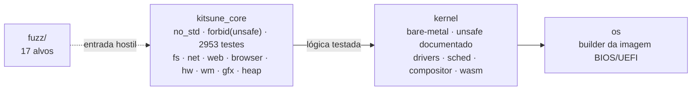

<div align="center">


# Kitsune™

### Um sistema operacional x86_64 completo, do firmware ao desktop.

**Sobe direto de BIOS ou UEFI para um desktop animado, em português e inglês. Fica em silêncio quando você não faz nada.
Cada app roda numa sandbox com limites de memória e CPU, e o navegador só diz "conexão segura" depois de verificar o certificado.**

*[English version](README.en.md)*


**🇧🇷 Português** · [🇺🇸 English](README.en.md)


</div>

---

## O que é o Kitsune

O Kitsune é o nosso sistema operacional, escrito do zero: o bootloader entrega a máquina ao kernel e o kernel
levanta tudo o que um computador precisa para ser usado. Scheduler preemptivo, memória própria, compositor,
sistema de arquivos persistente com journal, pilha de rede com TLS, navegador, terminal, editor, gerenciador de
arquivos e uma plataforma de apps com sandbox. Nada é emprestado de outro sistema: o código é nosso, da primeira
instrução ao último pixel.

Ele foi construído como produto. Toda mudança tem teste ou prova em QEMU, tudo o que vem de fora (rede, disco,
HTML, imagens, apps) passa por um parser fuzzado, e o projeto passou por uma
[auditoria completa de segurança e desempenho](docs/audit/RELATORIO.md) cujos achados estão corrigidos ou
documentados.

> **Honestidade primeiro.** O que está dito aqui é o que o repositório prova. Cada número tem o comando que o
> reproduz em [`docs/BENCHMARKS.md`](docs/BENCHMARKS.md), e o que ainda está em andamento está na seção
> [Estado do projeto](#-estado-do-projeto).

---

## ✨ Destaques

| | O que o Kitsune faz | Prova |
|---|---|---|
| **Boot** | Da entrada do kernel ao primeiro quadro do desktop em **cerca de 8 s** no QEMU **sem KVM** (emulação em software); 5 s desse tempo são a vinheta de abertura, de duração mínima fixa. Firmware e bootloader somam mais ~6 s (UEFI) ou ~11 s (BIOS) na mesma emulação | [`BENCHMARKS.md`](docs/BENCHMARKS.md#boot) |
| **Leve** | Imagem de **8,9 MB** (BIOS) ou **8,5 MB** (UEFI), desktop completo com 13 apps. Ocioso, usa **2,2 MiB** do heap de 64 MiB | [`BENCHMARKS.md`](docs/BENCHMARKS.md#tamanho-e-memória) |
| **Silencioso** | Desktop ocioso: **0 % de CPU ocupada** e um único quadro por segundo, o do relógio (0,5 ms). O compositor dorme até haver o que desenhar | [`BENCHMARKS.md`](docs/BENCHMARKS.md#desktop-ocioso) |
| **Fluido** | Interface animada com molas, sombras e transparência: **~6 ms por quadro** ao arrastar uma janela, medido em emulação em software | [`BENCHMARKS.md`](docs/BENCHMARKS.md#quadros) |
| **Apps com limites** | Cada app WebAssembly roda numa sandbox com teto de memória (até 24 MiB), de instruções por chamada, de disco e de arquivos abertos, com permissões declaradas no manifesto | [`docs/design/apps.md`](docs/design/apps.md) |
| **Rede verificada** | TLS 1.3 com cadeia de certificados, nome do servidor e assinatura do handshake verificados contra 46 raízes embutidas; a barra só diz "Conexão segura" nesse caso | [`docs/design/tls-browser.md`](docs/design/tls-browser.md) |
| **Dados íntegros** | **OJFS v3**: journal de metadados, dados *copy-on-write*, CRC32 e `fsck` a cada boot | [`docs/design/ojfs3.md`](docs/design/ojfs3.md) |
| **Dois idiomas, ao vivo** | Português do Brasil e inglês, trocados em *Ajustes > Idioma e região* sem reiniciar | [`docs/design/i18n.md`](docs/design/i18n.md) |
| **Acessível** | Tema claro, escuro ou automático, 8 cores de destaque, contraste de texto de 15,6:1 (claro) e 12,8:1 (escuro), opção de reduzir movimento | [`docs/design/ui-design.md`](docs/design/ui-design.md) |
| **Verificado** | **2953 testes**, **17 alvos de fuzz**, 100 % dos blocos `unsafe` do kernel justificados e impostos por lint, boot BIOS e UEFI conferido pixel a pixel a cada mudança de kernel | [`docs/TESTING.md`](docs/TESTING.md) |

---

## 🖼️ Capturas

| Desktop (escuro, por volta das 19h) | Desktop (claro) |
|:---:|:---:|
|  |  |
| **Apps: todos os aplicativos, por categoria, com busca** | **Busca: apps, arquivos e contas (`Ctrl+Space`)** |
|  |  |
| **Arquivos: barra lateral, ícones, pré-visualização, lixeira, tudo persistente** | **Navegador: HTTPS verificado ("Conexão segura")** |
|  |  |
| **Ajustes: aparência, destaque, notificações** | **Configurações rápidas: rede, aparência, destaque** |
|  |  |
| **Tarefas: CPU, memória, disco, rede e processos em tempo real** | **Componentes (`Ctrl+Alt+G`): a vitrine do toolkit** |
|  |  |

Quando o kernel falha, ele **diz o que aconteceu**, na tela e na serial (aqui, um estouro de pilha tratado numa
pilha própria, sem reinício e sem tela preta):


---

## 🚀 Começando

```bash
git clone https://github.com/Jeffinp/OSjeff && cd OSjeff
rustup show                  # instala o toolchain fixado e os alvos
sudo apt install qemu-system-x86 ovmf    # ou o equivalente da sua distro
tools/run.sh                 # compila e abre o QEMU (BIOS)
tools/run.sh uefi            # idem em UEFI
tools/run.sh bios -- -accel kvm          # com KVM, quando o host oferece
```

> O repositório ainda se chama `OSjeff` no GitHub; a URL de clonagem pode mudar quando ele for renomeado para `Kitsune` (o GitHub redireciona a antiga).

**Windows, nativo ou WSL.** Com o Rust e o QEMU instalados no Windows, `.\run.ps1` compila ali mesmo; sem
`cargo` no Windows, ele compila no WSL e roda o QEMU no Windows. Flags:

| Flag | Efeito |
|---|---|
| `.\run.ps1` | compila (release) e abre com aceleração WHPX |
| `-NoAccel` | emulação de CPU em software |
| `-SkipBuild` | só abre a imagem existente |
| `-Native` / `-Wsl` | força a compilação no Windows / no WSL |
| `-Usb` | gera `kitsune-uefi.img` para gravar em pendrive (não abre o QEMU) |
| `-Doom` | variante com DOOM (veja o guia) |
| `-Gl`, `-SoftwareGfx` | escolha do backend de vídeo do QEMU |
| `-NoRng` | sem o dispositivo de entropia (testa o caminho por jitter) |

Sem tela (CI): `tools/qemu-headless.sh bios /tmp/kit 25` salva `serial.log` e `screen.png`.
Pendrive e hardware real: [`docs/BOOT-USB.md`](docs/BOOT-USB.md). Guia completo, como criar um app e solução de
problemas: [`docs/BUILDING.md`](docs/BUILDING.md).

---

## 📦 O que tem dentro

| Área | O que o Kitsune tem | Detalhes |
|---|---|---|
| **Boot e CPU** | Boot BIOS e UEFI, GDT/TSS com pilha própria para #DF, IDT completa, todas as exceções e IRQs espúrias tratadas, tela de erro | [`ARCHITECTURE.md`](docs/ARCHITECTURE.md) |
| **Scheduler** | Preemptivo a 250 Hz, threads prontas/bloqueadas, **pilhas com página de guarda**, **uma thread que falha morre sozinha**, CPU real por thread | [`ARCHITECTURE.md`](docs/ARCHITECTURE.md) |
| **Memória** | Heap próprio com coalescência, matemática de alinhamento testada no host | [`ARCHITECTURE.md`](docs/ARCHITECTURE.md) |
| **Interface** | Painel superior, barra de tarefas flutuante, **Apps** com categorias, **Busca**, encaixe de janelas, 2 a 4 **áreas de trabalho**, configurações rápidas, central de notificações, Alt+Tab, tema claro/escuro | [`ui-identity.md`](docs/design/ui-identity.md), [`ui-design.md`](docs/design/ui-design.md), [`compositor.md`](docs/design/compositor.md) |
| **Gráficos** | Compositor com rastreio de dano, fontes vetoriais com kerning, sombras, desfoque, animações; HUD de desempenho (`Ctrl+Alt+H`) | [`compositor.md`](docs/design/compositor.md) |
| **Apps do sistema** | Terminal (shell com dezenas de comandos, pipes, scripts, `ping`/`nslookup`/`curl`), Editor (busca e substituição, desfazer, arquivos de 16 MiB), Arquivos (copiar/mover com progresso, lixeira), Imagens, Navegador, Tarefas, Registro, Ajustes, Calculadora | [`editor-shell.md`](docs/design/editor-shell.md), [`sysmgmt.md`](docs/design/sysmgmt.md), [`image.md`](docs/design/image.md) |
| **Armazenamento** | **OJFS v3**: journal, *copy-on-write*, extents, CRC32, `fsck` no boot, migração automática do v2, cache de blocos; uma camada VFS única para o desktop | [`ojfs3.md`](docs/design/ojfs3.md) |
| **Rede** | `virtio-net` e NE2000, ARP/IPv4/ICMP/DHCP com renovação, DNS com cache, TCP, **TLS 1.3 verificado**, hora por SNTP | [`tls-browser.md`](docs/design/tls-browser.md) |
| **Navegador** | HTML, CSS (cascata), layout, imagens PNG/BMP/PPM, formulários GET, favoritos, busca na página, zoom, redirects, gzip/deflate, limites de recurso | [`tls-browser.md`](docs/design/tls-browser.md) |
| **Apps WebAssembly** | Runtime com ABI própria e subconjunto WASI, manifesto com permissões e cotas, instalação em `/apps`, dados em `/data/<id>`. Vêm na imagem: Relógio, Notas, Pintura e Cobrinha; DOOM roda como app | [`apps.md`](docs/design/apps.md) |
| **Idiomas** | Português do Brasil e inglês ao vivo, plurais, formatos de data e número | [`i18n.md`](docs/design/i18n.md) |
| **Sistema** | Configurações persistentes (`/etc/kitsune.conf`), log do kernel em anel (`/var/log`), notificações, entropia com reseed e saúde por fonte | [`sysmgmt.md`](docs/design/sysmgmt.md), [`entropy.md`](docs/design/entropy.md) |
| **Dispositivos** | PS/2, RTC, PCI, ATA, virtio (rede, vídeo 2D, entropia) | [`ARCHITECTURE.md`](docs/ARCHITECTURE.md) |

---

## 🧭 Como funciona

Um binário de kernel não roda `cargo test`. Por isso a divisão é estrutural: **toda decisão que não precisa
tocar hardware mora em `kitsune_core`**, uma biblioteca com `#![forbid(unsafe_code)]` que compila com `std` sob
teste. O kernel só liga o hardware a ela. O código é Rust.


```mermaid
flowchart LR
    CORE["kitsune_core<br/>no_std · forbid(unsafe) · 2953 testes<br/>fs · net · web · browser · hw · wm · gfx · heap"]
    KERNEL["kernel<br/>bare-metal · unsafe documentado<br/>drivers · sched · compositor · wasm"]
    OS["os<br/>builder da imagem BIOS/UEFI"]
    FUZZ["fuzz/<br/>17 alvos"]
    CORE -->|lógica testada| KERNEL --> OS
    FUZZ -.->|entrada hostil| CORE
```

O kernel sobe, calibra o relógio, monta o OJFS (com `fsck`), inicia as threads de serviço (`fetcher` para a
rede, `appd` para os apps WebAssembly, `shelld` para os comandos do terminal, `logd` para o log) e entrega o
quadro ao compositor, que só desenha quando algo muda. Detalhes de cada subsistema em
[`docs/ARCHITECTURE.md`](docs/ARCHITECTURE.md).

---

## 🧪 Qualidade

| Verificação | Estado |
|---|---|
| Testes unitários | **2953** no `kitsune_core` (`cargo test -p kitsune_core`) |
| Fuzzing | **17 alvos**: rede, discos OJFS v2/v3, HTML/CSS/imagens/formulários, shell, editor, certificados X.509, manifesto e sandbox de apps, compositor; bugs achados viram entrada mínima e teste de regressão |
| `unsafe` | **100 %** dos blocos do kernel com `// SAFETY:`, imposto por `clippy::undocumented_unsafe_blocks` |
| Boot em QEMU | BIOS **e** UEFI a cada mudança de kernel, desktop comparado pixel a pixel com a baseline (`tools/verify-boot.sh`) |
| Lint e formato | `cargo lint-kernel`, `cargo lint-host`, `cargo fmt --check`, todos `-D warnings` |
| Supply chain | `cargo deny check` (advisories, licenças, bans, fontes) e `cargo audit` |
| CI | `.github/workflows/ci.yml` (cada comando foi rodado localmente; o workflow ainda não executou no GitHub) |

Mais em [`docs/TESTING.md`](docs/TESTING.md). A auditoria que deu origem a boa parte dessas garantias mediu, em
QEMU sem KVM (proporções, não valores absolutos):

| | Antes da auditoria | Depois |
|---|---|---|
| Testes | 189 | 423 (hoje: 2953) |
| `unsafe` sem justificativa | 100 | **0** |
| Falha fatal | `hlt` mudo ou reinício | **tela de erro + serial** |
| Estouro de pilha | triple fault | página de guarda: só a thread morre |
| Compositor em idle | 83 iterações/s | **250** |
| Latência tecla→captura | ~11 ms | **~0,4 ms** |
| Tick do relógio | 15,6 ms | **0,2 ms** |
| Disco após erro de leitura | formatado | **intocado** |
| Parser com entrada hostil | 3 travamentos remotos triviais | tetos e fuzz |

Relatório completo: [`docs/audit/RELATORIO.md`](docs/audit/RELATORIO.md).

---

## 🛡️ Segurança

A defesa do Kitsune é na entrada e nos limites. Tudo o que chega de fora (frames de rede, respostas HTTP, HTML e
CSS, imagens de disco, módulos `.wasm`) passa por código sem `unsafe`, com tetos explícitos e fuzzing. Os apps
WebAssembly rodam com combustível por chamada, teto de memória, cota de disco, caminhos confinados à própria
pasta e rede só com permissão e destinos públicos. O HTTPS verifica cadeia, nome e assinatura; falhas de
certificado bloqueiam a página.

Hoje o sistema inteiro roda num único nível de privilégio (ring 0), então a fronteira entre apps e kernel é o
WebAssembly com limites, e o HTTPS ainda não faz revogação (CRL/OCSP) nem HSTS. O isolamento por processo é um dos
próximos passos do [roadmap](docs/ROADMAP.md). Cenários de ataque, o que é e o que não é protegido e como relatar
um problema: [`docs/SECURITY-MODEL.md`](docs/SECURITY-MODEL.md) · [`SECURITY.md`](SECURITY.md).

---

## 🗺️ Estado do projeto

O Kitsune roda de ponta a ponta em QEMU, em BIOS e UEFI, e é nesse ambiente que tudo é medido e testado. O que vem
a seguir, em ordem, com critério de aceite para cada item, está em [`docs/ROADMAP.md`](docs/ROADMAP.md):

- **Drivers para hardware real**: placa de rede de PC (`e1000`, `rtl8139`), e o primeiro boot num computador
  físico com medição de quadro.
- **Aceleração gráfica** por GPU, depois de enviar à tela só o que mudou.
- **Isolamento por processo** (ring 3) e **vários usuários**.
- **Reiniciar e limpar threads de serviço** que falham; *fuel* retomável para apps WebAssembly.
- **HTTPS completo**: revogação, HSTS; no navegador, POST, `<select>`/`<textarea>`, JPEG/GIF.

---

## 📚 Documentação

| | |
|---|---|
| [`docs/ARCHITECTURE.md`](docs/ARCHITECTURE.md) | Mergulho técnico em cada subsistema |
| [`docs/BUILDING.md`](docs/BUILDING.md) | Compilar, rodar, DOOM, criar um app, problemas comuns |
| [`docs/BOOT-USB.md`](docs/BOOT-USB.md) | Gravar a imagem num pendrive |
| [`docs/TESTING.md`](docs/TESTING.md) | Testes, cobertura, fuzzing, QEMU, desempenho |
| [`docs/BENCHMARKS.md`](docs/BENCHMARKS.md) | Cada número deste README, o comando que o reproduz e a data |
| [`docs/SECURITY-MODEL.md`](docs/SECURITY-MODEL.md) | Fronteiras de confiança, o que é e não é protegido |
| [`docs/ROADMAP.md`](docs/ROADMAP.md) | Próximos passos com critério de aceite |
| [`docs/design/`](docs/design/code-structure.md) | Decisões de cada parte: interface, compositor, OJFS, rede, apps, idiomas |
| [`docs/brand/`](docs/brand/README.md) | Marca, paleta e o nome |
| [`docs/audit/`](docs/audit/README.md) | Auditoria completa, ADR de isolamento |
| [`CONTRIBUTING.md`](CONTRIBUTING.md) · [`CHANGELOG.md`](CHANGELOG.md) · [`SECURITY.md`](SECURITY.md) | Como contribuir, histórico, como relatar |

---

## 📁 Estrutura

Fonte da verdade e checklists (novo app, novo driver, novo módulo): [`docs/design/code-structure.md`](docs/design/code-structure.md).

```
Kitsune/
├── kitsune_core/src/  # lógica pura no_std, testada no host (forbid(unsafe_code)), uma pasta por responsabilidade:
│   ├── ui/            #   desenho e identidade visual (gfx, fontes, ícones, marca, animação, widgets)
│   ├── storage/       #   dispositivo de blocos, cache, OJFS v2/v3, VFS
│   ├── network/       #   DHCP, DNS, ICMP, SNTP, X.509, verificação TLS
│   ├── browsing/      #   motor HTML/CSS, modelo do navegador, redirects
│   ├── format/        #   PNG, BMP, PPM, deflate/gzip, base64, tempo Unix, busca
│   ├── platform/      #   plataforma de apps WebAssembly: ABI, manifesto, instalação, sandbox
│   ├── system/        #   log, monitor, notificações, processos, heap, entropia, configurações, entrada
│   ├── windowing/     #   janelas, encaixe, compositor (motor de dano), barra de tarefas, launcher
│   ├── apps/          #   lógica dos apps (arquivos, imagens, editor, terminal, calculadora, tarefas)
│   ├── hw/            #   lógica dos drivers independente de dispositivo
│   └── i18n/          #   catálogos, plurais, formatos por idioma
├── kernel/src/        # bare metal x86_64: drivers, scheduler, WebAssembly, desktop
│   └── desktop/       #   windows/ shell/ input/ kit/ services/ apps/<app>/ compositor/
├── os/                # builder: embute o kernel e gera as imagens BIOS/UEFI
├── fuzz/              # cargo-fuzz: 17 alvos + regressões
├── bench/             # microbenchmarks (criterion), fora do workspace
├── wasm-apps/         # apps WebAssembly (clock, notes, paint, snake; examples/, cdemo, doom) e o SDK
├── assets/            # fontes, ícones, catálogos de idioma (assets/i18n)
├── tools/             # run.sh, qemu-headless.sh, verify-boot.sh, harness de desempenho
└── docs/              # arquitetura, guias, segurança, auditoria, marca
```

---

## 👤 Autor, licença e contribuição

**Jeferson Reis Almeida**: [PolyForm Strict 1.0.0](LICENSE) © 2026. O código-fonte é disponível para leitura e uso
não comercial, sem redistribuição nem obras derivadas. Contribuições são bem-vindas nos termos de
[`LICENSE-CONTRIBUTORS.md`](LICENSE-CONTRIBUTORS.md) (leia antes do primeiro pull request; todo commit leva
`Signed-off-by`); o fluxo está em [`CONTRIBUTING.md`](CONTRIBUTING.md). Avisos de terceiros em
[`NOTICE.md`](NOTICE.md) e [`THIRD-PARTY.md`](THIRD-PARTY.md).
