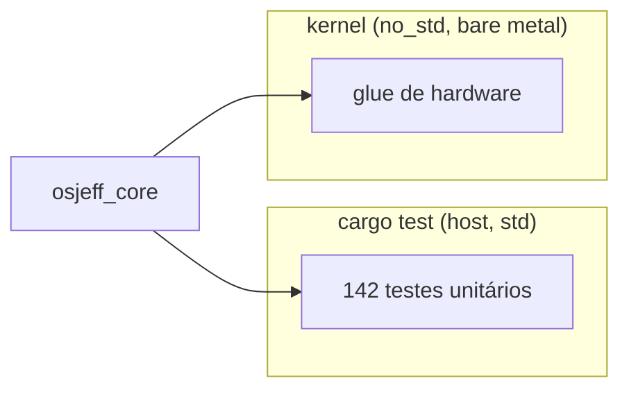
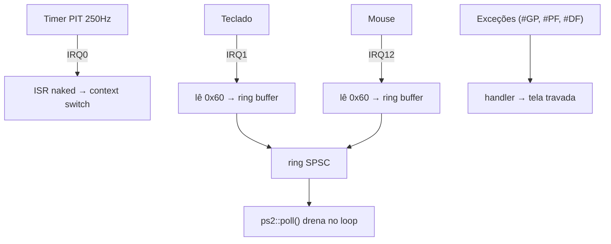
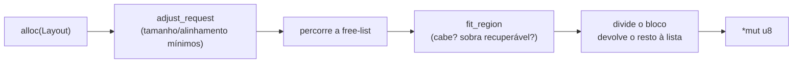
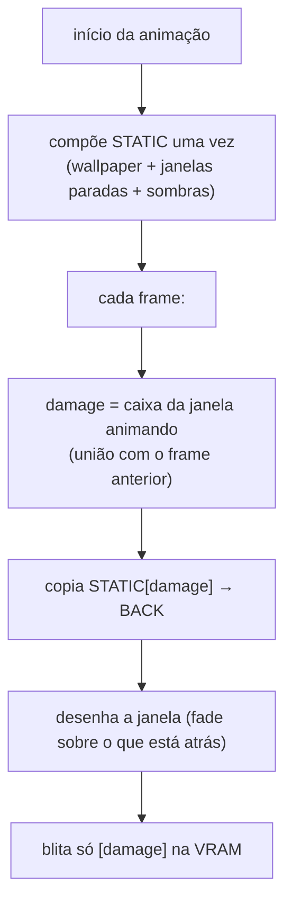
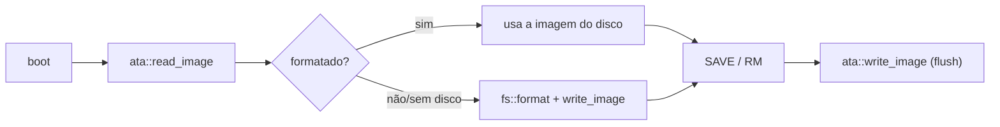

# Arquitetura do OSJeff

Mergulho técnico nos subsistemas do kernel. Para a visão geral e como rodar,
veja o [README](../README.md).

> **TL;DR** — OSJeff é um kernel x86_64 `no_std` que sobe direto do bootloader,
> sem nenhum SO por baixo. A lógica pura mora numa lib testável (`osjeff_core`);
> o kernel é a camada que fala com o hardware (framebuffer, portas, IDT, PIC,
> PIT, PS/2) e orquestra o desktop.

---

## 1. Separação lógica ↔ hardware

Um binário `no_std`/`no_main` **não roda `cargo test`** (não há harness de teste
sem `std`). A solução é mover toda decisão para uma biblioteca que compila com
`std` sob teste e `no_std` em produção:

```rust
// osjeff_core/src/lib.rs
#![cfg_attr(not(test), no_std)]
#![forbid(unsafe_code)]
```

Resultado: parser de comandos, modelo do editor, mapa de teclado, geometria de
janelas, easing de animação, tabela de processos e a **matemática do allocator**
são testados no host com ~98% de cobertura. O kernel fica só com o glue de
hardware — e o `unsafe` fica isolado e auditável.



---

## 2. Boot e composição de tela

O crate `bootloader` 0.11 gera uma imagem BIOS/UEFI, carrega o kernel em modo
longo (64-bit) e entrega um **framebuffer linear**. O `os` (builder) embute o
binário do kernel como *artifact dependency* (`-Z bindeps`).

### Double buffering + cache de fundo

- **`BG`** — wallpaper estático, pintado **uma vez** (gradiente + dois blobs de
  *glow* + dock).
- **`BACK`** — alvo de composição. Cada frame copia `BG → BACK`, desenha as
  camadas dinâmicas e blita `BACK → framebuffer`.
- **`STATIC`** — usado durante animações (ver §6).
- **`SCRATCH`** — snapshot do que está **atrás** de uma janela em fade.

### Primitivas (`fb.rs`)

`fill_rect` e `fill_round_rect` escrevem **por span** (linha inteira) no caminho
rápido RGB/BGR, em vez de passar pixel a pixel por `put` (que revalida bounds e
formato a cada pixel). Cantos arredondados usam `isqrt` para calcular o recuo de
cada linha. Há também `blend_pixel`/`fill_round_rect_alpha` (sombras e
translúcidos) e `draw_rgba` (blit do logo com alpha).

---

## 3. Interrupções



- **IDT** montada com o crate `x86_64` (definições de hardware; a lógica é nossa).
- **PIC 8259** remapeado para os vetores `0x20+` (senão IRQ0 colidiria com a
  exceção `#DF`). Máscaras liberam timer, teclado, cascata e mouse.
- **PIT** programado para 250 Hz (canal 0, modo 3).
- **Exceções fatais** (`#GP`, `#PF`, double fault) **travam com `hlt`** em vez de
  triple-faultar (que reiniciaria a máquina silenciosamente) — bugs ficam
  visíveis durante o desenvolvimento.

### Input por IRQ (ring buffer SPSC)

Os ISRs de teclado/mouse rodam com interrupções desabilitadas (não se preemptam),
então são um **único produtor**; o loop principal é o **único consumidor**. O
ring usa `head`/`tail` atômicos com ordenação `acquire`/`release` — lock-free, sem
busy-poll de portas. Cada byte carrega uma *tag* (teclado/mouse) no byte alto.

---

## 4. Heap allocator

A parte propensa a bug — **alinhamento e encaixe de região** — vive em
`osjeff_core::heap` e é testada. O kernel só faz o glue `unsafe` de escrever os
nós da free-list na própria memória.



Exposto como `#[global_allocator]` atrás de um **spin lock** que **desabilita
interrupções enquanto travado** — sem isso, uma preempção do timer com o lock
seguro levaria a thread seguinte a um deadlock ao tentar alocar.

---

## 5. Scheduler preemptivo

O coração do multitarefa. O timer **força** a troca de thread, sem cooperação.

### A troca de contexto (assembly puro — [`kernel/src/switch.s`](../kernel/src/switch.s))

A única coisa que **não dá para escrever em Rust**: trocar a pilha sob os próprios
pés e retornar em outra thread. Por isso vive num arquivo de assembly dedicado,
montado via `global_asm!(include_str!("switch.s"))`. Ele define o símbolo
`timer_isr` instalado na IDT para a IRQ0 e chama a metade Rust (`timer_schedule`).

```asm
; em cada tick do timer (IRQ0):
push rax ... push r15      ; salva todos os GP regs na pilha da thread atual
mov rdi, rsp               ; arg0 = rsp atual
call timer_schedule        ; salva rsp, fxsave/fxrstor, round-robin, retorna próxima
mov rsp, rax               ; troca para a pilha da próxima thread
pop r15 ... pop rax        ; restaura os regs dela
iretq                      ; restaura RIP/CS/RFLAGS/RSP/SS e continua
```

> **Estado FPU/SSE.** Os `push`/`pop` acima salvam só os registradores de uso
> geral. Os registradores de ponto flutuante/SSE (`xmm0..15`, `MXCSR`) são salvos
> à parte por `timer_schedule`, com `fxsave`/`fxrstor` numa área de 512 bytes
> (alinhada a 16) por thread — senão uma thread preemptada no meio de uma operação
> SSE teria seu estado corrompido por outra.

#### Onde mais há assembly

| Arquivo | Instruções | Necessidade |
|---|---|---|
| [`switch.s`](../kernel/src/switch.s) | `push`/`pop`/`iretq` | troca de contexto preemptiva |
| [`sched.rs`](../kernel/src/sched.rs) | `fxsave`/`fxrstor` | salvar/restaurar estado x87+SSE |
| [`io.rs`](../kernel/src/io.rs) | `in`/`out` (8/16-bit) / `rdtsc` | I/O de portas (PIC/PIT/PS2/CMOS/ATA) + TSC |
| [`main.rs`](../kernel/src/main.rs) | `hlt` | dormir a CPU quando ocioso |

### Nascimento de uma thread

Uma thread nova nunca "rodou", então `spawn` **fabrica** uma pilha que o epílogo
do ISR sabe restaurar: um frame `iretq` completo seguido de 15 registradores
zerados.

```
topo da pilha
┌─────────────┐  ← rsp da thread quando viva (≡ 8 mod 16, exigência do ABI)
│ SS          │
│ RSP         │  frame que o `iretq` consome
│ RFLAGS (IF) │
│ CS          │
│ RIP = entry │
├─────────────┤
│ rax … r15   │  15 regs zerados, que o epílogo do ISR faz `pop`
└─────────────┘  ← rsp salvo da thread (ponto de partida)
```

> **Detalhe que custou um triple-fault:** o ABI SysV exige `rsp ≡ 8 (mod 16)` na
> entrada de uma função. Errar isso faz o primeiro acesso SSE (`movaps`) dar
> `#GP` — **tolerado pelo TCG, mas fatal sob virtualização de hardware (WHPX)**.
> Encontrado com `qemu -d int,cpu_reset` e corrigido no cálculo do `entry_slot`.

### Prova de preempção

Os workers são **loops infinitos sem `yield`**. Ainda assim, o gerenciador mostra
CPU **idêntica** entre `compositor`, `worker-a` e `worker-b` (round-robin
perfeito) e a GUI continua respondendo — só possível porque o timer os
interrompe à força.

---

## 6. Compositor por damage tracking

O problema original: ao animar o **fechamento** de uma janela, quanto mais
janelas abertas, mais a animação travava. Cada frame recompunha **todas** as
janelas, e as paradas refaziam suas **sombras alpha (por pixel)**.

A solução é a técnica padrão de compositores (Wayland, DWM, Core Animation):
**damage tracking + cache de camada**.



Custo por frame: **O(área da janela)** — independe do número de janelas e do
tamanho da tela. As sombras das janelas paradas são compostas **uma vez** no
`STATIC`, não a cada frame.

O **fade** compõe sobre o conteúdo real atrás (snapshot em `SCRATCH`), não sobre
o wallpaper — por isso, ao fechar a janela da frente, a de trás aparece
corretamente, sem "buraco" transparente.

O **cursor** tem seu próprio *dirty-rect*: mover o mouse só restaura o retângulo
antigo do cursor e redesenha o sprite — nada de recompor a tela inteira.

---

## 7. Window manager e apps

`desktop.rs` mantém as janelas (rect, visível, z-order, animação, processo),
roteia input para a janela com foco e desenha tudo. A *lógica* dos apps é pura e
testada em `osjeff_core`:

- **`terminal`** — histórico em ring, linha de input com caret navegável, parser
  de comandos (`HELP`, `CLS`, `TIME`, `VER`, `ECHO`, `EDIT`, `PS`, e os de
  arquivo `LS`/`CAT`/`SAVE`/`LOAD`/`RM`).
- **`editor`** — buffer de texto multi-linha, cursor 2D, inserir/quebrar/juntar
  linhas, navegação, `set_text` para carregar um arquivo.
- **`calc`** — calculadora de 4 operações (semântica infix), com formatador
  decimal que evita intrínsecos de float do `std`.
- **`clipboard`** — buffer de texto compartilhado (Ctrl+C/Ctrl+V entre apps).
- **`window`** — geometria e hit-testing (título, botão fechar, união/interseção
  de retângulos para o damage).

Abrir um app **spawna um processo** (pid novo); fechar a janela **encerra** o
processo (removido da tabela). Processos de sistema (kernel/compositor) são
protegidos. O **ícone do sistema** abre um painel com todos os apps e os botões
de **Reiniciar**/**Desligar** (`power.rs`).

---

## 8. Filesystem e persistência

A lógica do filesystem (**`osjeff_core::fs`**, "OJFS") é pura e testada: uma
imagem de bytes fixa com magic + 16 registros `[used][nome][tamanho][dados]`.
Operações `format`/`write`/`read`/`remove`/`list` editam a imagem no lugar, sem
alocação — então rodam idênticas no host (com um array) e no kernel.



O kernel mantém a imagem em RAM (cópia alinhada a setor) e a sincroniza com o
disco via **`ata.rs`** — um driver **ATA PIO** (LBA de 28 bits) no canal IDE
secundário, separado do disco de boot. Todas as esperas são limitadas: um disco
ausente devolve `false` em vez de pendurar o boot, e o sistema cai para um
filesystem só em RAM. Cada `SAVE`/`RM` faz *flush* da imagem inteira (~17 KiB).

---

## Decisões de engenharia (resumo)

| Decisão | Motivo |
|---|---|
| Lógica em lib `no_std` + testes no host | Cobrir o que é difícil sem um runner de teste no kernel |
| `forbid(unsafe_code)` no core | `unsafe` só onde é inevitável (kernel), auditável |
| Damage tracking + layer cache | Animação O(janela), não O(janelas × tela) |
| Troca de contexto no ISR (não cooperativa) | Preempção real, independente de bom comportamento das threads |
| Spin lock com `cli/sti` | Evitar deadlock de alocação sob preempção |
| Exceções → tela travada | Tornar bugs visíveis em vez de reboot silencioso |
| `qemu -d int,cpu_reset` | Depurar faults sem hardware de debug |
