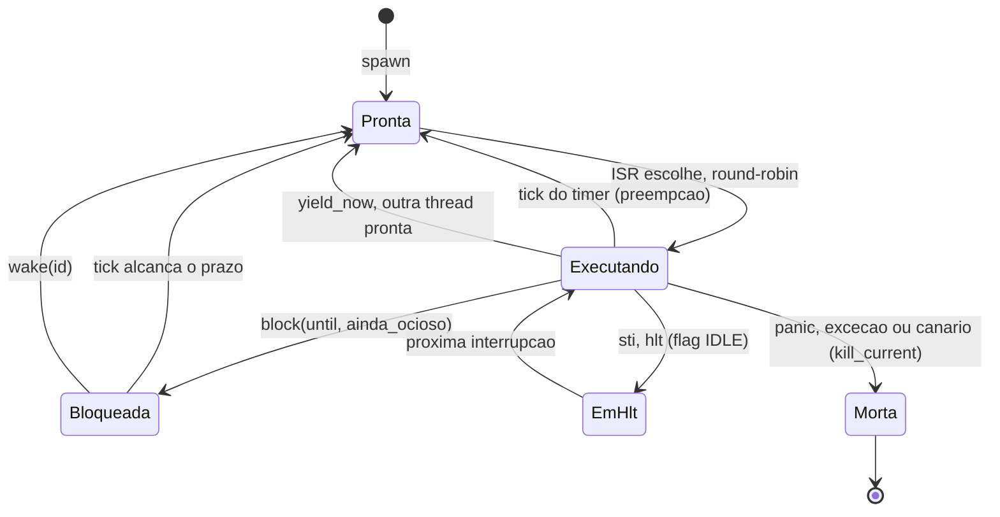
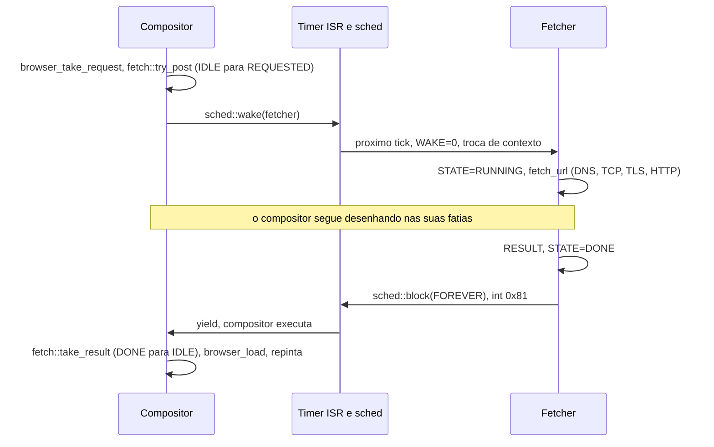
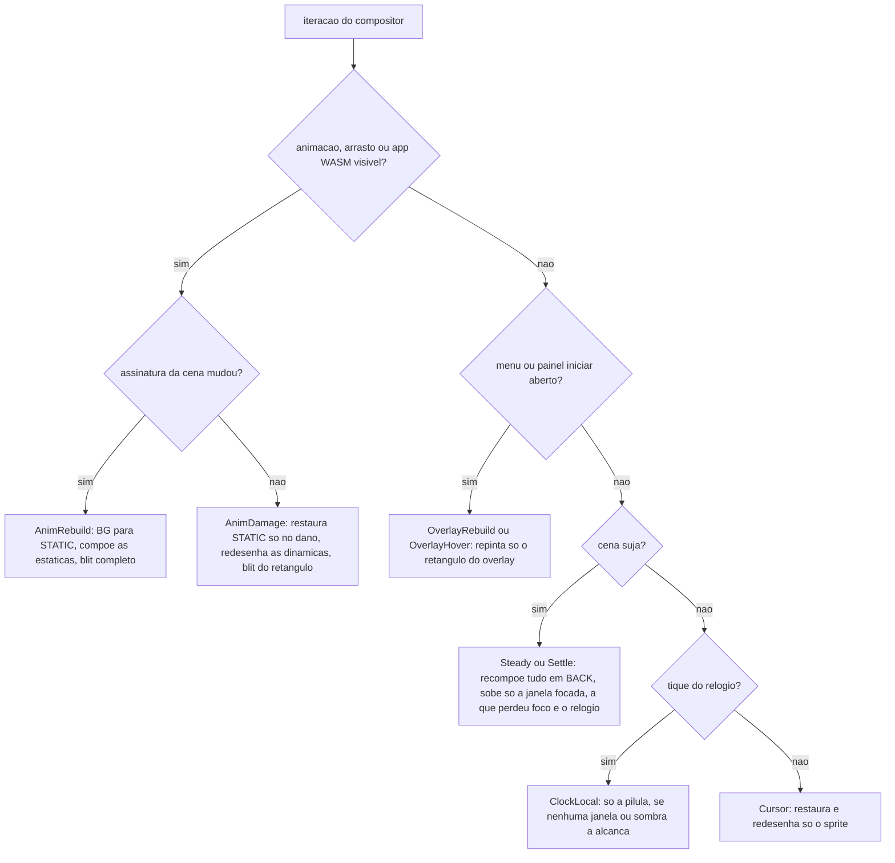

# Arquitetura do OSjeff

Documento de referência técnica. Descreve o sistema **como está no código deste
checkout**, não como se pretende que fique. Para compilar e rodar veja
[`BUILDING.md`](BUILDING.md); para verificação, [`TESTING.md`](TESTING.md); para o que
protege e o que não protege, [`SECURITY-MODEL.md`](SECURITY-MODEL.md); para o que
falta, [`ROADMAP.md`](ROADMAP.md). Os relatórios em [`audit/`](audit/README.md) são o
registro histórico da auditoria e **parte deles descreve um estado anterior às
correções**: onde divergem do código, vale o código.

Marcas de evidência: **[L]** lido no código (arquivo e função citados, sem números de
linha); **[M]** medido nesta revisão, QEMU 8.2.2 em TCG sem KVM (vale como proporção, não
como hardware real); **[A]** medido ou provado pela auditoria e **não repetido** aqui;
**[NV]** não verificado. Nada foi testado em hardware real.

## TL;DR

OSjeff é um SO x86_64 `no_std` em Rust que sobe direto de um bootloader (BIOS ou UEFI)
e mostra um desktop gráfico com 7 apps. **Tudo roda em ring 0, num único espaço de
endereçamento**; não existe modo usuário. O que separa "app" de "kernel" é convenção e
o `#![forbid(unsafe_code)]` do crate `osjeff_core`, não hardware.

- **Dois crates de código.** `osjeff_core` (~11,7 mil linhas com testes, 423 testes
  passando [M], sem `unsafe`): toda a lógica decidível. `kernel` (~11,0 mil linhas,
  0 testes): hardware, scheduler, compositor, drivers.
- **Multitarefa preemptiva** a 250 Hz, com bloqueio. Três threads: `compositor`,
  `fetcher` (rede), `wasmapp`.
- **Memória:** heap fixo de 64 MiB num BSS de ~91 MiB; sem alocador de frames. As page
  tables são do bootloader; o kernel só edita uma entrada de nível 1 por pilha de thread,
  para criar uma **guard page**.
- **Falhas:** todas as exceções têm handler. Um panic ou exceção no `fetcher` ou no
  `wasmapp` **mata só aquela thread** (log na serial, o resto segue). Falha no compositor,
  #DF/NMI/#MC, qualquer falha com interrupções desligadas ou durante a morte de uma thread
  pinta uma tela de erro e para a **máquina inteira**. A thread morta não é reiniciada
  nem liberada.
- **Rede, web e WASM:** NE2000 ISA, `smoltcp` configurado pelo DHCP do boot (IP, rota,
  DNS; fallback estático do SLIRP), TLS 1.3 **sem verificação de certificado**, motor
  HTML/CSS próprio, `wasmi` (um app por build).
- **Boot [M]:** primeiro frame em ~5 s (BIOS e UEFI) após a entrada do kernel, quase tudo
  é o splash.

## 1. Visão geral e fronteira core ↔ kernel

| Crate | Tipo | Tamanho | Papel |
|---|---|---|---|
| `osjeff_core` | lib, `no_std` fora de testes, `forbid(unsafe_code)` | 11,7 mil linhas, 423 testes [M] | lógica pura, testável no host |
| `kernel` | bin `x86_64-unknown-none`, `test = false` | 11,0 mil linhas + `switch.s` (85) | hardware, scheduler, compositor, drivers, rede, WASM |
| `os` | builder | ~70 linhas | `build.rs` gera `osjeff-bios.img` e `osjeff-uefi.img`; `main.rs` lança o QEMU |

Fora do workspace, cada um com seu `Cargo.lock`: `fuzz/` (3 alvos), `bench/` (criterion,
host) e `wasm-apps/*` (guests). O kernel é *artifact dependency* do `os` (`-Z bindeps`):
`os/build.rs` recebe o ELF e chama `bootloader::BiosBoot` e `UefiBoot`.

- **Toolchain:** `nightly-2026-10-05`, fixado em `rust-toolchain.toml` (o nightly é
  necessário por `abi_x86_interrupt` e `-Z bindeps`); edição 2024.
- **Versões** (`Cargo.lock`): `bootloader` 0.11.17 (no `os`), `bootloader_api` 0.11.17,
  `x86_64` 0.15.5, `smoltcp` 0.12.0, `embedded-tls` 0.19.0, `wasmi` 1.1.0.
- **SSE:** o alvo compila com `-mmx,-sse,-sse2,...,+soft-float` [M]; por isso
  `.cargo/config.toml` força os backends de software de `aes`/`polyval`/`ghash` e o `sha2`
  usa `force-soft`. Release: `opt-level = 3`, LTO; `panic` não é forçado (o alvo já aborta
  e os testes do core precisam de unwinding).

Quem fica de cada lado:

| `osjeff_core` (testado no host) | `kernel` (ring 0) |
|---|---|
| `terminal`, `editor`, `calc`, `clipboard`, `keymap`, `process`, `anim` | `main.rs` (boot e laço do compositor), `gdt`, `interrupts`, `switch.s`, `sched`, `crash`, `vm` |
| `fs` (OJFS), `net`, `redirect`, `rng` | `allocator`, `sync`, `io`, `serial` |
| `web` (HTML, CSS, layout), `browser` | `fb`, `font`, `icons`, `desktop/*` |
| `layout`, `wm`, `window`, `gfx`, `heap`, `paging`, `schedule` | drivers: `ps2`, `rtc`, `ata`, `ne2000`, `pci`, `virtio*`, `power` |
| `hw::{ps2, rtc, ata, pci, virtio, perf}` | `netstack`, `fetch`, `wasm/*`, `perf`, `trace` |


Regra do projeto: **decisão vai para o core com teste; o kernel liga o hardware a ela.**
O kernel faz a porta de E/S ou o MMIO e entrega bytes a `osjeff_core::hw::*`, que
decodifica (PS/2, BCD/12h/fuso do RTC, `IDENTIFY` e LBA do ATA, varredura PCI, capabilities
virtio, estatísticas do HUD, a conta de páginas das guard pages em `paging`, a escolha
da próxima thread em `schedule`), ou a `gfx`, `layout`, `wm`, `redirect`. A regra **ainda
não vale para tudo** [L]: o despacho de entrada (`desktop/input.rs`), a lógica de dano
(`desktop/render.rs`), as primitivas de `fb.rs`, o ring de eventos do WASM e os drivers
de porta de E/S seguem no kernel, sem teste automatizado. O comentário de `lib.rs`
("toda a lógica de decisão") é uma meta, não um fato.

## 2. Boot e memória

### 2.1 Cadeia de boot

| Caminho | Etapas [A] | Fatos |
|---|---|---|
| **BIOS** | setor de boot, stage-2 (modo real, e820, escolhe VESA), stage-3 (paginação), stage-4 | o stage-2 limita o VESA a **1280x720** (valores fixos no crate do bootloader [L]); saiu **24 bpp** [M] |
| **UEFI** | `exit_boot_services`, carrega o kernel | usa o **modo GOP corrente** [L]; no QEMU/OVMF saiu **1280x800, 32 bpp** [M] |

Passos comuns do bootloader [A, conferidos em parte contra o fonte de 0.11.17]: liga NXE
e CR0.WP; mapeia cada segmento do ELF com NX se não-executável e escrita só se gravável
(**o W^X da imagem vem daqui**); aloca a pilha de boot com **uma página de guarda**;
mapeia o framebuffer; mapeia **toda a memória física** em `physical_memory_offset` com
páginas de 2 MiB, RW+NX; cria o `BootInfo` e salta para o kernel.

`BOOT_CONFIG` (`main.rs`) muda duas coisas do default: `physical_memory = Dynamic` (o
virtio traduz endereços) e `kernel_stack_size = 512 KiB` (era 80 KiB). Medido [M]:
`physical_memory_offset = 0x28000000000`, kernel PIE em `0x10000000000`. O kernel não lê
`memory_regions` nem `rsdp_addr` e não toca em CR0/CR4/EFER; só lê CR3 e edita uma PTE
por pilha de thread (§2.6, §3.1).

### 2.2 Sequência de `kernel_main`

```text
serial -> vm::init(physical_memory_offset) -> framebuffer (registra p/ crash, guarda de
tamanho, zera) -> BACK/BG/STATIC
-> ALLOCATOR.init(HEAP 64 MiB) + smoke test -> wasm::run_demo (sem IRQ ainda)
-> PCI + sonda virtio-gpu -> ata::detect -> gdt::init -> sched::init (acha a guard page
da pilha de boot) -> ps2::init
-> interrupts::init (IDT, PIC, PIT 250 Hz, sti) -> calibra TSC (25 ticks)
-> ne2000::init + DHCP (NetConfig) + ARP gratuito -> spawn fetcher (só com NIC, stack
com guard page) e wasmapp
-> splash -> wallpaper em BG -> Desktop::new (lê o FS do ATA) -> laço do compositor
```

A ordem importa [L]: `gdt::init` precede `sched::init` e `interrupts::init` porque os gates
da IDT e `spawn` capturam os seletores `CS`/`SS` vivos, e `vm::init` precede `spawn`
porque criar a guard page exige o `physical_memory_offset`; `ps2::init` roda antes de `sti`
para o handshake não correr com as ISRs. Marcos de boot saem na serial em qualquer build
(`[trace] boot + N ms`). Medidos [M]: demo WASM 60-75 ms, calibração do TSC ~100 ms,
splash 4,2 s (UEFI) a 4,8 s (BIOS), `Desktop::new` 30-40 ms. O splash é um laço ocupado
que sai com `el >= 5` em segundos inteiros do RTC, então dura entre 4 e 5 s, não "≥ 5 s"
como diz o rótulo do marco. O virtio-gpu é **só sondado**: o scanout continua sendo o
framebuffer do bootloader, e no runner padrão o dispositivo nem existe [M].

### 2.3 Layout de memória

O arquivo de imagem tem ~4,6 MiB, mas o **bootloader materializa o BSS inteiro** (um
frame físico por página, zerado). O custo do BSS é RAM. Segmentos do ELF neste build
[M, `readelf`]: `R`, `R E` (~1,5 MiB), `RW` (~29 KiB) e `RW` com `MemSiz = 0x5b28900`
(**95.586.560 B, 91,16 MiB** de `.data`+`.bss`).

| Símbolo | Bytes | Uso |
|---|---|---|
| `HEAP` | 67.108.864 (64 MiB) | único heap do sistema |
| `BACK`, `BG`, `STATIC` | 3 x 8.294.400 | buffers de render, 1920x1080x4, alinhados a 64 B |
| `wasm::SURFACE` | 2.291.904 | 2 x 692x414x4, duplo buffer do app WASM |
| `desktop::SCRATCH` | 1.126.400 | 640x440x4, o que está atrás de uma janela em fade |
| `desktop::DISK` | 50.688 | imagem OJFS em RAM (99 setores) |
| `gdt::IST_STACK`, `gdt::PF_IST_STACK` | 2 x 32.768 | pilhas IST do #DF e do #PF |
| `TLS_RX`, `TLS_TX` | 2 x 16.384 | registros TLS |
| `virtio_gpu` (3 páginas), `EVENTS`, `RING`, demais | ~27 KiB | |

Heap e buffers são 96% do BSS. O resto da RAM física **não é usado**: não há alocador de
frames.

### 2.4 Framebuffer e a guarda de tamanho

| Modo [M] | Formato | Bytes |
|---|---|---|
| BIOS | 1280x720, `Bgr`, 3 B/px, stride 1280 | 2.764.800 |
| UEFI | 1280x800, `Bgr`, 4 B/px, stride 1280 | 4.096.000 |

Os buffers de render são fixos em 1920x1080x4. `kernel_main` calcula
`n = min(fb.len, MAX_BYTES)` e `fb_need = stride * height * bpp`; se `fb_need > n` chama
`crash::die(Kind::Unsupported, ...)`, que pinta **"UNSUPPORTED SCREEN"** com a resolução
detectada e para. Sem a guarda o `Canvas` (que indexa com o `info` real) estouraria o
buffer com um panic mudo. Uma tela 1920x1200 a 32 bpp (9,2 MB) é recusada. Em BIOS
(24 bpp) cada buffer usa só ~2,8 dos 8,3 MB; os caminhos rápidos de 32 bpp só valem com
`bpp == 4`.

### 2.5 RAM mínima

Conta [L]: BSS 91,16 MiB + ELF ~1,8 MiB + pilha de boot + tabelas de página, em frames
acima de 1 MiB. **UEFI com 128 MiB não chega ao kernel**: o bootloader panica em
`load_kernel.rs` (`Option::unwrap()` sobre `None`, ao mapear o BSS) [M]. **192 MiB boota**
(desktop em ~4,8 s, com as guard pages instaladas [M]), o mínimo registrado em
`os/src/main.rs`; 256 MiB (valor de `os/src/main.rs` e `run.ps1`) boota em UEFI e BIOS
[M]. BIOS com 128 MiB boota [A], não repetido. No UEFI o alocador do bootloader só usa
regiões `CONVENTIONAL` e o OVMF consome parte da RAM; a causa exata do limite de 192 MiB
é **[NV]**.

### 2.6 Pilhas

- **compositor** (thread 0): a pilha de **512 KiB** do bootloader, que tem uma página de
  guarda não mapeada logo abaixo; `sched::init` a acha descendo página a página a partir
  do `rsp` (`vm::find_guard_below`). O estouro é reportado como tal, mas continua fatal.
- **`fetcher` e `wasmapp`:** `sched::spawn` aloca com `alloc_zeroed` um bloco **alinhado a
  4096** de 1 página de guarda mais **128 KiB**, e `vm::unmap_page` tira a guarda das page
  tables (limpa `PRESENT` na PTE de nível 1 e faz `invlpg`). O bloco **nunca é liberado**
  (devolver ao allocator uma página não mapeada o faria faltar ao escrever o nó da
  free-list). Isso só é possível porque o `.bss` do kernel, onde mora o heap, é mapeado
  com páginas de 4 KiB, e `vm` recusa páginas de 2 MiB ou 1 GiB. Em BIOS e UEFI as duas
  guardas foram instaladas (`sched: 'fetcher' stack ..., guard page ...` na serial) [M].
- **Canário** de 8 B no menor endereço: só como *fallback*, plantado quando a guarda não
  pôde ser instalada (§4.5).
- **IST:** #DF e #PF têm 32 KiB estáticos cada (§3.2).

Folga medida pela auditoria, antes das guard pages [A, sem handshake TLS real]: compositor
~11 KiB, `fetcher` ~9 KiB, `wasmapp` ~13 KiB; o pico do `fetcher` num handshake real é
**[NV]**. A pilha de boot subiu de 80 para 512 KiB porque o layout HTML/CSS recursivo e o
TLS são os usuários mais fundos.

## 3. Privilégio, GDT/TSS, exceções e falhas

### 3.1 Modelo de privilégio

- **Tudo em ring 0**: nenhum descritor de usuário, nenhuma página `USER_ACCESSIBLE`,
  nenhum `syscall`/`sysret` [L, `grep`]. O único `iretq` escrito à mão é o de `switch.s`.
- **Um espaço de endereçamento**: o CR3 do bootloader, nunca trocado. O kernel o **lê**
  (`virtio.rs` traduz endereços; `vm.rs` caminha as tabelas pelo `physical_memory_offset`)
  e **edita um único tipo de entrada**: limpa `PRESENT` na PTE de nível 1 de cada guard
  page de pilha (`vm::unmap_page`, com `invlpg`). Não cria tabelas nem mapeia nada, e
  recusa páginas de 2 MiB ou 1 GiB. A matemática (índices por nível, entrada presente ou
  huge, página canônica) é de `osjeff_core::paging`, testada no host.
- **Toda a RAM física está mapeada RW+NX**, inclusive as page tables: qualquer código do
  kernel, ou um guest WASM que escape do interpretador, alcança tudo.
- **W^X e NX** valem para o que o bootloader mapeia (texto `R-X`, `.rodata` `R--`,
  `.data`/`.bss`/heap/pilhas `RW-` NX); escrever em `.text` e executar do heap dão #PF
  [A]. Sem SMEP/SMAP.

A escolha entre ring 3 e WASM como fronteira está em
[`audit/adr-isolamento.md`](audit/adr-isolamento.md) (status **Proposto**).

### 3.2 GDT, TSS e IST (`gdt.rs`)

O bootloader deixa uma GDT mínima e **nenhum TSS**. Sem TSS, um #PF ao empilhar o frame
numa pilha esgotada escala para #DF e triple fault: reset silencioso. `gdt::init` monta a
GDT própria (código, dados, TSS), recarrega `CS/SS/DS/ES` e faz `ltr`. O TSS preenche
**duas** entradas IST, cada uma com uma pilha estática de 32 KiB: **IST[0] para o #DF** e
**IST[1] para o #PF**. O #PF precisa da sua: uma thread que estoura a pilha acerta a guard
page com o `rsp` ainda no fim da pilha esgotada, onde a CPU não consegue empilhar o frame.
Slots distintos evitam que uma falha *dentro* do handler de #PF seja entregue por cima da
pilha que ele já usa. Não há RSP0 (não há ring 3). NMI e #MC rodam na pilha corrente. Que o
estouro da pilha de boot chegue ao #DF e produza a tela de erro, em BIOS e UEFI, foi mostrado
com `-d cpu_reset` antes do IST do #PF existir [A]; a trilha atual de estouro de pilha
(guard page, #PF na IST[1], morte da thread) **não foi disparada por mim nesta revisão
[NV]**.

### 3.3 IDT e fontes de interrupção (`interrupts.rs`)

| Vetor | Handler | Observação |
|---|---|---|
| `#DE`, `#UD`, `#NP`, `#SS`, `#GP`, `#OF`, `#BR`, `#NM`, `#TS`, `#MF`, `#AC`, `#XM` | `fatal` → `crash::fault` | **contidas** (mata a thread) se couber (§3.4); senão `die` |
| `#PF` | `page_fault` na **IST[1]** → `crash::fault` | acerto numa guard page vira "stack overflow in thread '<nome>'" (`sched::guard_owner`) |
| `#DF` | `double_fault` na **IST[0]** | sempre fatal (`fatal_always` → `die`) |
| `#DB`, NMI, `#MC`, `#VE`, `#CP`, `#HV`, `#VC`, `#SX` | `fatal_always` → `die` | sempre fatais: indicam hardware ou kernel quebrado, não uma thread |
| `#BP` | handler vazio | retorna |
| 32 (IRQ0) | `timer_isr` (asm) | tick e troca de contexto |
| 0x81 | `yield_isr` (asm) | troca voluntária, sem tick nem EOI |
| 33, 44 (IRQ1, IRQ12) | `keyboard`, `mouse` | lêem a porta `0x60`, empurram no ring, EOI |
| 39, 47 (IRQ7, IRQ15) | `spurious_master`, `spurious_slave` | lêem o ISR do PIC: EOI só se o bit 7 estiver setado; no IRQ15 o mestre recebe EOI sempre (aceitou a cascata). Os 4 primeiros são logados |

PIC 8259 remapeado para `0x20`/`0x28`, máscaras `0xF8` (IRQ0, 1, cascata) e `0xEF`
(IRQ12). PIT canal 0, modo 3, divisor `1193182 / 250` (**250 Hz**, tick de 4 ms). Sem
APIC nem SMP. Os handlers são gates de interrupção (IF zerado na entrada).

**Ring de entrada.** As ISRs de teclado e mouse empurram um `u16` (fonte no byte alto)
num ring SPSC de 512 entradas, `head`/`tail` atômicos com Acquire/Release; cheio, o byte
é descartado. O único consumidor é `ps2::poll`, no compositor.

### 3.4 Falhas: thread morta ou máquina morta (`crash.rs`, `sched.rs`)

Panic e exceções passam por `crash::fault(tipo, subtítulo, mensagem, frame, if_was_set)`,
que decide entre **matar só a thread** e **parar a máquina** com `crash::die`.
`sched::containable(if_was_set)` exige, ao mesmo tempo:

1. **não ser o compositor** (slot 0): perder o desktop é perder a máquina;
2. **IF=1 no contexto que falhou** (RFLAGS.IF do código que faltou, ou o IF vivo num
   panic): gates de interrupção e `SpinLock` rodam com IF=0, então IF=1 prova que não
   estávamos numa ISR (IRQ meio atendida, sem EOI) nem dentro do lock do heap, e nenhum
   lock fica preso por uma thread que some;
3. **não estar já matando** outra thread (`KILLING`) e haver mais de uma thread.

**Caminho contido.** `sched::kill_current(motivo)` (IF=0): loga na COM1
`thread '<nome>' died: <motivo>`, marca `DEAD[slot]`, escolhe a próxima thread com
`osjeff_core::schedule::next_runnable` (que nunca devolve uma thread morta), faz `fxrstor`
da próxima e salta para o contexto salvo dela com `resume_context` (`switch.s`),
**abandonando a pilha atual** (que pode ser a esgotada, ou a IST do #PF). Efeitos
visíveis: o Gerenciador de tarefas mostra `DEAD` no lugar dos ticks; o navegador mostra
`FailReason::WorkerDied` ("O carregador de paginas falhou"); a janela WASM mostra "App WASM
encerrado". O canário violado também mata a thread, a partir da própria ISR do timer.

**Continua fatal** (`die`): falha no compositor; #DF, NMI, #MC, #DB e demais abortos
(`fatal_always`); qualquer falha com IF=0 (numa ISR ou sob o spin lock do heap); uma falha
durante a morte de uma thread; framebuffer não suportado. `die` desabilita interrupções,
escreve **uma linha na COM1** (`KERNEL PANIC: ...` ou `FATAL EXCEPTION: ... rip= rsp=
rflags= cr2=`), pinta uma **tela de erro** direto no framebuffer registrado (faixa `KERNEL
PANIC` / `CPU EXCEPTION` / `UNSUPPORTED SCREEN`, mensagem, nome da thread,
RIP/RSP/RFLAGS/CR2/código) e para em `cli; hlt`; se já está dentro de `die`, só faz
`cli; hlt`. Não usa alocação, locks nem os buffers do compositor. Falha de alocação também
é um `panic!`. Capturas reais: `docs/img/panic-*.png`. A lógica de escolha da próxima
thread e de páginas é testada no host (`schedule`, `paging`); **a trilha de morte em si
(`kill_current` e `resume_context`) é de kernel e não tem teste automatizado**, e eu não a
disparei nesta revisão **[NV]**.

**O que ainda NÃO existe:**

- **Liberar os recursos de uma thread morta:** pilha (e sua guard page), memória do heap
  que ela alocou e, no `wasmapp`, a `Store` do `wasmi` continuam alocadas.
- **Locks que a thread segurava com IF=1 ficam presos** para sempre (só o lock do heap é
  imune, porque roda com IF=0).
- **Reiniciar a thread:** nunca. Um slot morto continua contando em `thr N` do HUD.
  Sem `fetcher`, o navegador falha toda navegação; sem `wasmapp`, o app não volta.
- O compositor é um ponto único de falha; NMI e #MC sem pilha própria; sem watchdog,
  reinício automático, dump ou backtrace.

### 3.5 FPU/SSE

O kernel é compilado sem SSE e nada nele usa `xmm` ou x87 (`f32` é emulado). O
`fxsave`/`fxrstor` por thread de `sched.rs` (512 B alinhados a 16, semeados com o estado
vivo) é hoje **defensivo e inerte**: com `CR4.OSFXSR` desligado (BIOS deixa `CR4 = 0x20`;
o firmware UEFI liga [A]) nem salva `xmm`. O alinhamento `rsp ≡ 8 (mod 16)` das threads
novas segue o ABI SysV, mas sem SSE nenhum `movaps` o exige: a história de que errá-lo
dava `#GP` fatal sob WHPX não tem sustentação no código atual.

## 4. Interrupções e scheduler

### 4.1 Threads

| Slot | Thread | Existe quando | Pilha | Se falhar |
|---|---|---|---|---|
| 0 | `compositor` (`kernel_main`) | sempre, é o contexto de boot | 512 KiB do bootloader, guard page achada por `sched::init` | **fatal** (tela de erro) |
| 1 | `fetcher` (`fetch::worker`) | só se `ne2000::init()` achou a placa | 128 KiB do heap + guard page | morre sozinha |
| 1 ou 2 | `wasmapp` (`wasm::worker`) | sempre, mesmo sem janela WASM | 128 KiB do heap + guard page | morre sozinha |

`MAX_THREADS = 8` (`assert!` em `spawn`). Threads **nunca terminam por conta própria**: a
entrada é `extern "C" fn() -> !` e a tabela só cresce; a única saída é morrer (§3.4), e o
slot morto continua contando em `thread_count`. O HUD mostra `thr 3` (2 sem NIC).

### 4.2 Política e estados

Round-robin de quantum fixo (1 tick, 4 ms), sem prioridades. Uma thread é **executável**
se não está morta **e** `WAKE[i] <= agora`: `0` é "pronta" e `FOREVER` (`u64::MAX`) é
"estacionada até `wake`". A escolha é `osjeff_core::schedule::next_runnable(cur, n, pred)`
(testada no host): tenta `cur+1, cur+2, ..., cur`, então a thread atual é a **última**
candidata e só continua se ainda for executável; devolve `None` se nenhuma é (o kernel
então para, mas o compositor nunca morre). O estado compartilhado entre ISR e threads
(`WAKE`, `TICKS`, `IDLE`, `DEAD`, `CURRENT`) é atômico: a ISR não usa locks nem aloca.


```mermaid
stateDiagram-v2
    [*] --> Pronta: spawn
    Pronta --> Executando: ISR escolhe, round-robin
    Executando --> Pronta: tick do timer (preempcao)
    Executando --> Pronta: yield_now, outra thread pronta
    Executando --> Bloqueada: block(until, ainda_ocioso)
    Bloqueada --> Pronta: tick alcanca o prazo
    Bloqueada --> Pronta: wake(id)
    Executando --> EmHlt: sti, hlt (flag IDLE)
    EmHlt --> Executando: proxima interrupcao
    Executando --> Morta: panic, excecao ou canario (kill_current)
    Morta --> [*]
```

`EmHlt` não é estado do scheduler, só a marca `IDLE[i]` para a contabilidade de CPU: a
thread segue executável. `Morta` é terminal: o slot nunca mais é escolhido.

### 4.3 Troca de contexto (`switch.s`)

A única parte que não dá para escrever em Rust: trocar de pilha e retornar noutra thread.
Uma macro de assembly serve **dois vetores**, `timer_isr` (IRQ0) e `yield_isr`
(`int 0x81`): empilha os 15 registradores gerais, passa `rsp` ao lado Rust, troca `rsp`
pelo valor devolvido, restaura e faz `iretq`. O lado Rust do timer (`timer_schedule`)
faz `TICKS += 1`, chama `sched::switch_current` (credita o tick, escolhe a próxima) e dá
**EOI antes do `iretq`**; o do yield (`yield_schedule`) só escolhe, sem tick nem EOI.
Quando a próxima é outra thread, `reschedule` faz `fxsave` da atual, grava seu `rsp` e faz
`fxrstor` da próxima. O epílogo é uma macro (`RESTORE_AND_IRET`) reaproveitada por um
terceiro ponto de entrada, `resume_context(rsp)`: carrega `rsp`, restaura os 15 registradores
e faz `iretq` **sem voltar ao chamador**, que é como `kill_current` sai de uma thread morta.

**Nascimento de uma thread:** `spawn` fabrica a pilha que o epílogo da ISR sabe
restaurar: de `thread_rsp = (topo & !0xF) - 8` para baixo, um frame de `iretq` (`SS`,
`RSP`, `RFLAGS = 0x202`, `CS`, `RIP = entrada`) e 15 registradores zerados; canário de
8 B no menor endereço. `spawn` é `pub fn` segura que **exige IF=0 por convenção**
(`kernel_main` a chama em `without_interrupts`).

### 4.4 Bloquear, acordar, ocioso

`block(until, ainda_ocioso)` grava `WAKE[eu] = until` e **só então** reavalia
`ainda_ocioso()`, para que um `wake` que corra com o anúncio não se perca; enquanto ocioso
faz `yield_now()` e `halt_unless` (`cli`, reavalia, `sti; hlt` atômico). `wake(id)` zera
`WAKE[id]`, de qualquer contexto; `yield_now` é no-op com IF=0. `sched::idle(tem_trabalho)`
é o passo ocioso do compositor: com IF=0 testa a entrada pendente; se outra thread está
executável, cede com `yield_now`; senão `sti; hlt`. Substituiu um `hlt` nu, que tinha
janela de *lost wakeup* e queimava a fatia inteira. Efeito [A]: o compositor acorda a cada
tick de 4 ms ou numa IRQ de entrada, e workers ociosos **não custam fatia**.


```mermaid
sequenceDiagram
    participant C as Compositor
    participant S as Timer ISR e sched
    participant F as Fetcher
    C->>C: browser_take_request, fetch::try_post (IDLE para REQUESTED)
    C->>S: sched::wake(fetcher)
    S->>F: proximo tick, WAKE=0, troca de contexto
    F->>F: STATE=RUNNING, fetch_url (DNS, TCP, TLS, HTTP)
    Note over C,F: o compositor segue desenhando nas suas fatias
    F->>F: RESULT, STATE=DONE
    F->>S: sched::block(FOREVER), int 0x81
    S->>C: yield, compositor executa
    C->>C: fetch::take_result (DONE para IDLE), browser_load, repinta
```

### 4.5 Contabilidade de CPU, guard pages e canário

- **CPU:** a ISR soma 1 em `TICKS[atual]` só se `IDLE[atual]` for falso, isto é, só conta
  o tick em que a thread **estava executando**, não parada em `hlt`. O Task Manager
  mostra esses ticks acumulados (coluna `CPU`), não um percentual, ou `DEAD` se a thread
  morreu. É amostragem a 250 Hz.
- **Guard page (mecanismo principal).** Estourar a pilha de `fetcher` ou `wasmapp` acerta
  uma página não mapeada: #PF na IST[1], `sched::guard_owner(cr2)` reconhece a guarda de
  qual thread foi e a mensagem vira `stack overflow in thread '<nome>': guard page hit at
  ...`; a thread morre (§3.4). A guarda falta no primeiro acesso, não no próximo tick; um
  frame grande não a pula porque o rustc sonda cada página de um frame grande (comentário
  de `sched.rs`; não o verifiquei).
- **Canário (só *fallback*).** `0xDEAD_C0DE_CAFE_F00D` nos 8 B mais baixos da pilha, plantado
  **apenas** se a guard page não pôde ser instalada (sem `physical_memory_offset`, página
  huge). É checado em `reschedule` para a thread que acabou de rodar, a cada tick ou
  yield, e uma violação **marca a thread morta na própria ISR**, sem `panic!`. É fraco:
  detecção tardia (as escritas já passaram), 8 bytes, e um teste forçado da auditoria
  mostrou corrupção do heap antes da detecção [A]. Nas duas execuções desta revisão o
  fallback não foi usado (as duas guardas foram instaladas) [M].
- O compositor também tem guarda (a do bootloader); estourá-la é fatal.

## 5. Allocator e concorrência

### 5.1 Allocator (`allocator.rs`, `osjeff_core::heap`)

- Free-list **ordenada por endereço**, *first-fit*, com **coalescência** a cada `dealloc`
  (funde com o seguinte e com o anterior); alocar e liberar são O(n); `realloc` e
  `alloc_zeroed` são os padrões de `GlobalAlloc`.
- **Matemática em `osjeff_core::heap`** (testada no host): `adjust_request` leva o pedido
  a pelo menos um nó (16 B) e ao alinhamento do nó; `fit_region_split` devolve
  `front + tamanho + excess` somando exatamente a região, com `checked_add`. Região cuja
  sobra final ficaria entre 1 e 15 B é rejeitada (o first-fit segue); vão frontal pequeno
  demais empurra a alocação ao próximo endereço alinhado. **Correção do padding frontal:**
  esse vão antes vazava; `alloc` agora o devolve à lista.
- **Lock:** `SpinLock` que **desabilita interrupções enquanto travado** e restaura o IF
  anterior no `Drop`. Sem isso, um tick com o lock seguro levaria a thread seguinte a girar
  para sempre na mesma trava. Não é reentrante; **nenhuma ISR aloca** [L].
- **Pilhas de thread** saem deste heap (bloco de 4096 B de alinhamento) e **nunca voltam**:
  uma delas tem uma página sem `PRESENT`, e a free-list escreveria nela ao liberar. O
  alinhamento de 4096 usa o mesmo caminho de `front`/`excess` acima.
- Esgotado, `alloc` devolve `null`, que vira `panic!` (§3.4: fatal no compositor; num
  worker com IF=1 mata só a thread). Não há quota por consumidor; os tetos são por origem
  (resposta HTTP 256 KiB, memória WASM 24 MiB).
- `HEAP` é `[u8; 64 MiB]` com alinhamento 1 em Rust; `init` exige 8 B e só tem
  `debug_assert!` (o linker o põe alinhado a página). O boot roda um smoke test (alocar,
  crescer, fragmentar, exigir um bloco maior que qualquer pedaço).

### 5.2 Concorrência

A máquina é **single-core com preempção por timer**, o que não é single-thread. Cada
estático tem uma disciplina escrita: escrito antes de `sti`, ISR com IF=0, dono único por
thread, ou máquina de estados atômica. `RacyCell<T>` (`sync.rs`) é `UnsafeCell` mais
`unsafe impl Sync` e entrega só `*mut T`: **não prova nada**, só lembra que o compilador
não verifica.

| Estático | Quem acessa | Disciplina |
|---|---|---|
| `BACK`, `BG`, `STATIC`, `SCRATCH`, `DISK`, `DECODER`, `trace::{MARKS,STATS}` | só o compositor | dono único |
| `HEAP` | só o allocator | spinlock com IF=0 |
| `IDT`, `GDT`, `TSS`, `IST_STACK`, `PF_IST_STACK`, `crash::SCREEN` | boot escreve; a CPU (ou `die`) lê | antes de `sti`; `SCREEN_READY` Release/Acquire |
| `SCHED` | ISR (muta `rsp`, `current`, FPU), `kill_current`, o handler de #PF (`guard_owner`, leitura) e compositor (`init`, `spawn`, leitura de `name`/`len`) | `spawn` com IF=0. **Formalmente o `&mut` da ISR sobrepõe os `&` de leitura** (inclusive o do #PF) |
| `WAKE`, `TICKS`, `IDLE`, `DEAD`, `KILLING`, `CURRENT`, `interrupts::TICKS`, `vm::PHYS_OFFSET` | ISR, threads e handlers de falha | atômicos |
| input `RING`; `wasm::{EVENTS,EV_HEAD,EV_TAIL}` | produtor e consumidor distintos | SPSC com Acquire/Release |
| `fetch::{NET, REQ_URL, REQ_LEN, RESULT}` | compositor posta, `fetcher` consome e devolve | máquina atômica `STATE` |
| `ne2000::NEXT` e a NIC | compositor (boot, responder) **ou** `fetcher` | **só por protocolo**: o compositor só toca a NIC com `fetch::is_idle()`; sem lock |
| `netstack::{TLS_RX,TLS_TX}`, `wasm::{APP,FB_INFO}`, `virtio_gpu::*` | só o worker dono (virtio: boot e DMA) | dono único |
| `wasm::SURFACE` + `FRONT`/`READY` | worker escreve o buffer de trás, compositor lê o da frente | atômicos, **sem lock**: um compositor preemptado no meio de `blit_surface` pode copiar um quadro rasgado |

Não há `static mut` no kernel nem no core (os guests `snake` e `plasma` usam, mas é
memória do guest).

**Pontos frágeis** [L]: `RacyCell` é `Sync` sem `T: Send` e nada impede um terceiro
acessor; **cinco** `fn` seguras devolvem `&'static mut` (`desktop::disk`,
`widgets::scratch_slice`, `sched::scheduler`, `wasm::app_mut`, `trace::stats`);
`sched::spawn` é segura mas só correta com IF=0; os wrappers de porta (`inb`, `outb`...)
são `fn` seguras; a COM1 não tem lock (linhas de threads diferentes podem se intercalar);
a RTC (par de portas índice/dado) só é lida pelo compositor, pois um tick entre as duas
portas corromperia a leitura.

### 5.3 Política de `unsafe`

`osjeff_core` proíbe. No kernel, `main.rs` liga `#![warn(clippy::undocumented_unsafe_blocks)]`
e o lint roda com `-D warnings` (`cargo lint-kernel`, e no CI): **todo bloco ou `impl`
`unsafe` precisa de `// SAFETY:` com a invariante**; passa limpo neste checkout [M], então
não há `unsafe` sem justificativa. Quando a garantia é convenção e não o tipo, o comentário
traz `NOTE: not guaranteed by the type`. São ~146 ocorrências da palavra `unsafe` em 22
arquivos do kernel (grep). Isso torna o `unsafe` **justificado e fiscalizado**, não
**isolado**: está em drivers, scheduler, allocator, framebuffer e WASM.

## 6. Gráficos e compositor

### 6.1 Buffers

`BG` guarda o wallpaper (gradiente, dois blobs de *glow*, dock), pintado **uma vez**;
`BACK` é o alvo de composição; `STATIC` é "tudo menos as janelas dinâmicas", composto uma
vez por animação ou arrasto; `SCRATCH` guarda o que está atrás de uma janela em fade; o
framebuffer só recebe retângulos ou um blit completo. Tamanhos em §2.3.

### 6.2 Caminhos do laço (`main.rs`)

Cada iteração lê a RTC, avança as animações por ticks reais, drena a entrada, escolhe
**um** caminho de desenho, mede e termina em `sched::idle`.


```mermaid
flowchart TD
    I["iteracao do compositor"] --> A{"animacao, arrasto ou app WASM visivel?"}
    A -->|sim| AR{"assinatura da cena mudou?"}
    AR -->|sim| ARB["AnimRebuild: BG para STATIC, compoe as estaticas, blit completo"]
    AR -->|nao| AD["AnimDamage: restaura STATIC so no dano, redesenha as dinamicas, blit do retangulo"]
    A -->|nao| O{"menu ou painel iniciar aberto?"}
    O -->|sim| OV["OverlayRebuild ou OverlayHover: repinta so o retangulo do overlay"]
    O -->|nao| S{"cena suja?"}
    S -->|sim| ST["Steady ou Settle: recompoe tudo em BACK, sobe so a janela focada, a que perdeu foco e o relogio"]
    S -->|nao| CL{"tique do relogio?"}
    CL -->|sim| CLK["ClockLocal: so a pilula, se nenhuma janela ou sombra a alcanca"]
    CL -->|nao| CU["Cursor: restaura e redesenha so o sprite"]
```

- **Damage tracking com camada em cache.** Na animação o dano é a união da caixa de cada
  janela dinâmica neste quadro com o do anterior; `STATIC` é restaurado só ali e só o
  retângulo sobe à VRAM, então o custo por quadro acompanha a área do dano, não o número
  de janelas. **O custo O(tela) existe no início**: `AnimRebuild` roda quando a assinatura
  da cena muda (`wm::scene_signature`, FNV-1a sobre visibilidade, animação, z-order e
  janela arrastada) ou a cena fica suja. O app WASM mantém o laço nesse caminho enquanto
  sua janela está visível (`has_animation`), pois pede quadro novo a cada tick.
- **Fade sobre o conteúdo real:** `draw_animating` guarda o fundo em `SCRATCH`, desenha a
  janela e mistura de volta com o alfa da animação. Janelas cujo retângulo não cabe em
  `SCRATCH` (navegador, gerenciador de arquivos e, em 32 bpp, o app WASM) abrem e fecham
  **sem fade**.
- **O cursor não está em `BACK`**: é desenhado direto no framebuffer depois de cada blit.
  **Relógio:** o tique de 1 s repinta só a pílula (e a janela do Task Manager, se aberta),
  em vez de subir ~8 MiB. **Sombra:** não é misturada sob o corpo opaco da janela
  (`fill_round_rect_alpha_skip`): evita ~85% do blend com saída idêntica.

### 6.3 Primitivas (`fb.rs`, `osjeff_core::gfx`)

`fill_rect` escreve por linha: em 32 bpp com `align_to_mut::<u32>` (um store por pixel);
em 24 bpp (BIOS) em blocos de 4 pixels (12 B) de um padrão pronto. **Tabela de blend:**
para áreas ≥ 4096 px, `gfx::blend_lut(cor, alfa)` constrói uma vez três tabelas
`destino para resultado` por canal, e o preenchimento alfa vira uma consulta por byte,
bit-idêntica a `mix256` (testes no core). Cantos arredondados usam `corner_inset`
(`isqrt`), também no core. Texto: fonte 8x8 própria com escala inteira.

### 6.4 HUD e `perf-trace`

O HUD (canto superior direito, 212x60) mostra ms por quadro, fps possível, `draws/s`, pior
quadro do segundo, uso do heap e `thr N`. Atualiza a cada 25 ticks (100 ms) **direto no
framebuffer**, depois de restaurar a área a partir de `BACK`, fora da janela cronometrada.
`trace.rs` tem **marcos de boot** (sempre compilados) e **estatísticas por segundo**
(caminhos de quadro, allocator, ISR, ocioso, latência de entrada) só com
`cargo build --release -p os --features perf-trace` (`ON` é `const`; sem a feature os
ganchos somem); saem como linhas `[trace]` na serial, lidas por `tools/perf/`.

## 7. Apps e window manager

### 7.1 Janelas

Sete janelas, cada uma com a lógica no core e o desenho no kernel (`desktop/apps.rs`,
`files_ui.rs`): Terminal (`terminal`), Editor (`editor`), Gerenciador de tarefas
(`process`), Calculadora (`calc`), Navegador (`browser`, `web`), App WASM (thread
`wasmapp`) e Gerenciador de arquivos (`fs`). Todas rodam na thread do compositor, exceto
a rede do navegador (`fetcher`) e o app WASM. `Desktop` guarda 7 `Win` (retângulo,
visível, tipo, animação, pid) e `order`, o z-order de trás para frente. Foco,
`bring_to_front`, `topmost_at` e `window_of_pid` vivem em `osjeff_core::wm`; geometria de
dock, menu, painel iniciar, teclado da calculadora e hit-test do gerenciador de arquivos
em `osjeff_core::layout`.

- **Dock** de 8 posições: o ícone do sistema (abre o **painel iniciar**: os 7 apps mais
  Reiniciar e Desligar) e um por app. **Menu de contexto** no botão direito (7 apps).
- **Abrir** um app fechado cria uma entrada de processo (pid novo); **fechar** roda a
  animação e remove a entrada. `kernel` e `compositor` são `ProcKind::System`.
- **Reiniciar/Desligar** (`power.rs`): 8042 (`0x64 <- 0xFE`) e `0xCF9`; desligar usa as
  portas `0x604`, `0xB004` e `0x4004` (QEMU, Bochs, cloud-hypervisor). Sem ACPI: em
  hardware real pode acabar em `hlt` **[NV]**.
- **Clipboard** (`osjeff_core::clipboard`, 256 B): Ctrl+C copia a linha de entrada do
  terminal, a linha atual do editor, o visor da calculadora ou a URL; Ctrl+V cola
  reenviando as teclas à janela focada. Ctrl+S salva o editor.

### 7.2 O "processo" do Task Manager

`ProcessTable` tem no máximo 8 entradas (pid, nome, estado, ticks): um **modelo de UI**,
sem ligação com threads. A tabela de cima ("PID NAME ST UP") mostra esse modelo; a de
baixo ("KERNEL THREADS CPU") mostra as threads reais com os ticks **executados** (§4.5), ou
`DEAD` para uma thread morta (§3.4).
`DEL` numa linha só fecha a janela; para o app WASM, fechá-la (`set_active(false)`) faz o
worker descartar o app de verdade (§10.4).

### 7.3 Apps

- **Terminal:** grade 40x14, entrada de até 32 bytes; `HELP`, `CLS`, `TIME`, `VER`, `ECHO`,
  `EDIT`, `CALC`, `PS`, `LS`, `CAT`, `SAVE`, `LOAD`, `RM`, `REBOOT`, `SHUTDOWN` (e aliases).
  Sem diretório corrente: `SAVE`, `LOAD`, `CAT` e `RM` só agem na raiz, e `RM` apaga de vez.
- **Editor:** grade fixa de 44x18. Um arquivo que não cabe na grade (linha com mais de 44
  colunas ou mais de 18 linhas) é carregado truncado, mas o buffer fica marcado
  (`Editor::is_lossy`), a barra de status mostra `TRUNC` e `fs_save_in` **recusa salvar**
  ("not saved: file is larger than the editor window"), para não destruir o resto. O
  `leiame.txt` semeado no primeiro boot foi reescrito para caber.
- **Calculadora:** quatro operações, entrada de até 16 caracteres, formatador decimal sem
  intrínsecos de `f64` do `std`.
- **Gerenciador de arquivos:** vistas Arquivos, Lixeira e painéis dos dois discos IDE
  (`IDENTIFY`). Opera **por slot e por pasta**: abrir um arquivo guarda a pasta de origem
  (`editor_dir`) e Ctrl+S regrava naquela pasta, não num homônimo da raiz; se a pasta foi
  para a lixeira, `fs::live_dir` cai para a raiz. Teclas: setas, Enter (abre, ou restaura
  na Lixeira), Backspace sobe, Tab troca a vista, Delete (lixeira ou definitivo), `N`.
- **Navegador e App WASM:** §9 e §10.

## 8. Armazenamento (OJFS)

### 8.1 Formato em disco

`osjeff_core::fs` é puro (sem alocação, sem hardware): toda função recebe a fatia da
imagem. Formato [L, `fs.rs`]:

```text
offset 0     4 B      magic "OJF2"
offset 4     48 registros de 1046 B, contíguos (MAX_FILES = 48); registro i em 4 + i*1046

registro (1046 B):
  +0     1 B     estado    0 = livre, 1 = ativo, 2 = na lixeira
  +1     1 B     flags     bit 0 = diretório
  +2     1 B     parent    slot do diretório pai; 0xFF = raiz
  +3     1 B     name_len  (<= 16; limitado a 16 na leitura)
  +4     16 B    nome      sem terminador, sensível a maiúsculas
  +20    2 B     tamanho   u16 little-endian (limitado a 1024 na leitura)
  +22    1024 B  dados     diretórios não usam
```

Tamanho `IMAGE_SIZE = 4 + 48 * 1046 = 50.212 B`, arredondado a **99 setores** (50.688 B,
`DISK_BYTES`); o excedente é preenchimento. Não há blocos de diretório: a árvore são
registros que apontam para o pai. Um item é identificado por `(pai, nome)` entre os
registros **ativos**; o mesmo nome pode existir em pastas diferentes. Não há timestamp,
permissão, checksum nem journal; a única versão é o magic (`OJF2` substituiu `OJFS`
quando o registro ganhou `flags` e `parent`; imagem antiga é tratada como não formatada).

Operações: `format`, `write_in`, `read_in`, `mkdir`, `trash_slot`/`restore_slot`/
`purge_slot` (recursivas; mudam o estado **antes** de recorrer, então um ciclo de `parent`
corrompido termina), `empty_trash`, `live_dir`, `find_in`. Campos lidos do disco são
limitados na leitura. O parser é fuzzado (`ojfs_parse`).

### 8.2 Persistência

O kernel mantém a imagem em RAM e a sincroniza via `ata.rs`: **ATA PIO**, LBA de 28 bits,
**canal IDE secundário, mestre** (`0x170`/`0x376`), separado do disco de boot; sem IRQ nem
DMA. Toda espera é limitada (`SPIN = 1_000_000` leituras de status; `0xFF` é barramento
flutuante): disco ausente ou travado devolve `false`. A imagem inteira (99 setores, um
comando de ≤ 255) é lida no boot e **regravada inteira** a cada `SAVE`, `RM`, exclusão,
restauração ou nova pasta, seguida de `FLUSH CACHE`. O runner cria `osjeff-fs.img`
(64 KiB) na primeira execução.

O que **não** existe: escrita atômica (cair a energia no meio de 99 setores deixa uma
imagem mista); se a leitura de boot falha, `PERSIST` vira falso e **nunca** se grava
(uma falha transitória não sobrescreve um FS bom), mas se a leitura funciona e o magic é
desconhecido o disco é **formatado** (é o desenho de um disco dedicado); a escrita
bloqueia o compositor (PIO síncrono, ~45 ms no TCG [A]); o disco de boot não é tocado
(só `IDENTIFY`).

## 9. Rede e navegador

### 9.1 Pilha

Fluxo: navegador (`Desktop`, `osjeff_core::browser`) → `fetch::try_post` → thread
`fetcher` → `redirect` → `netstack` (`smoltcp`, DNS, TCP, TLS) → `ne2000`. Em paralelo, o
compositor atende ARP e ping por `osjeff_core::net`, **só com `fetch::is_idle()`** (que também
é falso para sempre se o `fetcher` morreu).

- **NIC:** NE2000 (DP8390) ISA em `0x300`, MAC fixo `52:54:00:12:34:56` (tem de bater
  com `-device ne2k_isa`). Transferência byte a byte por porta, anel de recepção nas
  páginas `0x46..0x80` dos 16 KiB do chip, **polled** (IMR = 0). Esperas limitadas;
  `init` devolve `false` sem placa e o SO boota sem rede.
- **`osjeff_core::net` (puro, fuzzado):** checksum RFC 1071, parse e montagem de
  Ethernet, ARP, IPv4, ICMP, UDP, BOOTP/DHCP. `respond(frame, mac, ip, out)` devolve a
  resposta (ARP reply e ICMP echo reply: o SO é "pingável"). No boot sai um ARP gratuito.
  O compositor atende no máximo 32 frames por acordada.
- **O DHCP configura a pilha inteira.** `main.rs` faz DISCOVER/REQUEST com cada espera
  limitada a 75 ticks (~300 ms) e devolve um `osjeff_core::net::NetConfig` (IP, prefixo,
  gateway, DNS, lease). O ACK é interpretado de forma total (máscara não contígua,
  endereço inválido e lease 0 são recusados). `netstack::Net::new(&NetConfig)` usa esse
  resultado para o endereço da interface `smoltcp`, a rota padrão e o DNS, e o responder
  ARP/ping usa o mesmo IP. Sem servidor DHCP (ou sem NIC), uma oferta sem server id ou
  um ACK recusado, cai para `NetConfig::STATIC_FALLBACK` (`10.0.2.15/24`, gateway
  `10.0.2.2`, DNS `10.0.2.3`, os do SLIRP) e registra `net: static fallback (...)` na
  serial. O lease **não é renovado** (só o DISCOVER/REQUEST do boot): ao expirar há apenas
  um registro na serial e o endereço segue em uso. Literais IPv4 em URLs não consultam o
  DNS (`parse_ipv4`). Medido [M]: no SLIRP padrão a serial mostra `net: DHCP lease
  10.0.2.15/24 gw 10.0.2.2 dns 10.0.2.3` com lease de 86400 s, e com
  `QEMU_NETDEV` numa sub-rede 192.168.77.0/24 o lease sai `192.168.77.15/24 gw
  192.168.77.2 dns 192.168.77.3`; que a pilha de fato usou esse gateway e esse DNS numa
  navegação foi mostrado pelos autores [A], eu não carreguei uma página.
- **`smoltcp` 0.12:** um socket TCP (buffers de 8 KiB) e um DNS, **uma conexão por vez**;
  prazos de 5 s (DNS), 8 s (conexão), 10 s (leitura HTTP), 12 s (cada operação TLS).
  O pedido é `GET ... HTTP/1.0` com `Connection: close` (evita *chunked* e keep-alive).
- **TLS:** `embedded-tls` 0.19, TLS 1.3, `Aes128GcmSha256`, SNI, cripto por software
  (o handshake é lento no TCG: o motivo da thread própria). **Sem verificação de
  certificado** (`UnsecureProvider`): o tráfego é cifrado, o servidor **não é
  autenticado**.
- **RNG do handshake:** `RDRAND` se `CPUID.01H:ECX[30]` o anuncia e uma amostra de teste
  funciona (até 10 tentativas por palavra); senão `WeakMixer` (hash de TSC e ticks),
  **não criptográfico**, anunciado na serial (`RNG: weak fallback`). O `embedded-tls`
  exige `CryptoRng`, então o tipo fraco implementa o marcador sem merecê-lo. **No
  QEMU/TCG padrão o `RDRAND` não existe e o caminho fraco é o usado** [M: `RNG: weak
  fallback (RDRAND not available)` nas duas execuções].
- **`fetch.rs`:** `STATE` (IDLE, REQUESTED, RUNNING, DONE) com caixas estáticas. Segue até
  `MAX_REDIRECTS = 5` redirects via `osjeff_core::redirect`: mantém o esquema, **bloqueia
  https para http**, rejeita controles, espaços e valores grandes, detecta ciclos. Devolve
  `Loaded { data, https, truncated }` ou um `FailReason` distinto, incluindo `WorkerDied`:
  se a thread `fetcher` morre (§3.4), `take_result` responde ao pedido em andamento com
  esse erro e o estado vira `WORKER_DEAD` (terminal), o laço do compositor falha toda
  navegação seguinte e deixa de varrer a NIC que o worker pode ter largado no meio.
- **Limites:** `MAX_RESPONSE_BYTES = 256 KiB` (cabeçalhos mais corpo) **nos dois
  caminhos**; acima disso a resposta é cortada e a página marcada como truncada. URL do
  navegador 220 B, host 80 B.
- Sem placa, `fetch::init` e o `spawn` do `fetcher` não ocorrem, mas o compositor ainda
  posta o pedido: ele nunca é consumido e o navegador fica em "Carregando" [inferido da
  leitura, não executado]; `WorkerDied` só vale para um `fetcher` que existiu.

### 9.2 Navegador e motor web

`osjeff_core::browser` guarda a barra de endereço, o estado de carga e o rótulo de
segurança; texto sem cara de URL vira busca no Bing (`build_search_url`) e URL sem esquema
ganha `https://`. A tela inicial
tem 4 atalhos (Bing, Wikipedia, Cloudflare, Exemplo), escolhidos por aceitarem o
handshake P-256 do cliente.

**Rótulo de segurança.** O enum `Security` tem `None`, `Http` ("Nao seguro") e
`HttpsUnverified` ("Conexao nao verificada"). **Não existe variante "seguro"** de
propósito: nenhuma conexão é verificada, então um cadeado não pode ser desenhado por
engano.

`osjeff_core::web` é um motor de caixas no estilo "robinson": HTML para DOM, CSS (agente
de usuário mais `<style>`), árvore estilizada, layout de blocos com fluxo inline, lista
de comandos de desenho que o kernel rasteriza. **Não é um navegador de padrões**: sem
flexbox, grid, float, JavaScript nem imagens; do seletor complexo só vale o composto mais
à direita (combinadores são ignorados, o que super-casa).

Limites: `MAX_DEPTH = 40` (~550 B de pilha nativa por nível, ~22 KiB; o layout é
recursivo), `MAX_NODES = 8.000` e `MAX_RULES = 1.000` / `MAX_SELECTORS = 2.000` (a cascata
é O(regras x elementos); vencem as primeiras regras), comprimentos CSS limitados a
4.096 px, resposta de 256 KiB (§9.1). O excesso **trunca a página, não a recusa**. Parse e layout rodam **na thread do
compositor** (`browser_load`), nos 512 KiB da pilha de boot; páginas no teto ainda travam
a UI durante a renderização (~0,2 s em release num host, segundo o teste do core [L]).

## 10. WebAssembly

`wasmi` 1.1.0 (interpretador `no_std`, sem JIT) em `kernel/src/wasm/`. O módulo é
**embutido no build**; não há loader nem lista de apps.

### 10.1 O que entra na imagem

`kernel/build.rs` embute **um** app com janela, escolhido na compilação, mais a demo de
console e um arquivo de dados:

| Compilação | `app.wasm` | `doom1.wad` |
|---|---|---|
| padrão | `snake` (Rust, `wasm32-unknown-unknown`) | vazio |
| `WASI_SDK_PATH=...` | `cdemo` (C freestanding) | vazio |
| `DOOM=1 WASI_SDK_PATH=...` | DOOM (`tools/build-doom.sh`, `doomgeneric`) | `wasm-apps/doom/doom1.wad` (obrigatório, fora do repo) |

`wasm-apps/plasma` é **órfão**: nenhum caminho do `build.rs` o seleciona (o literal é
`"snake"`). DOOM não é reproduzível do checkout puro (precisa de `wasi-sdk`, de rede para
clonar o upstream GPLv2 e de um WAD); a auditoria o fez rodar com o Freedoom no lugar do
WAD shareware [A]; **não reproduzido aqui [NV]**. A demo de console (`demo.wasm`, WAT
montado no host) roda uma vez no boot como teste de fumaça.

### 10.2 ABI do host (31 importações)

| Módulo | Funções | Efeito |
|---|---|---|
| `host` | `log(ptr,len)` | serial, ≤ 4096 B por chamada |
| `host` | `fill_rect`, `draw_text`, `blit(off,w,h,dx,dy)` | desenham na **superfície fora de tela**, com translação e recorte à caixa de conteúdo; `draw_text` recorta glifo a glifo; `blit` limita a 2^20 px, cobra combustível (1 por 8 px) e amplia por fator inteiro |
| `host` | `time_ms()` | `ticks * 4` |
| `wasi_snapshot_preview1` (25) | `fd_write` (fd 1 e 2 vão à serial, 512 B por chunk), `fd_read`/`fd_seek`/`fd_tell`/`fd_close` (só o WAD), `path_open`/`path_filestat_get` (só `doom1.wad`), `fd_prestat_*`, `fd_fdstat_*`, `fd_sync`/`fd_datasync`, `clock_time_get`, `random_get` (xorshift de ticks, **não criptográfico**), `args_*`, `environ_*`, `poll_oneoff`, `proc_exit`; `path_create_directory`, `path_remove_directory`, `path_unlink_file`, `path_rename` **fingem sucesso** | subconjunto para um guest C como o DOOM; **não é um WASI conforme** |
| `env` | `system` | devolve -1 |

Os acessos do host à memória do guest passam por `Memory::read/write/data`, com checagem
de limites, e nenhum ponteiro do kernel é exposto. O guest só alcança a própria memória
linear, a superfície `SURFACE[back]`, a serial, o WAD (somente leitura) e os ticks; não
alcança rede, disco, o FS do SO nem a entrada além da fila `EVENTS`.

### 10.3 Limites de recurso

| Limite | Valor | Observação |
|---|---|---|
| combustível por chamada (`render`, `on_key`, `on_pointer`) | 20 M instruções (`FRAME_FUEL`) | DOOM em regime: 4,5 a 9 M por quadro [A] |
| combustível de inicialização (`_initialize`, 1º `render`) | 256 M (`INIT_FUEL`) | `doomgeneric_Create` ~39 M [A] |
| memória linear | **24 MiB** (`MEM_LIMIT`) | DOOM usa 16-20 MiB; sem teto chegou a 32 MiB [A] |
| tabela; instâncias, memórias, tabelas | 100.000; 1 de cada | `StoreLimits` |
| iovecs por `fd_write`/`fd_read`; `random_get` | 16; 64 KiB | laços do host que o combustível não vê |
| ritmo | 1 `render` a cada 4 ticks (16 ms) | o worker bloqueia entre quadros |

### 10.4 Execução e término real

O app roda na thread `wasmapp`, que **só trabalha com a janela aberta** (`set_active`);
fechada, o worker descarta o app e bloqueia (`FOREVER`) sem custo. O worker renderiza no
buffer de trás de `SURFACE`, publica com `FRONT`/`READY`, e o compositor copia o da
frente (`blit_surface`). A entrada vai por uma fila SPSC de 128 eventos (`on_key`,
`on_pointer`) que **acorda** o worker.

**Término real:** `OutOfFuel`, trap, falha de carga ou de `_initialize` e `proc_exit` (um
erro de saída que desenrola o guest) chamam `terminate`: registra o motivo na serial,
**destrói a `Store`** (a memória linear volta ao heap) e mantém a janela com a mensagem
até ser fechada; reabrir cria instância nova. Isso vale para falhas **do guest**. Se a
própria **thread** `wasmapp` morre (panic ou exceção dentro do motor, §3.4), nada disso
roda: `blit_surface` passa a mostrar "App WASM encerrado" (`worker_dead`), a `Store` e a
pilha ficam alocadas e a thread não volta.

**Fronteira de confiança:** o isolamento é o do interpretador mais as host functions, no
mesmo ring 0. A TCB inclui o `wasmi` (~135 `unsafe` nas crates `wasmi*` [A]) e as 31
funções, que **não são fuzzadas**: um bug ali é fuga total.

## 11. Decisões de engenharia

| Decisão | Motivo | Consequência e dívida |
|---|---|---|
| Lógica pura em `osjeff_core` com `forbid(unsafe_code)` | um binário `no_std`/`no_main` não roda `cargo test` | o kernel tem 0 testes; a fronteira ainda é imperfeita (§1) |
| Tudo em ring 0, espaço único, CR3 do bootloader | sem alocador de frames, page tables nem syscalls: o caminho curto até um desktop | **zero isolamento**: um bug em qualquer parte é um bug no kernel; o ADR segue "Proposto" |
| Heap estático de 64 MiB no BSS, free-list *first-fit* | não exige alocador de frames; simples | O(n); o BSS de 91 MiB eleva a RAM mínima do UEFI; resto da RAM ocioso; heap único sem quota por consumidor |
| `SpinLock` com IF=0; `RacyCell` no lugar de `static mut` | evitar deadlock sob preempção; a edição 2024 proíbe `&mut` a `static mut` | lock não reentrante, só vale porque nenhuma ISR aloca; soundness por convenção, 5 `fn` seguras devolvem `&'static mut` |
| Round-robin preemptivo com bloqueio por atômicos | a ISR não pode travar nem alocar; worker ocioso não deve custar fatia | quantum fixo de 4 ms, sem prioridades, máximo 8 threads, nenhuma sai (só morre) |
| GDT/TSS próprios com IST para #DF e para #PF | estouro de pilha vira relatório, não reset; o #PF da guard page precisa de pilha que não seja a esgotada | duas pilhas de 32 KiB; NMI e #MC na pilha corrente |
| Thread morta em vez de máquina morta, só se for seguro | um bug no `fetcher` ou no `wasmapp` não deve derrubar o desktop | contenção só com IF=1, fora do compositor e fora de abortos; nada da thread é liberado, locks presos ficam presos, sem reinício |
| Guard page por PTE editada pelo kernel (`vm`), canário só de *fallback* | detecta o estouro no primeiro acesso, sem alocador de frames nem page tables próprias | depende de o `.bss` estar em páginas de 4 KiB (senão recusa e cai no canário fraco); o bloco da pilha nunca volta ao heap |
| Fatal total para o compositor, #DF, NMI, #MC e falhas com IF=0 | sem o desktop ou com estado de IRQ/lock incerto não há o que preservar | tela de erro e parada, como antes |
| Buffers de render fixos de 1080p | sem alocação, custo zero | recusa telas maiores; em 24 bpp usa um terço do reservado |
| Damage tracking e camada `STATIC` | animação proporcional à área do dano | vários caminhos de desenho e uma assinatura de cena que precisa invalidar certo (já colidiu com ≥ 9 janelas; corrigido) |
| NE2000 ISA polled, `smoltcp`, DHCP próprio no boot (`NetConfig`) | NIC mais simples de programar; um único dono do endereço (sem socket DHCP do `smoltcp`) | só exercitado no QEMU (NE2000 é ISA rara); lease sem renovação |
| Fetcher em thread própria, NIC com dono por protocolo | o handshake TLS por software não pode congelar a UI | exclusão da NIC é convenção (`STATE`, `is_idle`), não lock |
| TLS 1.3 sem verificação de certificado | sem trust store nem relógio confiável | cifra sem autenticar; rótulo honesto na UI; RNG fraco sem `RDRAND` |
| `wasmi` com combustível, teto de memória e término real | WebAssembly como formato nativo de apps (Rust e C) | interpretador 25-37x mais lento que nativo [A]; combustível não retomável; um app por build; `unsafe` do `wasmi` na TCB |
| OJFS de registro fixo, imagem inteira regravada | simples, sem alocação, fuzzável | 48 entradas, nome de 16 B, 1 KiB por arquivo, sem journal; escrita não atômica e bloqueante |
| Toolchain nightly de data fixa | o `nightly` solto quebrou o build | atualizar de propósito, com o `Cargo.lock`; canário semanal no CI |

## 12. Limitações conhecidas e o que falta

- **Plataforma.** Nenhum teste em hardware real **[NV]**; imagem não assinada (Secure Boot
  desligado). BIOS fixa em 1280x720 e 24 bpp; telas maiores que 1920x1080x4 são recusadas,
  sem adaptação. UEFI exige ≥ 192 MiB e o excedente não é usado. Single-core, PIC 8259,
  sem ACPI, APIC ou SMP. Splash obrigatório de 4-5 s.
- **Robustez.** O compositor é ponto único de falha, e #DF, NMI, #MC e qualquer falha com
  IF=0 param a máquina. Uma thread morta (`fetcher`, `wasmapp`) **não é liberada** (pilha,
  heap, `Store` do `wasmi`), **não reinicia**, deixa presos os locks que segurava com IF=1
  e continua contando no HUD. A guard page cai para o canário (fraco) se o `.bss` deixar
  de ser mapeado em 4 KiB. NMI e #MC sem pilha própria; sem watchdog. Corretude por
  convenção em `RacyCell` e nas 5 `fn` seguras `&'static mut`; `SURFACE` pode rasgar um
  quadro; a serial não tem lock.
- **Rede e web.** HTTPS **não autentica o servidor**, e sem `RDRAND` (o caso do QEMU/TCG
  padrão) o RNG do handshake é fraco. Só o QEMU/SLIRP foi exercitado, e o lease DHCP não é
  renovado; uma conexão por vez,
  HTTP/1.0, sem cookies, imagens nem JS. Sem NIC o navegador fica em "Carregando"
  (inferido). `smoltcp` e o driver NE2000 não são fuzzados. A renderização de página roda
  na thread do compositor.
- **Armazenamento.** 48 entradas, 1 KiB por arquivo, nomes de 16 B; sem metadados,
  checksum nem journal; escrita de 99 setores não atômica e síncrona. O editor abre
  truncado um arquivo maior que sua grade de 44x18 e então se recusa a salvá-lo (`TRUNC`):
  não há como editar esses arquivos. `LS` lista todos os itens ativos sem
  caminho; os outros comandos de arquivo só veem a raiz. Disco com magic desconhecido é
  formatado.
- **WebAssembly.** Um app por build, sem loader; `plasma` órfão; DOOM não reproduzível do
  checkout. Combustível não retomável: um quadro legítimo pesado (carga de nível do DOOM
  [A]) pode estourar 20 M e ser encerrado. WASI é subconjunto; as escritas no FS fingem
  sucesso. O guest roda no ring 0 (§10.4).
- **Código e documentação.** O rótulo "artificial >= 5 s" do marco de splash em `main.rs`
  não bate com os 4-5 s reais. Muita lógica do kernel segue sem teste (desktop, drivers,
  `fb.rs`, `kill_current`/`resume_context`, `vm`).

O que vem a seguir, com critério de aceite, está em [`ROADMAP.md`](ROADMAP.md).

## 13. Verificação e segurança

**Verificação**, sem duplicar os guias: [`TESTING.md`](TESTING.md) cobre os testes do core
(`cargo test-core`, 423 [M]; cobertura de linhas bruta 96,52% medida com `cargo llvm-cov -p
osjeff_core` [M], incluindo os próprios módulos de teste; o CI exige ≥ 90%), o **fuzzing** (`fuzz/`:
`net_parse`, `ojfs_parse`, `web_parse`, com regressões versionadas), o harness de boot em
QEMU (`tools/qemu-headless.sh`, `tools/verify-boot.sh`: BIOS e UEFI, detecta `KERNEL
PANIC`/`FATAL`, compara o desktop com uma baseline), desempenho (`perf-trace`,
`tools/perf/`, `bench/`), lint e supply chain; [`BUILDING.md`](BUILDING.md) cobre
pré-requisitos, imagens, execução e variantes WASM. O CI (`.github/workflows/ci.yml`)
roda `test-core` (inclui compilar o core para `x86_64-unknown-none`), `lint`,
`build-image`, `coverage`, `fuzz-regressions` (reexecuta as entradas de crash versionadas
nos 3 alvos), `supply-chain` e um canário semanal do nightly; **boots em QEMU e campanhas
de fuzzing não rodam no CI**. O `kernel/` **não** tem testes automatizados: os caminhos de
falha foram exercitados na auditoria com ganchos temporários de build.

**Segurança.** Todo dado de fora (rede, disco, HTML/CSS, `.wasm`) passa por código sem
`unsafe` e com limites explícitos; rede, disco e HTML/CSS são fuzzados. O que o kernel faz
para se defender (IST, handlers, thread morta em vez de máquina morta, guard pages, tela
de erro, guarda de framebuffer, `PERSIST`) e o que **não** protege (HTTPS não autenticado,
ring 0 único, recursos de thread morta não liberados, nenhuma garantia fora do QEMU) está em [`SECURITY-MODEL.md`](SECURITY-MODEL.md); a
política de relato, em `SECURITY.md`.
