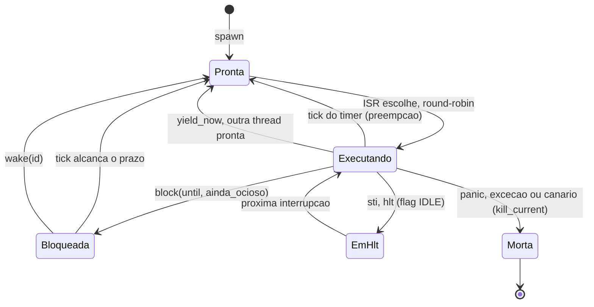
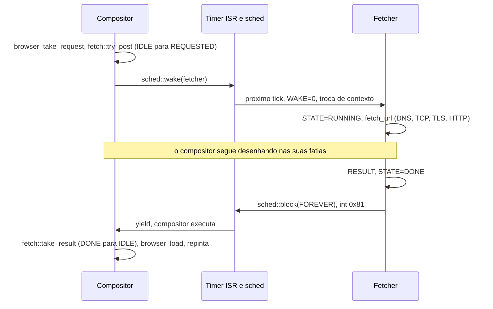
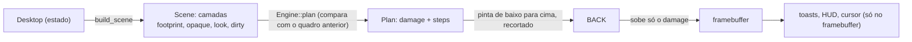

# Arquitetura do OSjeff

Documento de referência técnica. Descreve o sistema **como está no código deste
checkout**, não como se pretende que fique. Para compilar e rodar veja
[`BUILDING.md`](BUILDING.md); para verificação, [`TESTING.md`](TESTING.md); para o que
protege e o que não protege, [`SECURITY-MODEL.md`](SECURITY-MODEL.md); para o que
falta, [`ROADMAP.md`](ROADMAP.md). Os relatórios em [`audit/`](audit/README.md) são o
registro histórico da auditoria e **parte deles descreve um estado anterior às
correções**: onde divergem do código, vale o código.

Marcas de evidência: **[L]** lido no código (arquivo e função citados, sem números de
linha); **[M]** medido nesta revisão, QEMU 8.2.2 em TCG sem KVM (vale como proporção, não
como hardware real); **[A]** medido ou provado pela auditoria e **não repetido** aqui;
**[NV]** não verificado. Nada foi testado em hardware real.

## TL;DR

OSjeff é um SO x86_64 `no_std` em Rust que sobe direto de um bootloader (BIOS ou UEFI)
e mostra um desktop gráfico com 7 apps. **Tudo roda em ring 0, num único espaço de
endereçamento**; não existe modo usuário. O que separa "app" de "kernel" é convenção e
o `#![forbid(unsafe_code)]` do crate `osjeff_core`, não hardware.

- **Dois crates de código.** `osjeff_core` (dezenas de milhares de linhas com testes, 2532 testes
  passando [M], sem `unsafe`): toda a lógica decidível. `kernel` (~11,0 mil linhas,
  0 testes): hardware, scheduler, compositor, drivers.
- **Multitarefa preemptiva** a 250 Hz, com bloqueio. Cinco threads: `compositor`,
  `fetcher` (rede), `appd` e duas `shelld` (comandos do terminal).
- **Multitarefa preemptiva** a 250 Hz, com bloqueio. Quatro threads: `compositor`,
  `fetcher` (rede), `appd` (apps WASM) e `logd` (grava o log em disco, dorme até ser chamada).
- **Memória:** heap fixo de 64 MiB num BSS de ~91 MiB; sem alocador de frames. As page
  tables são do bootloader; o kernel só edita uma entrada de nível 1 por pilha de thread,
  para criar uma **guard page**.
- **Falhas:** todas as exceções têm handler. Um panic ou exceção no `fetcher` ou no
  `appd` **mata só aquela thread** (log na serial, o resto segue). Falha no compositor,
  #DF/NMI/#MC, qualquer falha com interrupções desligadas ou durante a morte de uma thread
  pinta uma tela de erro e para a **máquina inteira**. A thread morta não é reiniciada
  nem liberada.
- **Rede, web e WASM:** `virtio-net` (PCI) ou NE2000 ISA atrás do trait `Nic`, um **dono
  único** da NIC (`netd`, na thread `fetcher`), DHCP com renovação (T1/T2/expiração),
  resolvedor próprio com cache e vários servidores, cliente de ping, estatísticas por
  interface, `smoltcp` configurado pelo lease (fallback estático do SLIRP), TLS 1.3
  **com verificação de cadeia e nome** (§9), motor HTML/CSS próprio, `wasmi` com apps
  instaláveis que guardam dados no disco OJFS v3 e usam a rede pelo mesmo `fetcher`.
- **Boot [M]:** primeiro frame em ~5 s (BIOS e UEFI) após a entrada do kernel, quase tudo
  é o splash.

## 1. Visão geral e fronteira core ↔ kernel

| Crate | Tipo | Tamanho | Papel |
|---|---|---|---|
| `osjeff_core` | lib, `no_std` fora de testes, `forbid(unsafe_code)` | 11,7 mil linhas, 423 testes [M] | lógica pura, testável no host |
| `kernel` | bin `x86_64-unknown-none`, `test = false` | 11,0 mil linhas + `switch.s` (85) | hardware, scheduler, compositor, drivers, rede, WASM |
| `os` | builder | ~70 linhas | `build.rs` gera `osjeff-bios.img` e `osjeff-uefi.img`; `main.rs` lança o QEMU |

Fora do workspace, cada um com seu `Cargo.lock`: `fuzz/` (3 alvos), `bench/` (criterion,
host) e `wasm-apps/*` (guests). O kernel é *artifact dependency* do `os` (`-Z bindeps`):
`os/build.rs` recebe o ELF e chama `bootloader::BiosBoot` e `UefiBoot`.

- **Toolchain:** `nightly-2026-10-05`, fixado em `rust-toolchain.toml` (o nightly é
  necessário por `abi_x86_interrupt` e `-Z bindeps`); edição 2024.
- **Versões** (`Cargo.lock`): `bootloader` 0.11.17 (no `os`), `bootloader_api` 0.11.17,
  `x86_64` 0.15.5, `smoltcp` 0.12.0, `embedded-tls` 0.19.0, `wasmi` 1.1.0.
- **SSE:** o alvo compila com `-mmx,-sse,-sse2,...,+soft-float` [M]; por isso
  `.cargo/config.toml` força os backends de software de `aes`/`polyval`/`ghash` e o `sha2`
  usa `force-soft`. Release: `opt-level = 3`, LTO; `panic` não é forçado (o alvo já aborta
  e os testes do core precisam de unwinding).

Quem fica de cada lado:

| `osjeff_core` (testado no host) | `kernel` (ring 0) |
|---|---|
| `shell` (motor de comandos, linha, histórico rolável, sessão), `editor2` (editor e diálogos), `calc`, `clipboard`, `keymap`, `process`, `anim` | `main.rs` (boot e laço do compositor), `gdt`, `interrupts`, `switch.s`, `sched`, `crash`, `vm` |
| `fs` (OJFS), `net`, `lease`, `dns`, `icmp`, `netstats`, `redirect`, `rng`, `entropy` (pool, DRBG ChaCha20, qualidade) | `allocator`, `sync`, `io`, `serial`, `rng` (fontes, anel de amostras, política) |
| `web` (HTML, CSS, layout), `browser` | `fb`, `font`, `icons`, `desktop/*` |
| `layout`, `wm`, `window`, `gfx`, `heap`, `paging`, `schedule` | drivers: `ps2`, `rtc`, `ata`, `ne2000`, `pci`, `virtio*` (gpu, net, rng), `power` |
| `hw::{ps2, rtc, ata, pci, virtio, virtio_net, perf}` | `nic`, `netd`, `netstack`, `fetch`, `wasm/*`, `perf`, `trace` |


Regra do projeto: **decisão vai para o core com teste; o kernel liga o hardware a ela.**
O kernel faz a porta de E/S ou o MMIO e entrega bytes a `osjeff_core::hw::*`, que
decodifica (PS/2, BCD/12h/fuso do RTC, `IDENTIFY` e LBA do ATA, varredura PCI, capabilities
virtio, estatísticas do HUD, a conta de páginas das guard pages em `paging`, a escolha
da próxima thread em `schedule`), ou a `gfx`, `layout`, `wm`, `redirect`. A regra **ainda
não vale para tudo** [L]: o despacho de entrada (`desktop/input.rs`), a lógica de dano
(`desktop/render.rs`), as primitivas de `fb.rs`, o ring de eventos do WASM e os drivers
de porta de E/S seguem no kernel, sem teste automatizado. O comentário de `lib.rs`
("toda a lógica de decisão") é uma meta, não um fato.

## 2. Boot e memória

### 2.1 Cadeia de boot

| Caminho | Etapas [A] | Fatos |
|---|---|---|
| **BIOS** | setor de boot, stage-2 (modo real, e820, escolhe VESA), stage-3 (paginação), stage-4 | o stage-2 limita o VESA a **1280x720** (valores fixos no crate do bootloader [L]); saiu **24 bpp** [M] |
| **UEFI** | `exit_boot_services`, carrega o kernel | usa o **modo GOP corrente** [L]; no QEMU/OVMF saiu **1280x800, 32 bpp** [M] |

Passos comuns do bootloader [A, conferidos em parte contra o fonte de 0.11.17]: liga NXE
e CR0.WP; mapeia cada segmento do ELF com NX se não-executável e escrita só se gravável
(**o W^X da imagem vem daqui**); aloca a pilha de boot com **uma página de guarda**;
mapeia o framebuffer; mapeia **toda a memória física** em `physical_memory_offset` com
páginas de 2 MiB, RW+NX; cria o `BootInfo` e salta para o kernel.

`BOOT_CONFIG` (`main.rs`) muda duas coisas do default: `physical_memory = Dynamic` (o
virtio traduz endereços) e `kernel_stack_size = 512 KiB` (era 80 KiB). Medido [M]:
`physical_memory_offset = 0x28000000000`, kernel PIE em `0x10000000000`. O kernel não lê
`memory_regions` nem `rsdp_addr` e não toca em CR0/CR4/EFER; só lê CR3 e edita uma PTE
por pilha de thread (§2.6, §3.1).

### 2.2 Sequência de `kernel_main`

```text
serial -> vm::init(physical_memory_offset) -> framebuffer (registra p/ crash, guarda de
tamanho, zera) -> BACK/BG/STATIC
-> ALLOCATOR.init(HEAP 64 MiB) + smoke test -> wasm::run_demo (sem IRQ ainda)
-> PCI + sonda virtio-gpu -> ata::detect -> gdt::init -> sched::init (acha a guard page
da pilha de boot) -> ps2::init
-> interrupts::init (IDT, PIC, PIT 250 Hz, sti) -> calibra TSC (25 ticks)
-> rng::init (RDSEED/RDRAND, virtio-rng, 1º reseed; o timer já amostra o TSC)
-> nic::probe (virtio-net, senão NE2000) + Netd::boot (DHCP, NetConfig, ARP gratuito)
-> spawn fetcher (só com NIC, stack com guard page; sem NIC, `fetch::init_offline`) e appd
-> storage::init (OJFS v3: monta, migra ou formata; sempre antes de qualquer arquivo)
-> spawn logd
-> splash -> Desktop::new (semeia os apps embutidos uma vez, monta o catálogo, abre o terminal)
-> load_settings (/etc/osjeff.conf, já com o volume pronto) -> wallpaper em BG
-> laço do compositor (no 1º quadro: logd grava /var/log/boot.log)
```

A ordem importa [L]: `gdt::init` precede `sched::init` e `interrupts::init` porque os gates
da IDT e `spawn` capturam os seletores `CS`/`SS` vivos, e `vm::init` precede `spawn`
porque criar a guard page exige o `physical_memory_offset`; `ps2::init` roda antes de `sti`
para o handshake não correr com as ISRs. Marcos de boot saem na serial em qualquer build
(`[trace] boot + N ms`). Medidos [M]: demo WASM 60-75 ms, calibração do TSC ~100 ms,
splash 4,2 s (UEFI) a 4,8 s (BIOS), `Desktop::new` 30-40 ms. O splash é um laço ocupado
que sai com `el >= 5` em segundos inteiros do RTC, então dura entre 4 e 5 s, não "≥ 5 s"
como diz o rótulo do marco. O virtio-gpu é **só sondado**: o scanout continua sendo o
framebuffer do bootloader, e no runner padrão o dispositivo nem existe [M].

### 2.3 Layout de memória

O arquivo de imagem tem ~4,6 MiB, mas o **bootloader materializa o BSS inteiro** (um
frame físico por página, zerado). O custo do BSS é RAM. Segmentos do ELF neste build
[M, `readelf`]: `R`, `R E` (~1,5 MiB), `RW` (~29 KiB) e `RW` com `MemSiz = 0x5b28900`
(**95.586.560 B, 91,16 MiB** de `.data`+`.bss`).

| Símbolo | Bytes | Uso |
|---|---|---|
| `HEAP` | 67.108.864 (64 MiB) | único heap do sistema |
| `BACK`, `BG`, `STATIC` | 3 x 8.294.400 | buffers de render, 1920x1080x4, alinhados a 64 B (`STATIC` é o rascunho do modo verify) |
| `wasm::SURFACE` | 2.291.904 | 2 x 692x414x4, duplo buffer do app WASM |
| `desktop::SCRATCH` | 1.126.400 | 640x440x4, o que está atrás de uma janela em fade |
| `desktop::DISK` | 50.688 | imagem OJFS em RAM (99 setores) |
| `gdt::IST_STACK`, `gdt::PF_IST_STACK` | 2 x 32.768 | pilhas IST do #DF e do #PF |
| `TLS_RX`, `TLS_TX` | 2 x 16.384 | registros TLS |
| `virtio_gpu` (3 páginas), `EVENTS`, `RING`, demais | ~27 KiB | |

Heap e buffers são 96% do BSS. O resto da RAM física **não é usado**: não há alocador de
frames.

### 2.4 Framebuffer e a guarda de tamanho

| Modo [M] | Formato | Bytes |
|---|---|---|
| BIOS | 1280x720, `Bgr`, 3 B/px, stride 1280 | 2.764.800 |
| UEFI | 1280x800, `Bgr`, 4 B/px, stride 1280 | 4.096.000 |

Os buffers de render são fixos em 1920x1080x4. `kernel_main` calcula
`n = min(fb.len, MAX_BYTES)` e `fb_need = stride * height * bpp`; se `fb_need > n` chama
`crash::die(Kind::Unsupported, ...)`, que pinta **"UNSUPPORTED SCREEN"** com a resolução
detectada e para. Sem a guarda o `Canvas` (que indexa com o `info` real) estouraria o
buffer com um panic mudo. Uma tela 1920x1200 a 32 bpp (9,2 MB) é recusada. Em BIOS
(24 bpp) cada buffer usa só ~2,8 dos 8,3 MB; os caminhos rápidos de 32 bpp só valem com
`bpp == 4`.

### 2.5 RAM mínima

Conta [L]: BSS 91,16 MiB + ELF ~1,8 MiB + pilha de boot + tabelas de página, em frames
acima de 1 MiB. **UEFI com 128 MiB não chega ao kernel**: o bootloader panica em
`load_kernel.rs` (`Option::unwrap()` sobre `None`, ao mapear o BSS) [M]. **192 MiB boota**
(desktop em ~4,8 s, com as guard pages instaladas [M]), o mínimo registrado em
`os/src/main.rs`; 256 MiB (valor de `os/src/main.rs` e `run.ps1`) boota em UEFI e BIOS
[M]. BIOS com 128 MiB boota [A], não repetido. No UEFI o alocador do bootloader só usa
regiões `CONVENTIONAL` e o OVMF consome parte da RAM; a causa exata do limite de 192 MiB
é **[NV]**.

### 2.6 Pilhas

- **compositor** (thread 0): a pilha de **512 KiB** do bootloader, que tem uma página de
  guarda não mapeada logo abaixo; `sched::init` a acha descendo página a página a partir
  do `rsp` (`vm::find_guard_below`). O estouro é reportado como tal, mas continua fatal.
- **`fetcher` e `appd`:** `sched::spawn` aloca com `alloc_zeroed` um bloco **alinhado a
  4096** de 1 página de guarda mais **128 KiB**, e `vm::unmap_page` tira a guarda das page
  tables (limpa `PRESENT` na PTE de nível 1 e faz `invlpg`). O bloco **nunca é liberado**
  (devolver ao allocator uma página não mapeada o faria faltar ao escrever o nó da
  free-list). Isso só é possível porque o `.bss` do kernel, onde mora o heap, é mapeado
  com páginas de 4 KiB, e `vm` recusa páginas de 2 MiB ou 1 GiB. Em BIOS e UEFI as duas
  guardas foram instaladas (`sched: 'fetcher' stack ..., guard page ...` na serial) [M].
- **Canário** de 8 B no menor endereço: só como *fallback*, plantado quando a guarda não
  pôde ser instalada (§4.5).
- **IST:** #DF e #PF têm 32 KiB estáticos cada (§3.2).

Folga medida pela auditoria, antes das guard pages [A, sem handshake TLS real]: compositor
~11 KiB, `fetcher` ~9 KiB, `appd` ~13 KiB; o pico do `fetcher` num handshake real é
**[NV]**. A pilha de boot subiu de 80 para 512 KiB porque o layout HTML/CSS recursivo e o
TLS são os usuários mais fundos.

## 3. Privilégio, GDT/TSS, exceções e falhas

### 3.1 Modelo de privilégio

- **Tudo em ring 0**: nenhum descritor de usuário, nenhuma página `USER_ACCESSIBLE`,
  nenhum `syscall`/`sysret` [L, `grep`]. O único `iretq` escrito à mão é o de `switch.s`.
- **Um espaço de endereçamento**: o CR3 do bootloader, nunca trocado. O kernel o **lê**
  (`virtio.rs` traduz endereços; `vm.rs` caminha as tabelas pelo `physical_memory_offset`)
  e **edita um único tipo de entrada**: limpa `PRESENT` na PTE de nível 1 de cada guard
  page de pilha (`vm::unmap_page`, com `invlpg`). Não cria tabelas nem mapeia nada, e
  recusa páginas de 2 MiB ou 1 GiB. A matemática (índices por nível, entrada presente ou
  huge, página canônica) é de `osjeff_core::paging`, testada no host.
- **Toda a RAM física está mapeada RW+NX**, inclusive as page tables: qualquer código do
  kernel, ou um guest WASM que escape do interpretador, alcança tudo.
- **W^X e NX** valem para o que o bootloader mapeia (texto `R-X`, `.rodata` `R--`,
  `.data`/`.bss`/heap/pilhas `RW-` NX); escrever em `.text` e executar do heap dão #PF
  [A]. Sem SMEP/SMAP.

A escolha entre ring 3 e WASM como fronteira está em
[`audit/adr-isolamento.md`](audit/adr-isolamento.md) (status **Proposto**).

### 3.2 GDT, TSS e IST (`gdt.rs`)

O bootloader deixa uma GDT mínima e **nenhum TSS**. Sem TSS, um #PF ao empilhar o frame
numa pilha esgotada escala para #DF e triple fault: reset silencioso. `gdt::init` monta a
GDT própria (código, dados, TSS), recarrega `CS/SS/DS/ES` e faz `ltr`. O TSS preenche
**duas** entradas IST, cada uma com uma pilha estática de 32 KiB: **IST[0] para o #DF** e
**IST[1] para o #PF**. O #PF precisa da sua: uma thread que estoura a pilha acerta a guard
page com o `rsp` ainda no fim da pilha esgotada, onde a CPU não consegue empilhar o frame.
Slots distintos evitam que uma falha *dentro* do handler de #PF seja entregue por cima da
pilha que ele já usa. Não há RSP0 (não há ring 3). NMI e #MC rodam na pilha corrente. Que o
estouro da pilha de boot chegue ao #DF e produza a tela de erro, em BIOS e UEFI, foi mostrado
com `-d cpu_reset` antes do IST do #PF existir [A]; a trilha atual de estouro de pilha
(guard page, #PF na IST[1], morte da thread) **não foi disparada por mim nesta revisão
[NV]**.

### 3.3 IDT e fontes de interrupção (`interrupts.rs`)

| Vetor | Handler | Observação |
|---|---|---|
| `#DE`, `#UD`, `#NP`, `#SS`, `#GP`, `#OF`, `#BR`, `#NM`, `#TS`, `#MF`, `#AC`, `#XM` | `fatal` → `crash::fault` | **contidas** (mata a thread) se couber (§3.4); senão `die` |
| `#PF` | `page_fault` na **IST[1]** → `crash::fault` | acerto numa guard page vira "stack overflow in thread '<nome>'" (`sched::guard_owner`) |
| `#DF` | `double_fault` na **IST[0]** | sempre fatal (`fatal_always` → `die`) |
| `#DB`, NMI, `#MC`, `#VE`, `#CP`, `#HV`, `#VC`, `#SX` | `fatal_always` → `die` | sempre fatais: indicam hardware ou kernel quebrado, não uma thread |
| `#BP` | handler vazio | retorna |
| 32 (IRQ0) | `timer_isr` (asm) | tick e troca de contexto |
| 0x81 | `yield_isr` (asm) | troca voluntária, sem tick nem EOI |
| 33, 44 (IRQ1, IRQ12) | `keyboard`, `mouse` | lêem a porta `0x60`, empurram no ring, EOI |
| 39, 47 (IRQ7, IRQ15) | `spurious_master`, `spurious_slave` | lêem o ISR do PIC: EOI só se o bit 7 estiver setado; no IRQ15 o mestre recebe EOI sempre (aceitou a cascata). Os 4 primeiros são logados |

PIC 8259 remapeado para `0x20`/`0x28`, máscaras `0xF8` (IRQ0, 1, cascata) e `0xEF`
(IRQ12). PIT canal 0, modo 3, divisor `1193182 / 250` (**250 Hz**, tick de 4 ms). Sem
APIC nem SMP. Os handlers são gates de interrupção (IF zerado na entrada).

**Ring de entrada.** As ISRs de teclado e mouse empurram um `u16` (fonte no byte alto)
num ring SPSC de 512 entradas, `head`/`tail` atômicos com Acquire/Release; cheio, o byte
é descartado. O único consumidor é `ps2::poll`, no compositor.

### 3.4 Falhas: thread morta ou máquina morta (`crash.rs`, `sched.rs`)

Panic e exceções passam por `crash::fault(tipo, subtítulo, mensagem, frame, if_was_set)`,
que decide entre **matar só a thread** e **parar a máquina** com `crash::die`.
`sched::containable(if_was_set)` exige, ao mesmo tempo:

1. **não ser o compositor** (slot 0): perder o desktop é perder a máquina;
2. **IF=1 no contexto que falhou** (RFLAGS.IF do código que faltou, ou o IF vivo num
   panic): gates de interrupção e `SpinLock` rodam com IF=0, então IF=1 prova que não
   estávamos numa ISR (IRQ meio atendida, sem EOI) nem dentro do lock do heap, e nenhum
   lock fica preso por uma thread que some;
3. **não estar já matando** outra thread (`KILLING`) e haver mais de uma thread.

**Caminho contido.** `sched::kill_current(motivo)` (IF=0): loga na COM1
`thread '<nome>' died: <motivo>`, marca `DEAD[slot]`, escolhe a próxima thread com
`osjeff_core::schedule::next_runnable` (que nunca devolve uma thread morta), faz `fxrstor`
da próxima e salta para o contexto salvo dela com `resume_context` (`switch.s`),
**abandonando a pilha atual** (que pode ser a esgotada, ou a IST do #PF). Efeitos
visíveis: o Gerenciador de tarefas mostra `DEAD` no lugar dos ticks; o navegador mostra
`FailReason::WorkerDied` ("O carregador de paginas falhou"); a janela WASM mostra "App WASM
encerrado". O canário violado também mata a thread, a partir da própria ISR do timer.

**Continua fatal** (`die`): falha no compositor; #DF, NMI, #MC, #DB e demais abortos
(`fatal_always`); qualquer falha com IF=0 (numa ISR ou sob o spin lock do heap); uma falha
durante a morte de uma thread; framebuffer não suportado. `die` desabilita interrupções,
escreve **uma linha na COM1** (`KERNEL PANIC: ...` ou `FATAL EXCEPTION: ... rip= rsp=
rflags= cr2=`), pinta uma **tela de erro** direto no framebuffer registrado (faixa `KERNEL
PANIC` / `CPU EXCEPTION` / `UNSUPPORTED SCREEN`, mensagem, nome da thread,
RIP/RSP/RFLAGS/CR2/código) e para em `cli; hlt`; se já está dentro de `die`, só faz
`cli; hlt`. Não usa alocação, locks nem os buffers do compositor. Falha de alocação também
é um `panic!`. Capturas reais: `docs/img/panic-*.png`. A lógica de escolha da próxima
thread e de páginas é testada no host (`schedule`, `paging`); **a trilha de morte em si
(`kill_current` e `resume_context`) é de kernel e não tem teste automatizado**, e eu não a
disparei nesta revisão **[NV]**.

**O que ainda NÃO existe:**

- **Liberar os recursos de uma thread morta:** pilha (e sua guard page), memória do heap
  que ela alocou e, no `appd`, a `Store` do `wasmi` continuam alocadas.
- **Locks que a thread segurava com IF=1 ficam presos** para sempre (só o lock do heap é
  imune, porque roda com IF=0).
- **Reiniciar a thread:** nunca. Um slot morto continua contando em `thr N` do HUD.
  Sem `fetcher`, o navegador falha toda navegação; sem `appd`, o app não volta.
- O compositor é um ponto único de falha; NMI e #MC sem pilha própria; sem watchdog,
  reinício automático, dump ou backtrace.

### 3.5 FPU/SSE

O kernel é compilado sem SSE e nada nele usa `xmm` ou x87 (`f32` é emulado). O
`fxsave`/`fxrstor` por thread de `sched.rs` (512 B alinhados a 16, semeados com o estado
vivo) é hoje **defensivo e inerte**: com `CR4.OSFXSR` desligado (BIOS deixa `CR4 = 0x20`;
o firmware UEFI liga [A]) nem salva `xmm`. O alinhamento `rsp ≡ 8 (mod 16)` das threads
novas segue o ABI SysV, mas sem SSE nenhum `movaps` o exige: a história de que errá-lo
dava `#GP` fatal sob WHPX não tem sustentação no código atual.

## 4. Interrupções e scheduler

### 4.1 Threads

| Slot | Thread | Existe quando | Pilha | Se falhar |
|---|---|---|---|---|
| 0 | `compositor` (`kernel_main`) | sempre, é o contexto de boot | 512 KiB do bootloader, guard page achada por `sched::init` | **fatal** (tela de erro) |
| 1 | `fetcher` (`fetch::worker`), que também é o `netd` | só se `nic::probe()` achou uma NIC | 128 KiB do heap + guard page | morre sozinha |
| 1 ou 2 | `appd` (`wasm::worker`) | sempre, mesmo sem janela WASM | 128 KiB do heap + guard page | morre sozinha |
| 2 a 4 | `shelld` e `shelld2` (`desktop::shellhost::worker`, `worker2`) | sempre: executam as linhas de comando dos terminais (`sleep`, `ping`, `curl` esperam aqui, não no compositor) | 128 KiB do heap + guard page | morre sozinha; terminais com comando em andamento são liberados com "the command thread stopped" |

`MAX_THREADS = 8` (`assert!` em `spawn`). Threads **nunca terminam por conta própria**: a
entrada é `extern "C" fn() -> !` e a tabela só cresce; a única saída é morrer (§3.4), e o
slot morto continua contando em `thread_count`. O HUD mostra `thr 5` (4 sem NIC).
| última | `logd` (`logd::worker`) | sempre (criada depois do `storage::init`) | 128 KiB do heap + guard page | morre sozinha (o log de boot deixa de ser gravado) |

`MAX_THREADS = 8` (`assert!` em `spawn`). Threads **nunca terminam por conta própria**: a
entrada é `extern "C" fn() -> !` e a tabela só cresce; a única saída é morrer (§3.4), e o
slot morto continua contando em `thread_count`. O HUD mostra `thr 4` (3 sem NIC).

### 4.2 Política e estados

Round-robin de quantum fixo (1 tick, 4 ms), sem prioridades. Uma thread é **executável**
se não está morta **e** `WAKE[i] <= agora`: `0` é "pronta" e `FOREVER` (`u64::MAX`) é
"estacionada até `wake`". A escolha é `osjeff_core::schedule::next_runnable(cur, n, pred)`
(testada no host): tenta `cur+1, cur+2, ..., cur`, então a thread atual é a **última**
candidata e só continua se ainda for executável; devolve `None` se nenhuma é (o kernel
então para, mas o compositor nunca morre). O estado compartilhado entre ISR e threads
(`WAKE`, `TICKS`, `IDLE`, `DEAD`, `CURRENT`) é atômico: a ISR não usa locks nem aloca.


```mermaid
stateDiagram-v2
    [*] --> Pronta: spawn
    Pronta --> Executando: ISR escolhe, round-robin
    Executando --> Pronta: tick do timer (preempcao)
    Executando --> Pronta: yield_now, outra thread pronta
    Executando --> Bloqueada: block(until, ainda_ocioso)
    Bloqueada --> Pronta: tick alcanca o prazo
    Bloqueada --> Pronta: wake(id)
    Executando --> EmHlt: sti, hlt (flag IDLE)
    EmHlt --> Executando: proxima interrupcao
    Executando --> Morta: panic, excecao ou canario (kill_current)
    Morta --> [*]
```

`EmHlt` não é estado do scheduler, só a marca `IDLE[i]` para a contabilidade de CPU: a
thread segue executável. `Morta` é terminal: o slot nunca mais é escolhido.

### 4.3 Troca de contexto (`switch.s`)

A única parte que não dá para escrever em Rust: trocar de pilha e retornar noutra thread.
Uma macro de assembly serve **dois vetores**, `timer_isr` (IRQ0) e `yield_isr`
(`int 0x81`): empilha os 15 registradores gerais, passa `rsp` ao lado Rust, troca `rsp`
pelo valor devolvido, restaura e faz `iretq`. O lado Rust do timer (`timer_schedule`)
faz `TICKS += 1`, chama `sched::switch_current` (credita o tick, escolhe a próxima) e dá
**EOI antes do `iretq`**; o do yield (`yield_schedule`) só escolhe, sem tick nem EOI.
Quando a próxima é outra thread, `reschedule` faz `fxsave` da atual, grava seu `rsp` e faz
`fxrstor` da próxima. O epílogo é uma macro (`RESTORE_AND_IRET`) reaproveitada por um
terceiro ponto de entrada, `resume_context(rsp)`: carrega `rsp`, restaura os 15 registradores
e faz `iretq` **sem voltar ao chamador**, que é como `kill_current` sai de uma thread morta.

**Nascimento de uma thread:** `spawn` fabrica a pilha que o epílogo da ISR sabe
restaurar: de `thread_rsp = (topo & !0xF) - 8` para baixo, um frame de `iretq` (`SS`,
`RSP`, `RFLAGS = 0x202`, `CS`, `RIP = entrada`) e 15 registradores zerados; canário de
8 B no menor endereço. `spawn` é `pub fn` segura que **exige IF=0 por convenção**
(`kernel_main` a chama em `without_interrupts`).

### 4.4 Bloquear, acordar, ocioso

`block(until, ainda_ocioso)` grava `WAKE[eu] = until` e **só então** reavalia
`ainda_ocioso()`, para que um `wake` que corra com o anúncio não se perca; enquanto ocioso
faz `yield_now()` e `halt_unless` (`cli`, reavalia, `sti; hlt` atômico). `wake(id)` zera
`WAKE[id]`, de qualquer contexto; `yield_now` é no-op com IF=0. `sched::idle(tem_trabalho)`
é o passo ocioso do compositor: com IF=0 testa a entrada pendente; se outra thread está
executável, cede com `yield_now`; senão `sti; hlt`. Substituiu um `hlt` nu, que tinha
janela de *lost wakeup* e queimava a fatia inteira. Efeito [A]: o compositor acorda a cada
tick de 4 ms ou numa IRQ de entrada, e workers ociosos **não custam fatia**.


```mermaid
sequenceDiagram
    participant C as Compositor
    participant S as Timer ISR e sched
    participant F as Fetcher
    C->>C: browser_take_request, fetch::try_post (IDLE para REQUESTED)
    C->>S: sched::wake(fetcher)
    S->>F: proximo tick, WAKE=0, troca de contexto
    F->>F: STATE=RUNNING, fetch_url (DNS, TCP, TLS, HTTP)
    Note over C,F: o compositor segue desenhando nas suas fatias
    F->>F: RESULT, STATE=DONE
    F->>S: sched::block(FOREVER), int 0x81
    S->>C: yield, compositor executa
    C->>C: fetch::take_result (DONE para IDLE), browser_load, repinta
```

### 4.5 Contabilidade de CPU, guard pages e canário

- **CPU:** a ISR soma 1 em `TICKS[atual]` só se `IDLE[atual]` for falso, isto é, só conta
  o tick em que a thread **estava executando**, não parada em `hlt`. O app **Tarefas**
  transforma a variação por segundo em porcentagem (`CpuSampler`: threads + ocioso = 100,0 %
  exato) e mostra a thread como Parado se ela morreu. É amostragem a 250 Hz.
- **Guard page (mecanismo principal).** Estourar a pilha de `fetcher` ou `appd` acerta
  uma página não mapeada: #PF na IST[1], `sched::guard_owner(cr2)` reconhece a guarda de
  qual thread foi e a mensagem vira `stack overflow in thread '<nome>': guard page hit at
  ...`; a thread morre (§3.4). A guarda falta no primeiro acesso, não no próximo tick; um
  frame grande não a pula porque o rustc sonda cada página de um frame grande (comentário
  de `sched.rs`; não o verifiquei).
- **Canário (só *fallback*).** `0xDEAD_C0DE_CAFE_F00D` nos 8 B mais baixos da pilha, plantado
  **apenas** se a guard page não pôde ser instalada (sem `physical_memory_offset`, página
  huge). É checado em `reschedule` para a thread que acabou de rodar, a cada tick ou
  yield, e uma violação **marca a thread morta na própria ISR**, sem `panic!`. É fraco:
  detecção tardia (as escritas já passaram), 8 bytes, e um teste forçado da auditoria
  mostrou corrupção do heap antes da detecção [A]. Nas duas execuções desta revisão o
  fallback não foi usado (as duas guardas foram instaladas) [M].
- O compositor também tem guarda (a do bootloader); estourá-la é fatal.

## 5. Allocator e concorrência

### 5.1 Allocator (`allocator.rs`, `osjeff_core::heap`)

- Free-list **ordenada por endereço**, *first-fit*, com **coalescência** a cada `dealloc`
  (funde com o seguinte e com o anterior); alocar e liberar são O(n); `realloc` e
  `alloc_zeroed` são os padrões de `GlobalAlloc`.
- **Matemática em `osjeff_core::heap`** (testada no host): `adjust_request` leva o pedido
  a pelo menos um nó (16 B) e ao alinhamento do nó; `fit_region_split` devolve
  `front + tamanho + excess` somando exatamente a região, com `checked_add`. Região cuja
  sobra final ficaria entre 1 e 15 B é rejeitada (o first-fit segue); vão frontal pequeno
  demais empurra a alocação ao próximo endereço alinhado. **Correção do padding frontal:**
  esse vão antes vazava; `alloc` agora o devolve à lista.
- **Lock:** `SpinLock` que **desabilita interrupções enquanto travado** e restaura o IF
  anterior no `Drop`. Sem isso, um tick com o lock seguro levaria a thread seguinte a girar
  para sempre na mesma trava. Não é reentrante; **nenhuma ISR aloca** [L].
- **Pilhas de thread** saem deste heap (bloco de 4096 B de alinhamento) e **nunca voltam**:
  uma delas tem uma página sem `PRESENT`, e a free-list escreveria nela ao liberar. O
  alinhamento de 4096 usa o mesmo caminho de `front`/`excess` acima.
- Esgotado, `alloc` devolve `null`, que vira `panic!` (§3.4: fatal no compositor; num
  worker com IF=1 mata só a thread). Não há quota por consumidor; os tetos são por origem
  (resposta HTTP 1 MiB, memória WASM 24 MiB).
- `HEAP` é `[u8; 64 MiB]` com alinhamento 1 em Rust; `init` exige 8 B e só tem
  `debug_assert!` (o linker o põe alinhado a página). O boot roda um smoke test (alocar,
  crescer, fragmentar, exigir um bloco maior que qualquer pedaço).

### 5.2 Concorrência

A máquina é **single-core com preempção por timer**, o que não é single-thread. Cada
estático tem uma disciplina escrita: escrito antes de `sti`, ISR com IF=0, dono único por
thread, ou máquina de estados atômica. `RacyCell<T>` (`sync.rs`) é `UnsafeCell` mais
`unsafe impl Sync` e entrega só `*mut T`: **não prova nada**, só lembra que o compilador
não verifica.

| Estático | Quem acessa | Disciplina |
|---|---|---|
| `BACK`, `BG`, `STATIC`, `SCRATCH`, `DISK`, `DECODER`, `trace::{MARKS,STATS}` | só o compositor | dono único |
| `HEAP` | só o allocator | spinlock com IF=0 |
| `IDT`, `GDT`, `TSS`, `IST_STACK`, `PF_IST_STACK`, `crash::SCREEN` | boot escreve; a CPU (ou `die`) lê | antes de `sti`; `SCREEN_READY` Release/Acquire |
| `SCHED` | ISR (muta `rsp`, `current`, FPU), `kill_current`, o handler de #PF (`guard_owner`, leitura) e compositor (`init`, `spawn`, leitura de `name`/`len`) | `spawn` com IF=0. **Formalmente o `&mut` da ISR sobrepõe os `&` de leitura** (inclusive o do #PF) |
| `WAKE`, `TICKS`, `IDLE`, `DEAD`, `KILLING`, `CURRENT`, `interrupts::TICKS`, `vm::PHYS_OFFSET` | ISR, threads e handlers de falha | atômicos |
| input `RING`; `wasm::{EVENTS,EV_HEAD,EV_TAIL}` | produtor e consumidor distintos | SPSC com Acquire/Release |
| `fetch::{NET, REQ_URL, REQ_LEN, RESULT}` | compositor posta, `fetcher` consome e devolve | máquina atômica `STATE` |
| a NIC (`nic::Port`, dentro de `netstack::Net` dentro de `Netd`) | só a thread `fetcher` (antes dela existir, o boot) | **pelo tipo**: o `Port` é movido para o `Netd`; ninguém mais tem um `&mut` |
| caixas de ping (`netd::P_*`) | qualquer thread pede, o `fetcher` responde | `P_STATE` atômico (IDLE, CLAIMED, REQUESTED, RUNNING, DONE) |
| `fetch::{JSTATE, JOB, JRESULT}` | uma thread de comandos (`shelld`) pede e espera, o `fetcher` serve entre as páginas do navegador | `JSTATE` atômico (IDLE, CLAIMED, REQUESTED, RUNNING, DONE, ABANDONED); quem desiste de uma busca em andamento a abandona e a caixa só volta a IDLE quando o worker termina |
| `shellhost::{QUEUE, FINISHED, UI}` | o compositor posta linhas de comando e recolhe resultados e pedidos de UI; as `shelld` consomem e devolvem | `YieldMutex`; `PENDING` atômico decide se a thread dorme; `CANCEL` (uid do terminal) é um atômico lido pelo executor |
| `netstack::{TLS_RX,TLS_TX}`, `wasm::{APP,FB_INFO}`, `virtio_gpu::*` | só o worker dono (virtio: boot e DMA) | dono único |
| `wasm::SURFACE` + `FRONT`/`READY` | worker escreve o buffer de trás, compositor lê o da frente | atômicos, **sem lock**: um compositor preemptado no meio de `blit_surface` pode copiar um quadro rasgado |

Não há `static mut` no kernel nem no core (os guests `snake` e `plasma` usam, mas é
memória do guest).

**Pontos frágeis** [L]: `RacyCell` é `Sync` sem `T: Send` e nada impede um terceiro
acessor; **cinco** `fn` seguras devolvem `&'static mut` (`desktop::disk`,
`widgets::scratch_slice`, `sched::scheduler`, `wasm::app_mut`, `trace::stats`);
`sched::spawn` é segura mas só correta com IF=0; os wrappers de porta (`inb`, `outb`...)
são `fn` seguras; a COM1 não tem lock (linhas de threads diferentes podem se intercalar);
a RTC (par de portas índice/dado) só é lida pelo compositor, pois um tick entre as duas
portas corromperia a leitura.

### 5.3 Política de `unsafe`

`osjeff_core` proíbe. No kernel, `main.rs` liga `#![warn(clippy::undocumented_unsafe_blocks)]`
e o lint roda com `-D warnings` (`cargo lint-kernel`, e no CI): **todo bloco ou `impl`
`unsafe` precisa de `// SAFETY:` com a invariante**; passa limpo neste checkout [M], então
não há `unsafe` sem justificativa. Quando a garantia é convenção e não o tipo, o comentário
traz `NOTE: not guaranteed by the type`. São ~146 ocorrências da palavra `unsafe` em 22
arquivos do kernel (grep). Isso torna o `unsafe` **justificado e fiscalizado**, não
**isolado**: está em drivers, scheduler, allocator, framebuffer e WASM.

## 6. Gráficos e compositor

### 6.1 Buffers

`BG` guarda o wallpaper (gradiente e *glows* do esquema claro ou escuro, a faixa de vidro do
painel superior já assada), pintado **uma vez** (e de novo quando o wallpaper, o destaque ou a
aparência mudam); `BACK` é o alvo de composição; `STATIC` é só o buffer de rascunho do modo
verify (Ctrl+Alt+V, §6.2); uma textura de 3,5 MiB (`TEXTURE`) guarda a janela que abre, fecha,
minimiza ou restaura enquanto ela é reamostrada; o framebuffer só recebe retângulos (o dano) ou,
quando o dano é a maior parte da tela, um blit completo. Tamanhos em §2.3.

### 6.2 O compositor (`kernel/src/desktop/compositor/`, `osjeff_core::compositor`)

Projeto, invariantes e guia para estender: [`design/compositor.md`](design/compositor.md).

Há **um** caminho de desenho. Cada iteração do laço (`main.rs`) lê a RTC, avança as animações
por ticks reais, drena a entrada, monta um `FrameIn` e chama `Compositor::frame`, que termina
em `sched::idle`.


```mermaid
flowchart LR
    D["Desktop (estado)"] -- "build_scene" --> S["Scene: camadas<br/>footprint, opaque, look, dirty"]
    S -- "Engine::plan (compara com o quadro anterior)" --> P["Plan: damage + steps"]
    P -- "pinta de baixo para cima, recortado" --> B["BACK"]
    B -- "sobe só o damage" --> F["framebuffer"]
    F --> O["toasts, HUD, cursor (só no framebuffer)"]
```

- **A cena** é descrita, não desenhada: do fundo para cima, o papel de parede (implícito), as
  janelas em z-order (cada uma com o retângulo, a sombra, a área opaca e um `look`), a barra de
  apps, o painel (opaco, no topo das janelas), a pré-visualização de encaixe e os overlays
  (Apps, Busca, menu, popover, Alt+Tab, folha). **O motor de dano** (`Engine`, puro, testado
  no host) compara a cena com a do quadro anterior e calcula o dano: camada que apareceu ou
  sumiu, que mexeu (retângulo antigo **e** novo), de `look` novo, com retângulo `dirty`, que
  trocou de lugar na pilha (interseção), mais `invalidate(rect)` (o tique do relógio). Arrastar
  uma janela, o relógio e o gráfico que desliza são o mesmo caso, não caminhos à parte.
- **Pintura.** Cada camada é pintada sobre o dano que cai no seu footprint menos o que uma
  camada opaca acima esconde; onde nada opaco cobre, o papel de parede é restaurado antes. Todo
  pixel repintado é recalculado do fundo da pilha: a sombra pertence à camada da janela, nunca
  a um cache, e não pode ser aplicada duas vezes. O dano é um conjunto de retângulos
  **disjuntos** (`Region`), não um só: mover uma janela para o outro canto não repinta o
  meio da tela.
- **Invariante central:** o resultado incremental é idêntico, byte a byte, ao redesenho
  completo (`Engine::full_plan`) depois de cada quadro. Prova no host: `compositor::tests`
  (milhares de históricos aleatórios sobre um simulador de área de trabalho, testes de
  mutação permanentes que quebram cada regra do motor e exigem que o teste falhe), o alvo de
  fuzz `compositor_ops`; no QEMU: `tools/perf/scen/w27-oracle.sh` (tela em repouso contra o
  modo referência, Ctrl+Alt+R) e o modo verify (Ctrl+Alt+V).
- **Abrir, fechar, minimizar, restaurar:** `draw_animating` desenha a janela **uma vez** no
  tamanho de repouso na `TEXTURE` e, a cada quadro, reamostra (bilinear, cantos arredondados,
  alfa da animação) no retângulo do instante, sob uma sombra que desaparece junto; minimizar e
  restaurar voam de/para o ícone do app na barra (`Desktop::dock_target`). Janelas maiores
  que a textura (1280x720) animam sem o efeito de escala. **Zoom** (maximizar/restaurar) não
  usa textura: desenha a janela real no retângulo em voo com o conteúdo recortado. As animações
  andam por tempo real (`dt = ticks / 250`), são interrompíveis e obedecem a *reduzir
  movimento* (`osjeff_core::anim`). Uma janela animada não declara área opaca.
- **Janelas vivas:** o app WASM visível, o terminal executando, uma cópia de arquivos, o
  arrasto e a troca de foco repintam a janela a cada quadro (`dirty` = o footprint); as
  Tarefas e outras janelas que animam só o próprio conteúdo declaram o retângulo que muda (o
  gráfico) e, sozinhas, rodam a 50 quadros por segundo em vez de a cada tick. Uma janela que
  deixa de ser dinâmica é repintada uma última vez.
- **O cursor não está em `BACK`**: é desenhado direto no framebuffer, e vale uma invariante
  (`osjeff_core::cursor::CursorTrack`, testada no host com um framebuffer simulado):
  **todo quadro que renderiza algo começa apagando o sprite** (restaura de `BACK` o retângulo
  onde ele foi pintado, recortado na tela) **e termina pintando-o de novo**, depois dos
  uploads, dos toasts e do HUD. Nenhum caminho restaura ou desenha o cursor por conta própria.
  O HUD e os toasts também vivem só no framebuffer: se um upload ou o retângulo apagado os
  toca, eles são redesenhados antes do cursor. **Ao portar o desenho para outra estrutura,
  mantenha só isto:** `erase` antes de qualquer escrita no framebuffer do quadro, `paint`
  depois da última, e `CURSOR_W/H` (= `osjeff_core::pointer::{W, H}`) cobrindo todo sprite.
  Prova no QEMU: `tools/perf/scen/w20-cursor.sh` + `tools/perf/w20-cursor-check.sh` (0 pixels
  diferentes entre a tela em repouso e a mesma depois de um repaint completo forçado).
  **Relógio:** o tique de 1 s invalida só o retângulo do relógio (e as janelas "vivas": Tarefas,
  Registro, Ajustes) em vez de subir ~8 MiB. **Sombra:** não é misturada sob o corpo opaco da
  janela (`fill_round_rect_alpha_skip`): evita ~85% do blend com saída idêntica.
- **Depuração:** Ctrl+Alt+R liga o *modo referência* (todo quadro é o redesenho completo, a
  verdade que o oráculo fotografa); Ctrl+Alt+V liga o *verify* (cada quadro é comparado com o
  redesenho completo e as divergências saem na serial como `compositor-verify: MISMATCH`);
  Ctrl+Alt+H, o HUD.

### 6.3 Primitivas (`fb.rs`, `osjeff_core::gfx`)

A interface usa as primitivas anti-aliased de `osjeff_core::raster` e `fb/shapes.rs` (§6.5);
as de baixo nível seguem aqui. `fill_rect` escreve por linha: em 32 bpp com `align_to_mut::<u32>` (um store por pixel);
em 24 bpp (BIOS) em blocos de 4 pixels (12 B) de um padrão pronto. **Tabela de blend:**
para áreas ≥ 4096 px, `gfx::blend_lut(cor, alfa)` constrói uma vez três tabelas
`destino para resultado` por canal, e o preenchimento alfa vira uma consulta por byte,
bit-idêntica a `mix256` (testes no core). O texto da interface é vetorial (§6.5); a fonte 8x8
(`font.rs`) só desenha a tela de pânico.

### 6.4 HUD e `perf-trace`

O HUD (canto superior esquerdo, sob o painel; escondido: **Ctrl+Alt+H**) mostra ms por quadro, fps possível, `draws/s`, pior
quadro do segundo, uso do heap e `thr N`. Atualiza a cada 25 ticks (100 ms) **direto no
framebuffer**, depois de restaurar a área a partir de `BACK`, fora da janela cronometrada.
`trace.rs` tem **marcos de boot** (sempre compilados) e **estatísticas por segundo**
(caminhos de quadro, allocator, ISR, ocioso, latência de entrada) só com
`cargo build --release -p os --features perf-trace` (`ON` é `const`; sem a feature os
ganchos somem); saem como linhas `[trace]` na serial, lidas por `tools/perf/`.

### 6.5 A interface: texto, primitivas, movimento e o shell

O desenho da interface (`docs/design/ui-macos.md` tem os tokens e a API de widgets) se apoia
em quatro peças puras no `osjeff_core`, testadas no host, e em cola fina no kernel. O `f32`
do kernel é emulado em software (o alvo não tem SSE): todo trabalho por pixel é inteiro ou
ponto fixo (24.8 na cobertura, Q16/Q8 nas contas); `f32` só guarda o estado de animação por
quadro (algumas dezenas de valores).

- **Texto** (`ttf`, `glyph`, `fontcache`, `textlayout`; `kernel/src/text.rs`): leitor TrueType
  próprio (`glyf` simples e compostos, `cmap` formato 4, `hmtx`, kerning GPOS formatos 1 e 2),
  rasterizador de cobertura exata por área, cache preguiçoso de glifos por (peso, tamanho) e
  medição/quebra/reticências. Inter (Regular, Medium, Semibold) para a interface e JetBrains
  Mono para o terminal e o editor, ambas OFL e embutidas em subconjunto (~120 KiB, licenças em
  `THIRD-PARTY.md`); o atlas é montado no boot (~34 ms, registrado) e cresce sob demanda. Um
  segundo motor serve a thread `appd` (o do compositor é de uma thread só).
- **Primitivas** (`raster`, `fb/shapes.rs`, `fb/scale.rs`): superfícies ARGB pré-multiplicadas,
  retângulos arredondados e contornos com cantos de círculo ou superelipse (máscaras de
  cobertura em cache), sombras analíticas separáveis, gradientes, desfoque de caixa, reamostragem
  de área e bilinear, caminhos preenchidos (ícones, glifos, cursor).
- **Movimento** (`anim`): bezier, mola (Euler semi-implícito em subpassos), `Tween` que
  reaponta sem salto, a animação de janela (`Anim`), o zoom e o salto de lançamento. Tudo avança
  por tempo real e reporta se ainda se move, e é isso que decide se o laço fica no caminho de
  animação (`has_animation`) ou volta a custar zero.
- **Cromo e shell** (`chrome`, `widgets`, `style`, `search`, `iconart`): geometria do painel
  superior (itens à esquerda, relógio centralizado, pílula de status), dos menus, da barra de tarefas
  (`taskbar`: disposição, hit test, indicadores, reordenação), do Apps (`launcher` e
  `chrome::launcher_grid`: trilho de categorias, recentes, filtro), da Busca, dos popovers (Configurações rápidas,
  calendário com centro de notificações) e dos banners; paletas clara e escura; o ranqueamento e a calculadora da Busca; os
  ícones e glifos vetoriais.

No kernel: `desktop/shell.rs` guarda o estado (menus, popovers, folha, Apps, Busca, barra de
apps) e executa os comandos (`Cmd`), `panel.rs`, `taskbar.rs`, `overlays.rs`, `chrome.rs` e
`cursor.rs` desenham e tratam entrada, `glass.rs` captura o fundo borrado **uma vez** quando uma
superfície abre, e `ui.rs`/`gallery.rs` são o toolkit e sua vitrine. A janela do Alt+Tab, os
banners e o HUD usam o mesmo vidro. Aparência (automática pelo relógio, clara, escura), cor de
destaque e *reduzir movimento* vêm de `osjeff_core::settings` e valem na hora.

## 7. Apps e window manager

### 7.1 Janelas e instâncias

O desktop é um **window manager dinâmico**. A lógica pura vive em `osjeff_core::winman`
(testada no host); o kernel só guarda uma instância de app por janela e desenha.

- **`WindowManager<A>`** é uma tabela `Vec` de janelas em z-order (a última é a do topo),
  com no máximo `DEFAULT_MAX_WINDOWS = 32` (configurável em `WindowManager::new`). Cada
  `Window<A>` tem `WindowId` forte (monótono, nunca reutilizado), `rect`, `restore`
  (retângulo antes de maximizar), `minimized`, `maximized`, `anim`, tamanho mínimo,
  `resizable` e o app `A`. Operações: `open`, `request_close`, `minimize`, `activate`
  (restaura, cancela fechamento e levanta), `raise`, `maximize`/`unmaximize`,
  `move_to`, `resize` (por borda/canto, com tamanho mínimo e limites de tela),
  `topmost_at`, `focused`, `switch_list` (ordem de uso recente para o Alt+Tab),
  `step` (anima e devolve as janelas cujo fechamento terminou, já removidas) e
  `signature`. Fechar e minimizar reutilizam `Anim::close`; o que o término da animação
  faz (destruir ou esconder) é o campo `leaving`.
- **Instâncias.** `Desktop` guarda `WindowManager<Inst>`; `Inst` = `App` (enum com o
  estado próprio: `Terminal`, `Editor`, `TaskMgr`, `Calculator`, `Browser`, `Wasm`,
  `Files`; os estados grandes vão em `Box`, criados ao abrir e liberados ao destruir),
  `pid`, número da instância e título. Vários Terminais, Editores, Gerenciadores de
  arquivos e Calculadoras podem coexistir, cada um com **processo próprio** na
  `ProcessTable` (`shell`, `shell 2`, `shell 3`... o menor número livre). Fechar a janela
  encerra instância e processo; em Tarefas, `Del` (ou o botão Encerrar) fecha de fato a janela da
  instância. Navegador e Tarefas seguem **únicos** (uma NIC e uma thread de busca):
  lançá-los de novo foca a janela existente, mas passam pelo mesmo mecanismo. **Apps WASM são
  multi-instância** (cada janela é uma instância do `AppManager`, §10.4), com tamanho, mínimo e
  `resizable` vindos do manifesto; minimizar suspende o app (sem `render`), fechar o encerra.
- **Geometria** (`osjeff_core::window`, `snap`, `layout`): barra de título plana de 32 px com o
  ícone do app e o título à esquerda e, à direita, o botão de menu (32 px) e minimizar,
  maximizar/restaurar e fechar (células de 40x32; o pixel do canto é o fechar; sem botão de
  maximizar numa janela fixa), `Rect::title_layout`/`title_button_at`, faixa de
  redimensionar de 5 px em volta da janela (cantos de 14 px), `Rect::resized`, `layout::work_area`
  (a tela abaixo do painel de 30 px, até a barra de tarefas) e `winman::cascade_rect`
  (novas instâncias descem 28 px por índice, com volta a cada 8). Nenhuma janela cobre o painel
  (`clamped_pos`, `resized`).
- **Áreas de trabalho** (`winman`): 2 a 4 (`MIN_`/`MAX_WORKSPACES`; a lista mostra uma vazia além da
  última usada, `visible_workspaces`). Cada `Window` tem `ws` e `off_ws`; `shown()` é falso fora da área
  atual. `switch_workspace` desliza as janelas da área que sai e as da que entra (`Anim::slide_in/out`,
  420 px com desvanecimento, `Leaving::Workspace` esconde ao fim), `move_to_workspace` manda uma janela
  e `activate` de uma janela de outra área traz a área dela. `Ctrl+Alt+←/→` trocam, com `Shift`
  levam a janela focada; o painel mostra pontos (o atual alongado) clicáveis e o menu da janela
  oferece "Mover para a área de trabalho N".
- **Barra de tarefas e menus.** O ícone da barra **foca** (ou restaura) a janela mais recente do
  app, **minimiza** se ele já tem o foco, e só abre outra quando não há nenhuma (`taskbar::click_action`);
  uma pílula sob o ícone marca o app em foco e um ponto os abertos. **Nova instância:** `Ctrl+N` na
  janela focada (Terminal, Editor, Arquivos, Calculadora; Navegador apenas foca), `Shift`+clique
  no ícone, o botão de menu da janela ou o botão direito no ícone, "Nova janela". Os ícones fixados
  reordenam por arrasto; os apps abertos sem fixar aparecem no fim. O overlay **Apps**, a
  **Busca** (`Ctrl+Space`) e o menu de contexto da área de trabalho usam a mesma regra de foco.
  `Ctrl+W` fecha, `Ctrl+M` minimiza e `Ctrl+Alt+D` mostra a área de trabalho.
- **Mouse.** Botões de glifo plano (desbotados na janela sem foco, preenchimento suave ao passar,
  vermelho no fechar); duplo clique na barra de título alterna o zoom (`ClickTracker`, 500 ms);
  arrastar a barra move, e arrastar uma janela maximizada ou encaixada a solta sob o ponteiro
  (`WindowManager::restore_for_drag`). **Encaixe** (`osjeff_core::snap`): levar o ponteiro à borda de
  cima maximiza, às laterais encaixa a metade, aos cantos o quarto, com um contorno
  translúcido animado (`SnapPreview`) até soltar; `Window::snap` guarda o estado e o retângulo
  livre fica em `restore`. Arrastar qualquer borda ou canto redimensiona.
- **Teclado.** `Alt+setas` encaixam, maximizam, restauram ou minimizam a janela focada
  (`snap::key_action`; `Alt+Shift+setas` valem também no Navegador, onde `Alt+←/→` seguem
  voltando e avançando). `Alt+Tab` / `Alt+Shift+Tab` abrem o seletor (`Switcher`) em ordem de uso
  recente, mostrando também as minimizadas; soltar o Alt confirma, Esc cancela. O
  `Keymap` passou a rastrear Alt (`0x38`, esquerdo e estendido).
- **Reiniciar/Desligar** (`power.rs`): 8042 (`0x64 <- 0xFE`) e `0xCF9`; desligar usa as
  portas `0x604`, `0xB004` e `0x4004` (QEMU, Bochs, cloud-hypervisor). Sem ACPI: em
  hardware real pode acabar em `hlt` **[NV]**.
- **Clipboard** (`osjeff_core::clipboard`, 256 B): Ctrl+C copia o visor da calculadora ou a URL
  (no terminal, Ctrl+Shift+C copia a linha digitada: Ctrl+C sozinho interrompe); Ctrl+V cola
  na janela focada. O Editor trata Ctrl+C/X/V/S ele mesmo (`editor2`).

### 7.2 O "processo" de Tarefas

`ProcessTable` guarda até `MAX_PROC = 48` entradas (pid, nome, estado, ticks; cresce sob
demanda): um **modelo de UI**, sem ligação com threads, mas **um processo por instância de janela**
(mais `kernel`, do tipo `System`; o `compositor` aparece como thread). A aba **Processos** de Tarefas junta esse
modelo, as threads reais do escalonador (com a fração de CPU medida por `CpuSampler`, §4.5, e o tamanho da pilha) e a
linha Ocioso, com nomes amigáveis (`activity::friendly_name`), ordenação por coluna e seleção por id estável.
**Encerrar** numa linha de app fecha a janela daquela instância e o processo some quando a animação termina; **Reiniciar**
fecha e reabre (para um app WASM, `wasm::restart`); `Enter` foca (restaura) a janela do processo. Para um app WASM, fechar
a janela (`wasm::close`) faz a `appd` descartar a `Store` de verdade (§10.4); a CPU e a memória de cada instância vêm do
gerenciador (`wasm::statuses`). Encerrar um serviço do sistema pede confirmação: Aplicativos fecha todos os apps
instalados, Terminal (execução) interrompe os comandos em andamento.

### 7.3 Apps

Cada app guarda o estado **na instância**; o desenho acompanha o retângulo da janela.

- **Terminal** (`desktop/term.rs`, `shellhost.rs`; veja `docs/design/editor-shell.md`, "Integração no
  desktop"): `osjeff_core::shell::Term` (histórico rolável de até 5000 linhas, linha editável com
  histórico, Ctrl+R, Tab, Ctrl+C/L/D) sobre um `Shell` de 52 comandos cujo sistema de arquivos é o VFS
  (`VfsFs`, diretório corrente por terminal, `rm` vai para a lixeira) e cujas informações do sistema
  (`KSys`) são relógio (SNTP/RTC), uptime, heap, processos e threads, discos, `ping` (`netd`),
  `nslookup`/`curl`/`wget` (`fetch::run_job`) e `ifconfig`. A grade é o que cabe na janela (escala 2:
  maximizar mostra mais texto). As linhas rodam em duas threads `shelld` (fila única, resultado
  recolhido em `step_shell_jobs` a cada tick), então um comando que espera nunca congela o desktop; Ctrl+C
  cancela. `edit`, `files`, `tasks`, `calc`, `reboot` e `shutdown` pedem ao compositor por uma fila.
- **Editor** (`desktop/edit.rs`): `osjeff_core::editor2` (UTF-8, desfazer/refazer, buscar/substituir,
  números de linha, mouse, roda, arquivos de até 16 MiB inteiros) com abrir/salvar como pelo VFS
  (`Picker`, Ctrl+O, Ctrl+S, Ctrl+Shift+S) e a pergunta **Salvar / Descartar / Cancelar** em toda forma de
  fechar uma janela com alterações (`request_close`: botão, Ctrl+Q, Tarefas, `kill`, Reiniciar/
  Desligar). Cada janela tem seu buffer e seu caminho (`EditorState::path`, `None` = sem nome); o título
  mostra `nome *` enquanto há alterações. A grade acompanha a janela (`sync_editor`) e nada é desenhado
  fora dela.
- **Calculadora:** quatro operações, entrada de até 16 caracteres, formatador decimal sem
  intrínsecos de `f64` do `std`. As teclas se esticam com a janela (`calc_layout`).
- **Gerenciador de arquivos (v2):** navegação por **caminho** sobre o OJFS v3, uma
  janela independente por instância (`FilesState`, que embrulha o `osjeff_core::fileman::FileView`).
  Barra de endereço com migalhas clicáveis, voltar/avançar/subir (botões, Ctrl+←/→/↑,
  Backspace), barra lateral (Raiz, Documentos, Lixeira, disco com barra de uso por `statfs`),
  colunas Nome/Tamanho/Modificado (clique no cabeçalho ordena; pastas sempre primeiro; ordem
  natural: `f2` antes de `f10`), seleção múltipla (Shift/Ctrl+clique, Shift+setas, Ctrl+A),
  rolagem (roda, PageUp/PageDown, barra) com até 20 000 linhas, nomes UTF-8 de até 255 bytes
  (desenhados dobrados para ASCII: a fonte 5x7 não tem acentos). Operações: `F` novo arquivo,
  `N` nova pasta, F2 renomear (campo de nome em linha), Ctrl+C/X/V (área de transferência de
  **caminhos** compartilhada entre janelas: recortar+colar é um `rename`, instantâneo; copiar
  vira um `CopyJob` que avança 128 KiB por quadro com barra de progresso, Esc cancela e apaga o
  arquivo pela metade; colisão vira `nome (2).ext`), Del (lixeira), Shift+Del (permanente, com
  confirmação), Restaurar, Esvaziar lixeira, Propriedades, menu de contexto (botão direito),
  F5 atualiza. Enter/duplo clique: pasta entra; `.png/.bmp/.ppm` abre o Visualizador;
  `.wasm` é validado, instalado se for novo e executado (`Desktop::open_wasm_path`); texto abre
  o Editor (a janela que já mostra o arquivo é focada; senão uma nova; até 16 MiB). Toda mudança
  do disco recarrega todas as janelas do gerenciador (`Desktop::fs_changed`); desenhar nunca
  toca o disco. Fechar a janela no meio de uma cópia desfaz o arquivo parcial.
- **Visualizador de imagens (`Kind::Viewer`):** multi-instância, redimensionável. Abre
  PNG/BMP/PPM por `image::decode` (limite de 16 Mpx embutido; arquivo corrompido mostra a
  mensagem na janela). Ajusta à janela (`0`), tamanho real (`1`), `+`/`-`/roda de zoom em
  torno do cursor, arrastar com o mouse (ou setas) para mover, `R` gira (Shift+R anti-horário),
  `H`/`V` espelham, ←/→ (e PageUp/PageDown) trocam de imagem da mesma pasta, `I` painel de
  informações, `S`/Ctrl+S salva como (extensão `.png`/`.bmp`/`.ppm` escolhe o formato), `W`
  usa a imagem como papel de parede (`Desktop::set_wallpaper_path`, que grava `/etc/osjeff.conf`). Transparência sobre fundo xadrez. Abaixo
  de 100 % a imagem é reduzida uma vez por mudança de zoom (filtro de caixa, em cache); a 100 %
  ou mais a amostragem é por vizinho mais próximo direto da origem. Lógica pura em
  `osjeff_core::viewer` (zoom, pan, caixa de ajuste, lista da pasta, texto de informações).
  Está no overlay Apps e na Busca. Capturas:
  `docs/img/files-list.png`, `files-copy-progress.png`, `files-trash-confirm.png`,
  `viewer-photo.png`, `viewer-transparency.png`, `viewer-error.png`.
- **Navegador:** a barra de endereço e a área de conteúdo seguem a janela, e a página é
  **diagramada de novo** para a nova largura ao terminar de redimensionar (o corpo HTML
  fica guardado na instância). Fechar a janela descarta página e estado.
- **Apps WASM:** §10. O overlay Apps lista os instalados (ícone e nome, com rolagem) depois dos
  apps do sistema; o Gerenciador de arquivos ganhou a vista **Apps** (`Enter` abre, `I` instala,
  `Del` remove).

- **App WASM:** §10.
- **Tarefas, Ajustes e Registro** (no overlay Apps e na Busca; Tarefas e Ajustes também na barra de apps): monitor
  de atividade com abas CPU/Memória/Disco/Rede/Processos (reúne o antigo Gerenciador de tarefas e o Monitor de
  recursos), janela de ajustes (aparência, papel de parede, barra de apps, teclado ABNT2, data e hora com lista de
  fusos, rede, disco, energia, sobre) e visualizador do log do kernel (`klog`), mais as notificações em banner.
  Detalhes, formatos e traits de integração: `docs/design/sysmgmt.md`; aparência: `docs/design/ui-macos.md`,
  seção 11.

### 7.4 Como registrar um app novo

1. `desktop/instance.rs`: nova variante em `Kind` (metadados `const`: título, nome de
   processo, rótulo, ícone, `default_rect`, `min_size`, `multi`, `resizable`) e em `App`
   (estado por janela, criado em `App::new`).
2. `desktop/render.rs` (`draw_window`) e `apps.rs`: desenhar dentro do `Rect` da janela
   (nunca fora dele); `input.rs`: teclas (`handle_key`) e cliques (`click_window`).
3. Barra de tarefas (opcional): uma entrada em `taskbar::DEFAULT_PINNED`. Todo `Kind` de `Kind::ALL`
   aparece sozinho no overlay Apps e na Busca; enquanto roda, a barra mostra o app mesmo sem fixar.

Foco, z-order, minimizar/maximizar/redimensionar, Alt+Tab, processo (`nome`, `nome 2`...),
ponto de minimizada, menu "Nova janela" e o encerramento ao fechar não pedem nenhuma mudança.

### 7.5 Provas e custo de quadro

Cenários em `tools/perf/scen/w8-*.sh` (QEMU BIOS e UEFI), saída em `docs/img/wm-*.png`:

| Imagem | O que prova |
|---|---|
| `wm-instances.png` | 3 terminais (cada um com seu `echo`) e 2 editores com textos diferentes, cada instância com o seu estado |
| `wm-taskmgr.png` | processos `shell`, `shell 2`, `shell 3`, `editor`, `editor 2`; `DEL` em `shell 3` fecha a janela |
| `wm-maximized.png` | editor maximizado: texto na escala 3, barra de status presa à borda |
| `wm-minimized.png` | terminal minimizado: indicador sob o ícone da barra de tarefas |
| `wm-alttab.png` | seletor Alt+Tab em ordem de uso recente |
| `wm-many.png` | 32 janelas (31 terminais + Tarefas, o teto da tabela) sem pânico |

- **Vazamento:** `scen/w8-soak.sh` abre e fecha editor e calculadora 100 vezes cada (400
  trocas de quadro); em build `perf-trace` a ocupação exata do heap
  (`tools/perf/w8-heap.sh`) ficou entre 291 544 e 292 560 bytes em BIOS e UEFI, e igual no
  fim e no começo (`last - first = 0`).
- **Custo de quadro** (UEFI, QEMU/TCG sem KVM, `perf-trace`, 2 execuções intercaladas por
  build, `tools/perf/ab.sh`; mediana do tempo por quadro): ocioso, arrastar e abrir/fechar
  não regrediram além do ruído do emulador.

| Caminho | antes | depois |
|---|---|---|
| ocioso, tique do relógio (`ClockLocal`) | 253 µs | 227 µs |
| arrastar: quadro de dano (`AnimDamage`) | 28,0 ms | 18,7 ms |
| arrastar: só o cursor | 42 µs | 34 µs |
| arrastar: `Steady` / `Settle` | 7,5 / 16,7 ms | 6,0 / 11,5 ms |
| abrir/fechar a calculadora: `AnimDamage` / `AnimRebuild` | 14,9 / 31,9 ms | 17,5 / 33,8 ms |
| abrir/fechar: `Settle` | 10,2 ms | 11,7 ms |
| CPU ocupada, ocioso / abrir-fechar | 0,57 % / 5,75 % | 0,60 % / 5,83 % |

  Redimensionar uma janela custa o mesmo que arrastá-la (quadro de dano, ~13 ms para um
  terminal grande); maximizar/restaurar "assenta" com um repaint completo (~24 ms), e
  entrar/sair de uma janela com o ponteiro (botões de minimizar/maximizar) repinta só a
  janela (~7 a 12 ms).

## 8. Armazenamento (OJFS)

### 8.1 Formato em disco

`osjeff_core::fs` é puro (sem alocação, sem hardware): toda função recebe a fatia da
imagem. Formato [L, `fs.rs`]:

```text
offset 0     4 B      magic "OJF2"
offset 4     48 registros de 1046 B, contíguos (MAX_FILES = 48); registro i em 4 + i*1046

registro (1046 B):
  +0     1 B     estado    0 = livre, 1 = ativo, 2 = na lixeira
  +1     1 B     flags     bit 0 = diretório
  +2     1 B     parent    slot do diretório pai; 0xFF = raiz
  +3     1 B     name_len  (<= 16; limitado a 16 na leitura)
  +4     16 B    nome      sem terminador, sensível a maiúsculas
  +20    2 B     tamanho   u16 little-endian (limitado a 1024 na leitura)
  +22    1024 B  dados     diretórios não usam
```

Tamanho `IMAGE_SIZE = 4 + 48 * 1046 = 50.212 B`, arredondado a **99 setores** (50.688 B,
`DISK_BYTES`); o excedente é preenchimento. Não há blocos de diretório: a árvore são
registros que apontam para o pai. Um item é identificado por `(pai, nome)` entre os
registros **ativos**; o mesmo nome pode existir em pastas diferentes. Não há timestamp,
permissão, checksum nem journal; a única versão é o magic (`OJF2` substituiu `OJFS`
quando o registro ganhou `flags` e `parent`; imagem antiga é tratada como não formatada).

Operações: `format`, `write_in`, `read_in`, `mkdir`, `trash_slot`/`restore_slot`/
`purge_slot` (recursivas; mudam o estado **antes** de recorrer, então um ciclo de `parent`
corrompido termina), `empty_trash`, `live_dir`, `find_in`. Campos lidos do disco são
limitados na leitura. O parser é fuzzado (`ojfs_parse`).

### 8.2 Persistência

O kernel mantém a imagem em RAM e a sincroniza via `ata.rs`: **ATA PIO**, LBA de 28 bits,
**canal IDE secundário, mestre** (`0x170`/`0x376`), separado do disco de boot; sem IRQ nem
DMA. Toda espera é limitada (`SPIN = 1_000_000` leituras de status; `0xFF` é barramento
flutuante): disco ausente ou travado devolve `false`. A imagem inteira (99 setores, um
comando de ≤ 255) é lida no boot e **regravada inteira** a cada `SAVE`, `RM`, exclusão,
restauração ou nova pasta, seguida de `FLUSH CACHE`. O runner cria `osjeff-fs.img`
(64 KiB) na primeira execução.

O que **não** existe: escrita atômica (cair a energia no meio de 99 setores deixa uma
imagem mista); se a leitura de boot falha, `PERSIST` vira falso e **nunca** se grava
(uma falha transitória não sobrescreve um FS bom), mas se a leitura funciona e o magic é
desconhecido o disco é **formatado** (é o desenho de um disco dedicado); a escrita
bloqueia o compositor (PIO síncrono, ~45 ms no TCG [A]); o disco de boot não é tocado
(só `IDENTIFY`).

**Camada de armazenamento do kernel (OJFS v3).** `ata.rs` também expõe `AtaDisk`, uma
implementação de `osjeff_core::blockdev::BlockDevice` sobre o mesmo canal: LBA28
arbitrário fatiado em comandos de ≤ 255 setores (`hw::ata::chunks`, testado no core),
`FLUSH CACHE` em `flush`, capacidade pelo `IDENTIFY`, ERR/DF/timeout viram `IoError`
(com *soft reset* do canal e falha imediata após 3 falhas seguidas, para um disco travado
não custar segundos por tentativa) e **cede a CPU entre setores** (`sched::yield_now`),
para uma transferência longa não congelar o compositor. As portas ATA ficam atrás de um
`YieldMutex` (sync.rs: espera cedendo a CPU, e que uma thread pode segurar durante E/S).
`storage.rs` monta o v3 no boot (`storage::init`, antes do desktop): v3 existente →
`mount` + `fsck`; imagem v2 → `migrate_v2` + `mount`; disco em branco ≥ 1 MiB →
`format` + arquivos de boas-vindas (`vfs::seed_welcome`, a única cópia da semente; a área v2 fica em branco);
disco < 1 MiB (o de 64 KiB antigo) → `TooSmall`, segue no v2; `OJF3` com CRC ruim ou
conteúdo desconhecido → **não escreve nada**. API: `storage::with_fs(|fs| ...)`, `is_v3()`, `state()` e `now()` (segundos Unix em UTC, do
RTC). **O desktop não usa mais o v2** (`disk()`, `PERSIST`, `ata::read_image/write_image`
foram removidos): tudo passa pela camada VFS abaixo.

### 8.3 A camada VFS do desktop (`desktop/vfs.rs`, `osjeff_core::vfs`)

Um único caminho para arquivos: gerenciador, visualizador, editor e comandos do terminal.
A lógica (caminhos, validação de nomes, `unique_name`, `move_to`, `CopyJob`, `tree_size`,
erros tipados com mensagem em português) é `osjeff_core::vfs` sobre o trait `Backend`
(implementado para qualquer `Fs3<D>`), testada no host com `RamDisk`. O kernel só decide
**qual volume**: `storage::state() == V3` → o disco ATA montado; qualquer outro estado
(disco de 64 KiB, sem disco, desconhecido, falha) → um `Fs3<RamDisk>` de 4 MiB criado no
primeiro uso, com o aviso "arquivos só na memória" (log serial e barra de status do
gerenciador, "Memoria (RAM)" na barra lateral). Num disco pequeno com v2 legível o v2 é
**importado** para o volume de RAM (`migrate_v2`); senão ele nasce com os arquivos de
boas-vindas. O disco nunca é escrito nesse caminho (e um `Unknown` jamais). Falha de E/S é
um `VfsError` mostrado ao usuário, nunca um pânico. A API (documentada no topo do arquivo):
`read_file`, `read_range`, `write_file`, `append`, `list`, `stat`, `exists`, `statfs`,
`mkdir`, `new_file`, `new_folder`, `rename`, `rename_path`, `remove` (lixeira), `purge`,
`trash_list`, `restore`, `trash_purge`, `empty_trash`, `move_to`, `copy_plan`/`copy_step`/
`copy_abort`, `copy` e `generation`.

O terminal usa a mesma camada pelo `VfsFs` (`desktop/shellhost.rs`): `ShellFs` sobre `vfs::*`, caminho
absoluto por chamada e o diretório corrente guardado no próprio terminal; `rm` e `mv` por cima de um
arquivo mandam o antigo para a lixeira. O editor lê e grava só com `vfs::read_file`/`write_file`.
**O que mais vive no volume (W18).** O mesmo volume (disco v3 ou RAM) guarda, por convenção:
`/etc/osjeff.conf` (configurações, `VfsStore`), `/var/log/syslog.txt` ("Salvar" do visualizador de
log) e `/var/log/boot.log` (a thread `logd`, uma vez por boot, `klog::dump_bounded`), e a
**plataforma de apps**: `/apps/<id>.wasm` (+ `/apps/.seeded`), `/data/<id>` e `/home`. Os apps não
falam com o VFS: `osjeff_core::appfs::VolumeFs` é um adaptador `AppFs` sobre o mesmo `Backend`
(`kernel/src/wasm/appfs_backend.rs::with` abre uma seção crítica do volume por chamada, sem
mascarar interrupções e sem atravessar código do guest), e só enxerga essas três árvores. Cada
escrita de app sobe `vfs::generation()` e o Arquivos recarrega em até 100 ms. Ordem de boot: o
volume existe antes de qualquer um desses leitores (`storage::init` < `Desktop::new` <
`load_settings`).

## 9. Rede e navegador

### 9.1 Pilha

Fluxo: navegador (`Desktop`, `osjeff_core::browser`) → `fetch::try_post` → thread `fetcher`
(que é também o **`netd`**) → `redirect` → `netstack` (`smoltcp`: TCP, UDP; DNS próprio) →
`nic::Port` → `virtio_net` ou `ne2000`. O compositor **não toca a NIC**: só posta pedidos
(página, ping) e lê estatísticas.

- **NIC (`nic.rs`).** O trait `Nic` (`kind`, `mac`, `send`, `poll`, `link_up`) é o que um
  driver implementa; `Port` é o dono exclusivo de um `Box<dyn Nic>` e conta pacotes, bytes,
  erros e descartes em `nic::STATS`. `nic::probe(phys_offset)` escolhe no boot: **virtio-net**
  se há um no PCI, senão **NE2000** se a placa responde, senão **sem rede** (log
  `net: no network interface found`; `fetch::init_offline` faz toda navegação falhar na hora
  em vez de ficar em "Carregando"). O NE2000 deixou de aceitar um barramento ISA flutuante
  (`0xFF`) como placa.
- **virtio-net (`virtio_net.rs`, matemática em `osjeff_core::hw::virtio_net`).** PCI
  `1af4:1000` (transitório, o padrão do QEMU) ou `1af4:1041`, pelas capabilities modernas
  (um dispositivo só-legado, sem capabilities, é recusado com log). Negocia `VERSION_1`,
  `MAC` e `STATUS` e mais nada (sem offloads, sem *mergeable buffers*, sem multiqueue): cada
  quadro recebido é um descritor atrás de um cabeçalho de 12 bytes. Filas 0 (RX) e 1 (TX) de
  até 16 entradas, uma página de anéis cada, um descritor por buffer de 2 KiB (nunca cruza
  página, então cada endereço físico é uma tradução). RX é pré-postada e cada buffer volta ao
  anel assim que é lido; TX copia o quadro num slot livre e recupera os concluídos sem pressa.
  Tudo *polled*, MMIO volátil, janelas MMIO conferidas como mapeadas antes do uso (um BAR de
  64 bits acima do que o bootloader mapeou não é tocado), índice `used` impossível
  ressincroniza em vez de girar. Registrado [M] no QEMU (BIOS e UEFI): `virtio-net: up,
  features 0x10020, rx/tx queue 16/16, link up`.
- **`osjeff_core::net` (puro, fuzzado):** checksum RFC 1071, parse e montagem de
  Ethernet, ARP, IPv4, ICMP, UDP, BOOTP/DHCP. `respond(frame, mac, ip, out)` devolve a
  resposta (ARP reply e ICMP echo reply: o SO é "pingável"). No boot sai um ARP gratuito.
- **Dono único: `netd` (`netd.rs`).** `Netd` guarda `Net` (e dentro dele o `Port`), o cliente
  DHCP e o cliente de ping, e vive na thread `fetcher`. A thread alterna dois trabalhos:
  **uma busca** (acordada por `fetch::try_post`; o `smoltcp` é dono da NIC e responde ARP/eco
  sozinho; os temporizadores DHCP esperam, e uma busca é limitada a dezenas de segundos
  enquanto o menor temporizador é T1 = lease/2) e **o serviço** (`Netd::service`, a cada 4
  ticks ocioso, a cada tick durante um ping): esvazia o anel de recepção despachando cada
  quadro (resposta DHCP → máquina de lease; ARP reply e ICMP → ping; ARP/eco requests →
  `respond`), dispara os temporizadores do lease e avança o ping. Não há corrida porque só
  essa thread tem o `Port`: a exclusão que antes era `fetch::is_idle()` e um comentário agora
  é o sistema de tipos. Custo assumido: se o `fetcher` morre, a máquina fica muda na rede.
- **DHCP completo (`osjeff_core::lease`, puro, relógio injetado).** Estados INIT, SELECTING,
  REQUESTING, BOUND, RENEWING, REBINDING. T1 = 50% e T2 = 87,5% do lease, contados do envio do
  REQUEST que foi confirmado. Em T1 um REQUEST **unicast** (RENEW, `ciaddr` = nosso IP, MAC do
  servidor aprendido do ACK, sem ARP) vai ao servidor que deu o lease; em T2 o REQUEST vira
  **broadcast** (REBIND); na expiração o endereço é **removido** (`Lost`) e recomeça o DISCOVER.
  Retransmissão: metade do tempo restante até o fim da etapa, no mínimo 60 s e nunca além dela;
  DISCOVER/REQUEST com recuo exponencial de 1 a 64 s para sempre (uma rede que sobe tarde ainda
  configura a interface); REQUEST desiste após 4 tentativas. NAK em qualquer estado derruba o
  lease (e recomeça após 1 s). Um ACK de renovação com **configuração diferente** (IP, prefixo,
  gateway ou DNS) é `Reconfigured`: o `netd` chama `Net::reconfigure` (endereço, rota, servidores
  DNS, derruba a conexão TCP e esvazia o cache DNS), e anuncia com ARP gratuito. `RELEASE`
  opcional existe na máquina e no construtor de quadros, mas nada o chama ainda (sem gancho de
  desligamento). Lease infinito não tem temporizador. O `ciaddr`, a flag de broadcast e as
  opções 50/54 seguem o RFC 2131 em cada tipo de mensagem (testado byte a byte).
- **Boot do DHCP.** `Netd::boot` roda a mesma máquina até o fim com orçamento de 2 s; sem
  resposta usa `NetConfig::STATIC_FALLBACK` (`10.0.2.15/24`, gateway `10.0.2.2`, DNS `10.0.2.3`)
  e registra `net: static fallback (...)`, **mas a máquina continua tentando** em segundo plano:
  um servidor que aparece depois configura a interface (`Bound`). O ACK é interpretado de
  forma total (máscara não contígua, endereço inválido e lease 0 são recusados); a opção 6
  inteira é mantida (até 3 servidores, sem duplicatas nem endereços inúteis).
- **DNS (`osjeff_core::dns`, `netstack::Net::resolve`).** Não usa o socket DNS do `smoltcp`
  (um servidor só): consulta A por um socket UDP, com **todos** os servidores do lease. A
  tentativa *k* vai ao servidor `(preferido + k) mod n`, espera 1,5 s; SERVFAIL, REFUSED ou
  mensagem inválida passam ao próximo na hora; NXDOMAIN e NODATA são finais; cada servidor é
  tentado até 2 vezes dentro de 8 s. O servidor que respondeu vira o preferido. A resposta só
  vale com id, pergunta e origem certos, e registros só contam se o dono é o nome ou o alvo de
  um CNAME da cadeia; ponteiros de compressão só voltam; id e porta de origem vêm do TSC
  (fracos, como o RNG do TLS). Cache com TTL (limitado a 1 h; TTL 0 não é guardado; NXDOMAIN
  por 30 s; 32 entradas, sai a que expira primeiro); trocar de servidores esvazia o cache. O
  socket é fechado e reaberto a cada tentativa: o `smoltcp` envia os datagramas de um socket em
  ordem e um que espera ARP de um servidor morto travaria a consulta ao seguinte (visto num
  pcap, corrigido). Literais IPv4 em URLs não consultam o DNS (`parse_ipv4`).
- **Ping (`osjeff_core::icmp`, `netd::ping*`).** `netd::ping_start(ip, timeout_ms)` +
  `netd::ping_poll()` (não bloqueantes, para o compositor e o terminal) e
  `netd::ping(ip, timeout_ms) -> Result<u32 /*ms*/, PingError>` / `ping_us` (bloqueiam só a
  thread que chama). O `netd` escolhe o próximo salto (`next_hop`), resolve o MAC por ARP (3
  tentativas de 300 ms, cache de 4 saltos por 60 s), envia o eco e casa a resposta por id, seq e
  origem; um ICMP *unreachable* ou *time exceeded* só encerra o ping se citar o nosso pedido.
  Erros: `Timeout`, `Unreachable(código)`, `TimeExceeded`, `NoRoute`, `ArpFailed`, `BadTarget`,
  `NoNetwork`, `Busy` (página em carga ou outro ping). Como não há IRQ da NIC, a resposta espera
  o próximo tick (4 ms): o RTT medido inclui até um tick.
- **Estatísticas (`osjeff_core::netstats`, `netd::stats()`).** `Snapshot` com pacotes e bytes
  tx/rx, erros e descartes, link, driver, a `NetConfig` em vigor (IP, prefixo, gateway, DNS),
  tempo de lease restante, estado do DHCP, contadores de RENEW/REBIND/perda, de DNS (consultas,
  acertos de cache, failovers, falhas) e de ping. Com `perf-trace`, uma linha `[trace] net: ...`
  por segundo na serial.
- **`smoltcp` 0.12:** um socket TCP (buffers de 8 KiB) e um UDP (para o DNS), **uma conexão por
  vez**; prazos de 8 s (conexão), 10 s (leitura HTTP), 12 s (cada operação TLS). O pedido é
  `GET ... HTTP/1.1` com `Connection: close` e `Accept-Encoding: gzip, deflate` (sem keep-alive;
  *chunked* e `Content-Encoding` são tratados em `browser::page_body`).
- **TLS:** `embedded-tls` 0.19, TLS 1.3, `Aes128GcmSha256`, SNI, cripto por software
  (o handshake é lento no TCG: o motivo da thread própria). **Com verificação de
  certificado**: `kernel/src/tlsv.rs` liga um `Verifier` ao `embedded-tls` (cadeia, nome e
  `CertificateVerify`, lógica em `osjeff_core::tlsverify` sobre `rustls-webpki`, trust store
  de 46 raízes em `osjeff_core/data/`), na hora de `kernel/src/clock.rs` (RTC + SNTP). Ver
  [`design/tls-browser.md`](design/tls-browser.md).
- **Aleatoriedade** (W21, [`design/entropy.md`](design/entropy.md)): um só gerador, `rng::fill`
  (`kernel/src/rng.rs`), para o TLS (*client random*, chave efêmera), ISN do TCP (semente do
  `smoltcp`), DHCP, DNS, SNTP, portas locais e `random_get` dos apps. É um DRBG ChaCha20 de
  apagamento rápido de chave (`osjeff_core::entropy`) sobre um pool SHA-256 alimentado por
  `RDSEED`/`RDRAND` (CPUID, tentativas, valores sabidamente ruins rejeitados), pelo driver virtio-rng
  (`virtio_rng.rs`, `-device virtio-rng-pci`) e por timestamps de timer, teclado, mouse e chegada de
  quadros (anel sem trava preenchido pelas ISRs; só `rng::sample`, sem alocação nem lock) e, enquanto
  um HTTPS espera, por jitter de CPU. Crédito conservador (<= 0,5 bit por amostra de timing).
  Nota **Strong** (hardware), **Mixed** (>= 128 bits de timing) ou **Weak**: com Weak o handshake
  espera até 5 s por 128 bits e depois recusa; Mixed só registra uma linha INFO. **Provado no QEMU**
  [M] com `-device virtio-rng-pci` (`RNG: strong`) e sem ele (jitter chega a 128 bits em ~1,1 s).
- **`fetch.rs`:** `STATE` (IDLE, REQUESTED, RUNNING, DONE) com caixas estáticas. Segue até
  `MAX_REDIRECTS = 5` redirects via `osjeff_core::redirect`: mantém o esquema, **bloqueia
  https para http**, rejeita controles, espaços e valores grandes, detecta ciclos. Devolve
  `Loaded { data, https, truncated }` ou um `FailReason` distinto, incluindo `WorkerDied`:
  se a thread `fetcher` morre (§3.4), `take_result` responde ao pedido em andamento com
  esse erro e o estado vira `WORKER_DEAD` (terminal), o laço do compositor falha toda
  navegação seguinte e deixa de varrer a NIC que o worker pode ter largado no meio.
- **Limites:** `MAX_RESPONSE_BYTES = 1 MiB` (cabeçalhos mais corpo, ainda compactado)
  **nos dois caminhos**; acima disso a resposta é cortada e a página marcada como truncada
  (eram 256 KiB: a home de uma CDN em gzip passa disso e o gzip cortado no meio virava
  "Falha ao descompactar"). **Memória de um carregamento**, no pior caso, dos 64 MiB do
  heap: resposta crua 1 MiB + cópia sem `chunked` 1 MiB + corpo descompactado até
  `gzip::MAX_DECODED_BYTES = 4 MiB` (até 2x de folga do `Vec` durante o crescimento) ~ 12 MiB,
  liberados quando o DOM existe; o DOM em si tem teto (`MAX_NODES`). URL do
  navegador 480 B, host 80 B. O teto é um parâmetro do pedido (`http_get`/`https_get`):
  **imagens** usam 512 KiB + cabeçalhos.
- **Imagens (W17).** A mesma caixa de correio carrega um segundo tipo de pedido
  (`fetch::try_post_image` / `take_image_result`): o `fetcher` baixa a imagem, confere o
  cabeçalho (2 Mpx), decodifica e reduz à coluna **na própria thread**, e o compositor só
  recebe os pixels prontos. Uma imagem por vez, até 8 por página; um pedido de página que
  chega durante uma imagem espera o fim dela (no máximo os tempos de conexão e leitura).
- Sem NIC, `fetch::init_offline` faz `try_post` responder `FailReason::Network` na hora
  (o navegador mostra "Falha ao carregar a pagina", visto [M] com `QEMU_NIC=none`);
  `WorkerDied` só vale para um `fetcher` que existiu.

### 9.2 Navegador e motor web

`osjeff_core::browser` guarda a barra de endereço, o estado de carga e o rótulo de
segurança; texto sem cara de URL vira busca no Bing (`build_search_url`) e URL sem esquema
ganha `https://`. A tela inicial
tem 4 atalhos (Bing, Wikipedia, Cloudflare, Exemplo), escolhidos por aceitarem o
handshake P-256 do cliente.

**Rótulo de segurança.** O enum `Security` tem `None`, `Http` ("Nao seguro"),
`HttpsVerified` ("Conexão segura") e `HttpsInvalid` ("Certificado inválido", só depois do
"continuar mesmo assim"). **"Seguro" só existe como `HttpsVerified`**, que só sai de
`Browser::loaded_with(Conn::Verified, ..)`: o `fetcher` devolve `Conn::Verified` apenas
depois da cadeia e da assinatura do handshake verificadas.

`osjeff_core::web` é um motor de caixas no estilo "robinson": HTML para DOM, CSS (agente
de usuário mais `<style>`), árvore estilizada, layout de blocos com fluxo inline, lista
de comandos de desenho que o kernel rasteriza. **Não é um navegador de padrões**: sem
flexbox, grid, float nem JavaScript; do seletor complexo só vale o composto mais
à direita (combinadores são ignorados, o que super-casa).

Limites: `MAX_DEPTH = 40` (~550 B de pilha nativa por nível, ~22 KiB; o layout é
recursivo), `MAX_NODES = 8.000` e `MAX_RULES = 1.000` / `MAX_SELECTORS = 2.000` (a cascata
é O(regras x elementos); vencem as primeiras regras), comprimentos CSS limitados a
4.096 px, resposta de 1 MiB (§9.1). O excesso **trunca a página, não a recusa**. Parse e layout rodam **na thread do
compositor** (`browser_load`), nos 512 KiB da pilha de boot; páginas no teto ainda travam
a UI durante a renderização (~0,2 s em release num host, segundo o teste do core [L]).

**W17: imagens, formulários, UI.** `web::Doc` guarda DOM e folhas de estilo (a análise roda
uma vez por página) e `Doc::layout(Layout { width, zoom, images })` diagrama de novo ao
redimensionar, mudar o zoom ou chegar uma imagem. Imagens e controles de formulário são
*objetos em linha* nas linhas de texto (alinhados à linha de base). `web::imgcache` (limites,
decodificação para a página, cache LRU de 6 MiB), `web::form` (campos, edição, query GET, teclas
mortas), `web::textops` (busca e seleção sobre a lista de desenho) e `web::find` são puros e
testados; `browser::` ganhou favoritos (`BookmarkStore`), sugestões e páginas `osjeff://`.
Detalhes e provas em [`design/tls-browser.md`](design/tls-browser.md) §8. A roda do mouse é
do sistema todo: `hw::ps2` decodifica pacotes de 3 e 4 bytes e `Desktop::handle_wheel` entrega
a rolagem à janela sob o ponteiro.

## 10. WebAssembly

`wasmi` 1.1.0 (interpretador `no_std`, sem JIT) em `kernel/src/wasm/` é a **plataforma de
apps** do SO: pacotes `.wasm` com manifesto e permissões, vários rodando ao mesmo tempo,
instalados em `/apps`. O desenho completo (formato, manifesto, ABI v2, sandbox, escalonamento,
instalação, o que vira teste) está em [`docs/design/apps.md`](design/apps.md); aqui o resumo
do que existe no código.

### 10.1 Pacote, manifesto e instalação

Um app é **um arquivo `.wasm`** com a seção customizada `osjeff.manifest` (texto `chave=valor`)
e, opcionalmente, `osjeff.icon` (PNG até 64x64). O leitor de seções
(`osjeff_core::wasmsec`, sem alocar, nunca entra em pânico) e o manifesto
(`osjeff_core::appmanifest`: `id`, `name`, `version`, `abi`, `fs`, `net`, `clipboard`,
`mem_mib`, `fuel_frame`, `disk_kib`, `max_fds`, `tick_ms`, janela) são puros e **fuzzados**
(`app_manifest`, `app_sandbox`). Chave repetida/desconhecida, permissão inexistente e pedido
acima do teto do sistema (24 MiB, 20 M de combustível, 4 MiB de disco, 32 descritores) são
**recusados**. `osjeff_core::appinstall` instala em `/apps/<id>.wasm` (valida antes, recusa id
duplicado, grava em nome temporário e renomeia), remove, lista (catálogo com ícone 24x24) e
semeia os apps embutidos **uma vez** (`seed_once`, com o marcador `/apps/.seeded`: um app
removido não volta no boot seguinte) sem sobrescrever os do usuário. O Arquivos tem o lugar
**Apps** (instalar, remover, abrir, manifesto em Propriedades; `osjeff_core::fileman::apps`) e abre
um `.wasm` instalando-o e executando-o. O manifesto aceita `net_hosts` (lista de destinos de rede).

`kernel/build.rs` compila `wasm-apps/{hello,clock,notes,paint,snake,plasma}` (Rust,
`wasm32-unknown-unknown`, workspaces isolados, SDK em `wasm-apps/sdk`) e os embute. Um módulo
**sem** manifesto (DOOM com `DOOM=1 WASI_SDK_PATH=...`, `cdemo` com `WASI_SDK_PATH=...`) roda como
app legado (ABI v1, 692x414 fixa), aberto pelo ícone "W" da barra de tarefas; sem essas variáveis o ícone
abre o `snake` empacotado. DOOM continua sem ser reproduzível do checkout puro (precisa de
`wasi-sdk`, rede para clonar o upstream GPLv2 e um WAD).

### 10.2 ABI do host

| Módulo | Funções | Efeito |
|---|---|---|
| `host` (v1) | `log`, `fill_rect`, `draw_text`, `blit`, `time_ms` | como antes (snake, plasma, DOOM): desenham na superfície do app com translação e recorte; `blit` limita a 2^20 px e cobra combustível |
| `wasi_snapshot_preview1` (25) | subconjunto para um guest C como o DOOM | `fd_*`/`path_*` servem só o WAD; `path_create_directory` etc. **fingem sucesso**; não é um WASI conforme |
| `osj` (v2) | janela (`set_title`, `get_size`, `request_redraw`), desenho (`fill_rect`, `draw_text`, `blit_rgba`, `draw_image_png`), tempo (`now_ms`, `monotonic_ms`), `random`, `log`, `exit`, clipboard (`clip_get/set`), **arquivos** (`fs_open/read/write/seek/close/stat/readdir/mkdir/unlink/rename`), **rede** (`net_http_get`) | `kernel/src/wasm/abi2.rs`; erros são códigos negativos (`osjeff_core::appabi`); ponteiro fora da memória do guest = trap que mata **só** o app |
| `env` | `system` | devolve -1 |

Entrada por exports do guest: `on_key(code, mods)`, `on_text`, `on_pointer(x, y, buttons)`,
`on_resize(w, h)`, `on_tick(dt)`, `on_close()` e `render()` (`on_scroll` existe na ABI, mas o
driver PS/2 não decodifica a roda). Os acessos do host à memória do guest passam por
`appabi::check_range` (aritmética sem estouro contra o tamanho atual da memória linear); tudo
que o combustível não vê (preenchimentos, decodificação de PNG, E/S de arquivo) é **cobrado**
do combustível do app. Um app v1 não precisa mudar nada.

**Arquivos.** `osjeff_core::appfs`: o caminho do guest nunca é concatenado como texto
(`normalize` resolve `.`/`..`/`//` lexicalmente e **recusa** subir acima da raiz; nomes de 1 a 48
bytes ASCII imprimíveis, sem `\ : * ? " < > |`; <= 256 B, <= 8 níveis). `Sandbox`: raiz por app
(`/data/<id>/` com `fs=own`, `/home` com `fs=home`, tudo negado com `fs=none`), tabela de
descritores (`max_fds`), cota de disco (soma de tamanhos + 256 B por entrada; escrita parcial até
o limite) e teto de 64 KiB por chamada. O backend é o trait `AppFs`; **o do kernel é o
`VolumeFs`** (`kernel/src/wasm/appfs_backend.rs`, o único ponto de troca) sobre o volume OJFS v3
do desktop, então `/apps`, `/data/<id>` e `/home` **sobrevivem ao reboot** (provado em QEMU); sem
disco v3 são o volume em RAM do desktop. O `VolumeFs` só alcança `/apps`, `/data` e `/home`.

**Rede.** `osjeff_core::appnet` decide (esquemas `http(s)`, URL <= 512 B, destinos locais,
privados, IPv6 e IPs disfarçados recusados, `net_hosts` do manifesto, 1 requisição por segundo,
256 KiB, 8 s em http e 20 s em https) e `net_http_get` **transporta de verdade**: a vaga única de
requisição do `fetcher` é dividida com o navegador por um `compare_exchange`
(`IDLE -> CLAIMED`), a thread `appd` dorme em `sched::block` até a resposta, o `fetcher` repete a
política a cada redirecionamento e sobre o endereço resolvido, TLS tem verificação completa e
nenhum "continuar mesmo assim", e só o corpo de uma resposta 2xx chega ao app. Enquanto um app
espera a rede os outros apps esperam (uma só `appd`). Sockets TCP (`net=tcp`) são só aceitos no
manifesto. Detalhes em `docs/design/apps.md` §7 e `docs/SECURITY-MODEL.md` §3.6.

### 10.3 Limites de recurso (por app)

| Limite | Valor | Observação |
|---|---|---|
| combustível por chamada | `fuel_frame` do manifesto (padrão 4 M, teto 20 M) | legado v1: 20 M; DOOM em regime 4,5 a 9 M por quadro [A] |
| combustível de inicialização | 8x `fuel_frame` (teto 64 M); legado v1: 256 M | `doomgeneric_Create` ~39 M [A] |
| memória linear | `mem_mib` (padrão 8, teto **24 MiB**) | `memory.grow` acima disso falha (devolve -1 ao guest) |
| tabela; instâncias, memórias, tabelas | 100.000; 1 de cada | `StoreLimits` |
| descritores / disco | `max_fds` (teto 32) / `disk_kib` (teto 4096) | por app, no `Sandbox` |
| log | 512 B por chamada, 16 KiB por execução | prefixo `[app <id>]` |
| instâncias simultâneas | 8 (`MAX_APPS`) | |

### 10.4 Execução: `AppManager` e a thread `appd`

`kernel/src/wasm/manager.rs`. Cada janela WASM é **uma instância** (`App::Wasm(WasmWin)` guarda
só o handle); o `Kind::WasmApp` é multi-instância e a janela segue o manifesto (tamanho
padrão e mínimo, redimensionável ou não). A superfície offscreen é **por instância**, no formato
do framebuffer, com dois buffers (frente/trás) e é realocada no tamanho da janela depois que ele
se estabiliza por 3 ticks (o app recebe `on_resize` e redesenha). O compositor copia a frente sob
um aperto de mão (`reading`), sem quadro torto.

Uma única thread **`appd`** (substitui a antiga `wasmapp`; o kernel só tem 8 vagas de thread) é a
dona de todas as `Store`: percorre as instâncias em **round-robin**, uma fatia por app pronto
(até 8 eventos e um `render`, cada chamada com o seu combustível); sem nada pronto, bloqueia em
`sched::block` até o prazo mais próximo (tick de app, quadro de app v1) ou um `wake` (entrada,
abrir, fechar, redimensionar): parada, custa zero CPU. Um app `abi=2` é orientado a eventos (só
renderiza com motivo); um app v1 mantém o laço contínuo de 16 ms. A tabela de instâncias é
compartilhada com o compositor sob interrupções mascaradas (núcleo único, seções curtas).

Estados: `Starting`, `Running`, `Suspended` (janela minimizada: sem `render`, sem ticks, entrada
descartada), `Exited` (`exit`/`proc_exit`), `Crashed`. **Término real e isolamento de falhas:**
falta de combustível, trap, ponteiro inválido e falha de carga encerram **só aquela instância**:
a `Store` (memória linear, descritores) é destruída na hora e a janela mostra "O app encerrou:
<motivo>" até fechar. Fechar a janela manda `on_close` (uma chamada para salvar) e depois mata a
instância; o Gerenciador de tarefas (`DEL` fecha, `R` reinicia) lista cada app com estado, CPU
(tempo de relógio das fatias, medido com o TSC) e memória. Se a **thread** `appd` morrer (pânico
ou falha de CPU dentro do `wasmi`, §3.4), todos os apps morrem juntos e não há reinício
automático: é a mesma TCB de antes.

**Fronteira de confiança:** o isolamento é o do interpretador mais as host functions, no mesmo
ring 0. A TCB inclui o `wasmi` (~135 `unsafe` nas crates `wasmi*` [A]) e as funções do host
(`osj.*`, `host.*`, WASI): a parte de decisão (caminhos, cotas, URL, manifesto, ponteiros) é
código seguro em `osjeff_core`, testado e fuzzado, mas a cola em `abi2.rs` e `manager.rs` não é.

## 11. Decisões de engenharia

| Decisão | Motivo | Consequência e dívida |
|---|---|---|
| Lógica pura em `osjeff_core` com `forbid(unsafe_code)` | um binário `no_std`/`no_main` não roda `cargo test` | o kernel tem 0 testes; a fronteira ainda é imperfeita (§1) |
| Tudo em ring 0, espaço único, CR3 do bootloader | sem alocador de frames, page tables nem syscalls: o caminho curto até um desktop | **zero isolamento**: um bug em qualquer parte é um bug no kernel; o ADR segue "Proposto" |
| Heap estático de 64 MiB no BSS, free-list *first-fit* | não exige alocador de frames; simples | O(n); o BSS de 91 MiB eleva a RAM mínima do UEFI; resto da RAM ocioso; heap único sem quota por consumidor |
| `SpinLock` com IF=0; `RacyCell` no lugar de `static mut` | evitar deadlock sob preempção; a edição 2024 proíbe `&mut` a `static mut` | lock não reentrante, só vale porque nenhuma ISR aloca; soundness por convenção, 5 `fn` seguras devolvem `&'static mut` |
| Round-robin preemptivo com bloqueio por atômicos | a ISR não pode travar nem alocar; worker ocioso não deve custar fatia | quantum fixo de 4 ms, sem prioridades, máximo 8 threads, nenhuma sai (só morre) |
| GDT/TSS próprios com IST para #DF e para #PF | estouro de pilha vira relatório, não reset; o #PF da guard page precisa de pilha que não seja a esgotada | duas pilhas de 32 KiB; NMI e #MC na pilha corrente |
| Thread morta em vez de máquina morta, só se for seguro | um bug no `fetcher` ou no `appd` não deve derrubar o desktop | contenção só com IF=1, fora do compositor e fora de abortos; nada da thread é liberado, locks presos ficam presos, sem reinício |
| Guard page por PTE editada pelo kernel (`vm`), canário só de *fallback* | detecta o estouro no primeiro acesso, sem alocador de frames nem page tables próprias | depende de o `.bss` estar em páginas de 4 KiB (senão recusa e cai no canário fraco); o bloco da pilha nunca volta ao heap |
| Fatal total para o compositor, #DF, NMI, #MC e falhas com IF=0 | sem o desktop ou com estado de IRQ/lock incerto não há o que preservar | tela de erro e parada, como antes |
| Buffers de render fixos de 1080p | sem alocação, custo zero | recusa telas maiores; em 24 bpp usa um terço do reservado |
| Motor de dano sobre uma cena de camadas (sem cache estático nem assinatura) | todo quadro é função só da descrição da cena; custo proporcional ao dano; um caminho de desenho que o teste diferencial prova igual ao redesenho completo | o dono da cena tem de declarar footprint, área opaca e `look` verdadeiros (o modo verify e o oráculo acusam); janelas "vivas" repintam a cada quadro |
| `Nic` trait + `Port`, virtio-net e NE2000 polled, `smoltcp`, DHCP e DNS próprios (`lease`, `dns`) | um único dono do endereço e do resolvedor (sem socket DHCP/DNS do `smoltcp`, que só tem um servidor); a lógica é pura e testada | só exercitado no QEMU (virtio-net existe em VMs, não em PCs; NE2000 é ISA rara); virtio só-legado não é suportado; DHCP sem autenticação |
| Fetcher em thread própria que também é o `netd`, NIC movida para ele | o handshake TLS por software não pode congelar a UI; um dono só, garantido pelo tipo | se o `fetcher` morre a rede fica muda; um RENEW espera uma busca em curso terminar |
| TLS 1.3 sem verificação de certificado | sem trust store nem relógio confiável | cifra sem autenticar; rótulo honesto na UI; RNG: ver §9.1 (DRBG com pool; HTTPS recusa se Weak) |
| `wasmi` com combustível, teto de memória e término real | WebAssembly como formato nativo de apps (Rust e C) | interpretador 25-37x mais lento que nativo [A]; combustível não retomável; um app por build; `unsafe` do `wasmi` na TCB |
| OJFS de registro fixo, imagem inteira regravada | simples, sem alocação, fuzzável | 48 entradas, nome de 16 B, 1 KiB por arquivo, sem journal; escrita não atômica e bloqueante |
| Toolchain nightly de data fixa | o `nightly` solto quebrou o build | atualizar de propósito, com o `Cargo.lock`; canário semanal no CI |

## 12. Limitações conhecidas e o que falta

- **Plataforma.** Nenhum teste em hardware real **[NV]**; imagem não assinada (Secure Boot
  desligado). BIOS fixa em 1280x720 e 24 bpp; telas maiores que 1920x1080x4 são recusadas,
  sem adaptação. UEFI exige ≥ 192 MiB e o excedente não é usado. Single-core, PIC 8259,
  sem ACPI, APIC ou SMP. Splash obrigatório de 4-5 s.
- **Robustez.** O compositor é ponto único de falha, e #DF, NMI, #MC e qualquer falha com
  IF=0 param a máquina. Uma thread morta (`fetcher`, `appd`) **não é liberada** (pilha,
  heap, `Store` do `wasmi`), **não reinicia**, deixa presos os locks que segurava com IF=1
  e continua contando no HUD. A guard page cai para o canário (fraco) se o `.bss` deixar
  de ser mapeado em 4 KiB. NMI e #MC sem pilha própria; sem watchdog. Corretude por
  convenção em `RacyCell` e nas 5 `fn` seguras `&'static mut`; `SURFACE` pode rasgar um
  quadro; a serial não tem lock.
- **Rede e web.** O HTTPS autentica o servidor (cadeia, nome e `CertificateVerify`; sem
  revogação nem *pinning*), e o RNG do handshake é um DRBG com pool de entropia; sem `RDRAND` nem virtio-rng a nota é, no máximo, "Mixed" (jitter de temporização, sem garantia numa VM determinística; `design/entropy.md`).
  Uma chamada `net_http_get` de app bloqueia a thread `appd` (os outros apps) até 8 s (20 s em https). Só o QEMU/SLIRP foi exercitado (o lease é renovado,
  mas só provado contra o servidor DHCP do SLIRP); uma conexão por vez, HTTP/1.0, sem
  cookies, JPEG/GIF/WebP nem JS. IPv6, `e1000`/`rtl8139`, virtio só-legado, MSI-X/interrupções da
  NIC e RELEASE no desligamento não existem. `smoltcp` e os drivers de NIC não são fuzzados
  (o fuzz cobre a máquina de lease, o DNS e o ICMP, que são puros). O DHCP e o DNS não são
  autenticados. A renderização de página roda na thread do compositor.
- **Armazenamento.** 48 entradas, 1 KiB por arquivo, nomes de 16 B; sem metadados,
  checksum nem journal; escrita de 99 setores não atômica e síncrona. O editor abre
  truncado um arquivo maior que sua grade de 44x18 e então se recusa a salvá-lo (`TRUNC`):
  não há como editar esses arquivos. `LS` lista todos os itens ativos sem
  caminho; os outros comandos de arquivo só veem a raiz. Disco com magic desconhecido é
  formatado.
- **WebAssembly.** Apps instaláveis (`.wasm` com manifesto) com dados persistentes; sem
  assinatura de pacotes nem atualização de versão; uma só thread `appd` para todos os apps (uma
  chamada de rede ou de disco lenta os atrasa); DOOM não reproduzível do checkout. Combustível não retomável: um quadro legítimo pesado (carga de nível do DOOM
  [A]) pode estourar 20 M e ser encerrado. WASI é subconjunto; as escritas no FS fingem
  sucesso. O guest roda no ring 0 (§10.4).
- **Código e documentação.** O rótulo "artificial >= 5 s" do marco de splash em `main.rs`
  não bate com os 4-5 s reais. Muita lógica do kernel segue sem teste (desktop, drivers,
  `fb.rs`, `kill_current`/`resume_context`, `vm`).

O que vem a seguir, com critério de aceite, está em [`ROADMAP.md`](ROADMAP.md).

## 13. Verificação e segurança

**Verificação**, sem duplicar os guias: [`TESTING.md`](TESTING.md) cobre os testes do core
(`cargo test-core`, 423 [M]; cobertura de linhas bruta 96,52% medida com `cargo llvm-cov -p
osjeff_core` [M], incluindo os próprios módulos de teste; o CI exige ≥ 90%), o **fuzzing** (`fuzz/`:
`net_parse`, `ojfs_parse`, `web_parse`, com regressões versionadas), o harness de boot em
QEMU (`tools/qemu-headless.sh`, `tools/verify-boot.sh`: BIOS e UEFI, detecta `KERNEL
PANIC`/`FATAL`, compara o desktop com uma baseline), desempenho (`perf-trace`,
`tools/perf/`, `bench/`), lint e supply chain; [`BUILDING.md`](BUILDING.md) cobre
pré-requisitos, imagens, execução e variantes WASM. O CI (`.github/workflows/ci.yml`)
roda `test-core` (inclui compilar o core para `x86_64-unknown-none`), `lint`,
`build-image`, `coverage`, `fuzz-regressions` (reexecuta as entradas de crash versionadas
nos 3 alvos), `supply-chain` e um canário semanal do nightly; **boots em QEMU e campanhas
de fuzzing não rodam no CI**. O `kernel/` **não** tem testes automatizados: os caminhos de
falha foram exercitados na auditoria com ganchos temporários de build.

**Segurança.** Todo dado de fora (rede, disco, HTML/CSS, `.wasm`) passa por código sem
`unsafe` e com limites explícitos; rede, disco e HTML/CSS são fuzzados. O que o kernel faz
para se defender (IST, handlers, thread morta em vez de máquina morta, guard pages, tela
de erro, guarda de framebuffer, `PERSIST`) e o que **não** protege (HTTPS não autenticado,
ring 0 único, recursos de thread morta não liberados, nenhuma garantia fora do QEMU) está em [`SECURITY-MODEL.md`](SECURITY-MODEL.md); a
política de relato, em `SECURITY.md`.
