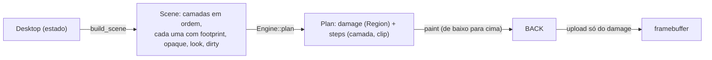

# O compositor

Status: implementado (W27). Este documento é o projeto, as invariantes e o guia para estender o
compositor sem quebrá-lo. A seção 6 de `docs/ARCHITECTURE.md` resume o resultado.

## 1. O problema

A área de trabalho piscava com várias janelas abertas: a janela do Snake piscava e as **sombras
sumiam** (a do Editor desaparecia; um Editor sobre as Tarefas aparecia sem sombra, com a borda
dura, e às vezes a área inteira acendia). A causa não era um bug só, era uma **classe** de bugs:

- o compositor tinha vários caminhos que desenhavam a mesma coisa de formas diferentes
  (estável, animação com uma "camada estática" em cache, dano por janela, repintura parcial
  das janelas vivas, passes de overlay, toast, HUD e cursor);
- uma **assinatura** (um hash) decidia quando reconstruir o cache, e toda funcionalidade nova
  (janelas vivas, encaixe, áreas de trabalho, barra de tarefas) precisava lembrar de estendê-la;
- o caminho de quadro estável recompunha a cena inteira em `BACK` mas subia à VRAM só alguns
  retângulos, então `BACK` e a tela divergiam e o próximo upload mostrava mudanças antigas;
- a "janela estática acima de uma animada" era restaurada pelo retângulo da janela, sem a sombra;
- a sombra pertencia ao cache, não à janela.

O oráculo (`tools/perf/scen/w27-oracle.sh`, seção 7) reproduziu a falha no commit anterior: 12 de
23 estados com janelas vivas diferiam de um redesenho completo (de 452 a 62 017 pixels, inclusive
uma janela pintada acima de outra que está acima dela) e quadros consecutivos de uma rajada
diferiam em até 2 657 pixels.

## 2. A ideia: corretude por construção

> **O que está na tela é, em todo quadro, função só da descrição da cena, não do histórico de
> como se chegou a ela.**

Para isso o compositor tem três peças, de fora para dentro:



1. **A cena** (`osjeff_core::compositor::Scene`) é uma lista ordenada de **camadas**: de baixo
   para cima, o papel de parede (implícito), as janelas em z-order, a barra de apps, o painel, a
   pré-visualização de encaixe e as camadas do shell (Apps, Busca, menu, popover, Alt+Tab,
   folha). Cada camada diz só o que é: um `LayerId`, o **footprint** (tudo o que ela pode
   desenhar, sombra incluída), a área **opaque** (o que ela cobre com pixels opacos), um
   **look** (um valor que muda quando os pixels dela podem ter mudado) e, opcionalmente, um
   retângulo **dirty** (mudou só ali: um gráfico, um cursor de texto). Ninguém diz *o que
   repintar*.
2. **O motor de dano** (`Engine`) guarda a cena do quadro anterior (o que está em `BACK`) e,
   dada a nova, calcula o **dano**: o conjunto de pixels que podem ter mudado. Uma camada que
   apareceu ou sumiu danifica o footprint; uma que mexeu ou mudou de tamanho, o footprint antigo
   **e** o novo; uma de `look` novo, o footprint; uma com `dirty`, esse retângulo; duas que
   trocaram de lugar na pilha, a interseção dos footprints; mais as invalidações explícitas
   (`invalidate(rect)`). O arrasto, o tique do relógio e o gráfico que desliza **não são caminhos
   especiais**: são casos dessa mesma regra.
3. **O pintor** executa o plano. Cada camada, de baixo para cima, é pintada sobre o dano que cai
   no footprint dela, menos o que uma camada opaca acima esconde. Onde há dano e nada opaco o
   cobre, o papel de parede é pintado primeiro: **todo pixel repintado é recalculado do fundo
   da pilha**. Por isso uma sombra nunca é aplicada duas vezes nem "fica" numa janela que já
   não a tem, e a sombra é da camada da janela, nunca de um cache.

`Plan::damage` é exatamente o que sobe à VRAM. `BACK` só muda dentro do dano e a tela só recebe o
dano, então as duas não podem divergir (fora do cursor, dos toasts e do HUD, seção 4).

## 3. Invariantes

**Do motor** (provadas pelo teste diferencial, seção 6):

- **I1.** `damage` é um conjunto de retângulos **disjuntos** (`Region`): um pixel nunca é pintado
  duas vezes no mesmo quadro. Uma `Region` só **cresce** ao se fundir (fundir dois retângulos
  vizinhos que gastam pouco), nunca encolhe: sempre é um superconjunto do que foi adicionado.
- **I2.** Incremental == completo: depois de cada quadro, `BACK` é idêntico, byte a byte, ao
  que `Engine::full_plan` desenha do zero (cada camada sobre a tela inteira, sem cortar nada).
- **I3.** Um quadro sem mudança não planeja nada (nem pinta, nem sobe).

**Do dono da cena** (o kernel; o motor depende delas e o teste do kernel as verifica):

- **C1. footprint**: pintar uma camada não toca pixel fora do `footprint` declarado.
- **C2. opaque**: todo pixel de `opaque` termina totalmente opaco, qualquer que fosse o fundo
  (por isso as camadas de baixo podem ser puladas ali). Vazio quando há dúvida (janela em fade,
  animação de abrir/fechar).
- **C3. invariância ao recorte**: pintar com um `clip` dá, dentro dele, os mesmos pixels que
  pintar tudo, sobre o mesmo fundo. As primitivas de `Canvas` respeitam o recorte; o conteúdo dos
  apps (`draw_window`) só desenha com elas.
- **C4. look**: se a camada pintaria pixels diferentes do quadro anterior, o `look` mudou, ou
  `dirty` cobre a diferença.

O modo **verify** (Ctrl+Alt+V, `desktop/compositor/verify.rs`) checa C1 a C4 no kernel: depois
de cada quadro, repinta a cena inteira (plano de referência, que não confia em footprint nenhum)
num buffer à parte e compara com `BACK`; as divergências saem na serial como
`compositor-verify: MISMATCH`. O modo **referência** (Ctrl+Alt+R) faz o mesmo para a tela: todo
quadro é o redesenho completo, a verdade que o oráculo fotografa.

## 4. O que fica só no framebuffer

O cursor, os toasts e o HUD **não são camadas**: vivem só no framebuffer, nunca em `BACK`
(mover o cursor não recompõe nada). Cada um é restaurável a partir de `BACK`:

- **Cursor** (`osjeff_core::cursor`, inalterado): todo quadro que renderiza algo começa
  apagando o sprite e termina pintando-o, depois dos uploads, dos toasts e do HUD.
- **Toasts**: a cada quadro de trabalho restaura-se de `BACK` a área que cobriam (agora e na
  última vez) e desenham-se por cima.
- **HUD**: atualiza a cada 100 ms e, além disso, **sempre que um upload ou o apagar do cursor
  tocou o retângulo dele**.

Regra geral: fora essas três coisas, `framebuffer == BACK` depois de cada quadro.

## 5. O kernel (`kernel/src/desktop/compositor/`)

| Arquivo | Responsabilidade |
|---|---|
| `mod.rs` | `Compositor::frame`: apaga o cursor, `compose` (invalida, descreve a cena, planeja, pinta), sobe o dano, toasts, HUD, cursor. |
| `layers.rs` | `Desktop::build_scene`: o desktop como cena. Footprint, opaque, look e dirty de cada camada. |
| `paint.rs` | `DeskPainter`: pinta uma camada com um recorte (`draw_window`, `draw_dock`, ...). |
| `animating.rs` | `draw_animating`: janela abrindo/fechando/minimizando, via textura. |
| `present.rs` | `Screen` (os três buffers), upload de retângulos, passes só-framebuffer. |
| `verify.rs` | O modo verify. |

O laço de `main.rs` só junta as entradas do quadro (`FrameIn`) e chama `Compositor::frame`.

**Por que cada camada existe e o que a repinta.**

| Camada | Footprint | Opaca | Repintada quando |
|---|---|---|---|
| Janela | retângulo + sombra (`shadow_box`) | a faixa de linhas entre os cantos arredondados (da esquerda à direita); vazia se anima ou dá zoom | `look` (foco, hover, arrasto...), ou `dirty`: o footprint se a forma muda (anima, zoom, mover, redimensionar, foco); o retângulo se só o conteúdo anima (editor, terminal, cópia, visualizador, arrasto interno de Arquivos/Ajustes); a área de conteúdo de um jogo; a área do cliente de um navegador; o gráfico de uma janela viva |
| Barra de apps | a barra e a sombra em repouso; a zona acima dela (ícones levantados, dica) quando algo se move ou está sobre ela | não | `look` (época do chrome), e todo quadro enquanto `dock_animating` |
| Painel | `panel_rect` | sim (a faixa de vidro vem do papel de parede) | época do chrome; o relógio, por `invalidate(clock_rect)` |
| Encaixe | o retângulo + 3 | não | o próprio retângulo e a opacidade |
| Apps, Busca, menu, popover, Alt+Tab, folha | o retângulo + 40 (Apps e folha: a tela) | não | época dos overlays (entrada, hover, animação); o Apps só no retângulo `dirty` do hover |

A **época do chrome** sobe quando houve entrada (`scene_dirty`/`force_full`), quando uma
animação assentou ou enquanto um overlay anima; a **época dos overlays** também sobe com o hover
do ponteiro. Um quadro de arrasto não sobe nenhuma das duas, então arrastar uma janela só repinta
o que o dano dela toca.

**Navegador (W24).** O repaint só da área do cliente (rolagem, hover num link, tecla na barra) é o `dirty` da camada da janela: `FrameIn::client` invalida o retângulo do cliente e uma janela de navegador ocupada declara a área do cliente como o que muda; o título e a sombra não são tocados. Não há caminho próprio para isso.

Entradas que o motor não pode ver (um handler mudou a janela focada sem dizer como): em quadros
de entrada invalidam-se as caixas da janela focada, da que perdeu o foco e da sob o ponteiro; o
resultado de rede do navegador invalida a janela dele; o tique do relógio invalida o relógio e
as janelas "vivas"; e uma janela que parou de ser dinâmica é repintada uma última vez
(`dynamic_prev`).

### Memória e tempo

Não há superfícies retidas por janela: o motor repinta do estado, e o recorte mais a oclusão
(camadas opacas escondem as de baixo) mantêm o custo proporcional ao dano. Os buffers são os
mesmos de antes (`BACK`, `BG`, a textura de animação de 3,5 MiB); o buffer `STATIC` (3,7 MiB)
virou o scratch do modo verify. O heap de 64 MiB não é tocado.

## 6. O teste diferencial

`osjeff_core/src/compositor/sim/` simula uma área de trabalho (192x128): janelas com
áreas de trabalho, z-order, animações (opacidade e retângulo), três tipos de conteúdo (parado,
"vivo" com um gráfico que muda por conta própria, "jogo" que muda tudo), painel, barra,
popover, toast e pré-visualização de encaixe. O **pintor de modelo** desenha cada camada com um
padrão reconhecível: cor única por janela, faixa de título, cantos recortados, anel de sombra
translúcido (aritmética inteira: aplicar duas vezes ou em outra ordem dá outro pixel).

Para milhares de históricos aleatórios (abrir, fechar, mover, redimensionar, focar, minimizar,
restaurar, encaixar, maximizar, área de trabalho, popover, toast, tique de animação, tique
das janelas vivas, edição parcial, relógio, quadro ocioso; de 1 a 3 eventos por quadro) o teste
afirma **depois de cada quadro** que o resultado incremental (só com o dano que o motor
reporta) é idêntico ao redesenho completo. O seed aparece na mensagem de falha. Casos
específicos: sombra sob a vizinha, janela acima de uma animada, sombra cortada pela borda do
dano, janela saindo da tela, maximizada, translúcida, dano de 1 pixel e os dois bugs reportados
(Tarefas + Snake; Editor sobre Tarefas).

**Teste de mutação permanente** (`tests/mutants.rs`): quebra-se de propósito cada invariante e
exige-se que o teste diferencial falhe: esquecer o footprint antigo de uma camada que mexeu, as
trocas de z-order, o que uma camada removida cobria, o `look`, o `dirty`; omitir a sombra do
footprint; declarar os cantos arredondados como opacos; esquecer o `dirty` de uma janela; esquecer de
subir o `look`; esquecer de invalidar o relógio.

O mesmo simulador alimenta o alvo de fuzz `compositor_ops`.

## 7. O oráculo no QEMU

```bash
QEMU_MEM=256M tools/perf/run.sh  bios /tmp/o 900 tools/perf/scen/w27-oracle.sh          # conjunto A
W27_SET=b W27_VERIFY=1 QEMU_MEM=256M tools/perf/run.sh  bios /tmp/o 1200 tools/perf/scen/w27-oracle.sh
tools/perf/w27-oracle-check.sh /tmp/o          # pixels diferentes por par (tem de ser 0)
tools/perf/w27-burst-check.sh /tmp/o b2_ 0     # rajadas: quadros consecutivos idênticos
grep compositor-verify /tmp/o/serial.log       # divergências do modo verify
```

O conjunto A move, redimensiona, foca, minimiza, restaura, encaixa e maximiza janelas estáticas,
troca de área de trabalho e abre popovers e menus; o B repete com janelas que mudam sozinhas
(Snake, um terminal executando `sleep`, Tarefas). Depois de cada passo tira-se `rest<N>.png`
(o que o compositor incremental deixou) e `clean<N>.png` (o mesmo estado em modo referência);
no B uma segunda foto de verdade diz quais pixels são voláteis e o verificador os ignora.

## 8. Como estender sem quebrar

**Uma janela nova** (um tipo de app): nada a fazer no compositor, ela já é uma janela. O que
for desenhado tem de ficar dentro do retângulo dela e usar só primitivas de `Canvas` (C1, C3).
Se o conteúdo muda por conta própria (relógio, animação, rede), diga isso em
`window_activity` (`layers.rs`): `dirty` com o retângulo que muda, ou o footprint inteiro.
Mudança por entrada do usuário já é coberta: a janela focada é invalidada em todo quadro de
entrada; se o app muda uma janela **sem foco**, chame `mark_dirty(window_box)`.

**Um overlay novo**: uma constante `LayerId` e uma variante de `Slot` em `layers.rs`, um
footprint que inclua a sombra, um `look` (a época dos overlays serve), e um ramo em `paint.rs`.
Pinte só com `Canvas`. Se o overlay captura o fundo (vidro), a captura lê `BACK`, que já tem
tudo o que está abaixo.

**Algo que mexe fora de qualquer camada** (o papel de parede): `Compositor::repaint_everything`.

Regra de ouro: **não** crie um caminho de desenho, um cache ou uma assinatura. Se um estado novo
muda os pixels de uma camada, ele entra no `look` dela, na construção da camada, e o verify e o
oráculo dizem se faltou.

## 9. O que mudou em relação ao desenho anterior

Removidos: `Desktop::render`, `render_anim_frame`, `compose_static`, `anim_signature`,
`draw_overlay*`, `clock_repaint_is_local`, `repaint_clock`, `task_window_rect`,
`WindowManager::signature` e `wm::scene_signature` (com seus testes), o buffer `STATIC` como
cache, os caminhos `OverlayRebuild`/`Clock` e `Prim`-s sem uso. O painel passou a ser uma camada
opaca no topo: uma sombra de janela que chega à faixa do painel não a escurece mais.
