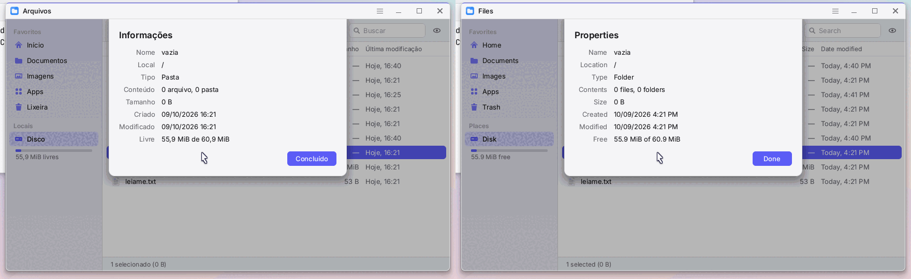
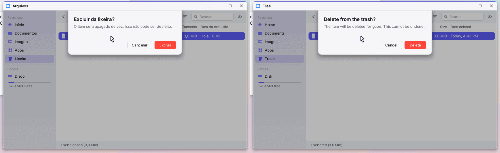
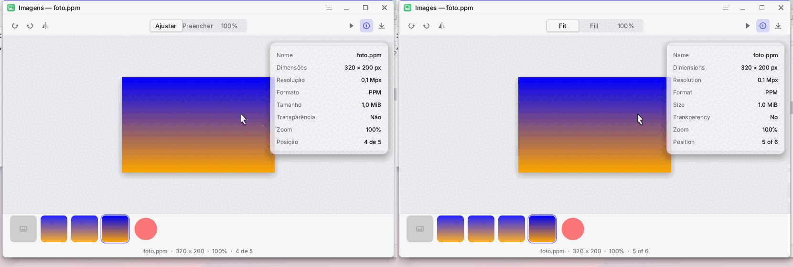
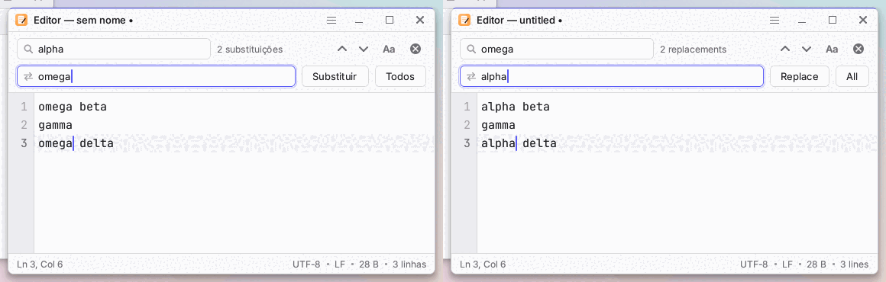

# Idiomas e acentuação (i18n)

Estado: **infraestrutura pronta e o shell migrado** (W28). O sistema fala **português do Brasil**
(padrão) e **inglês**; o idioma muda ao vivo, sem reiniciar, em *Ajustes > Idioma e região*. Os
interiores dos apps ainda estão em português fixo no código: a lista do que falta, por app e por
arquivo, está em [`i18n-audit.md`](i18n-audit.md) (gerada por `tools/i18n-audit.py`).

Pedido do dono: "muitas palavras da interface estão sem acento e o sistema **precisa** de acentos";
e internacionalização, começando por exatamente dois idiomas. Este documento é o contrato para quem
migra um app.

## 1. Decisões

| Pergunta | Decisão | Por quê |
|---|---|---|
| Onde fica a lógica? | `osjeff_core::i18n` (`no_std`, `forbid(unsafe_code)`, sem dependência nova) | testa no host, como o resto; o kernel só chama |
| Como o catálogo entra no binário? | arquivos de texto `assets/i18n/{pt,en}.txt` (`chave = valor`), embutidos com `include_str!` e **processados em tempo de compilação** por uma `const fn` que ordena e confere duplicatas | zero custo no boot, zero heap, zero estado global além do idioma; consulta por busca binária numa tabela só de leitura. Alternativas descartadas: `build.rs` que gera um array (mais um passo de build e um arquivo gerado para revisar) e *parse* no boot (aloca e gasta tempo antes do primeiro quadro) |
| Chave | string estável `area.objeto.detalhe` (minúsculas, dígitos e `_`; seções separadas por `.`) | nunca muda quando a tradução muda; dá para procurar com `grep` |
| Cadeia de busca | idioma atual, depois **inglês**, depois **a própria chave** | uma chave esquecida aparece como texto legível em vez de sumir; nunca dá pânico e nunca aloca |
| Marcadores | `{nome}` ou `{0}`, com **argumentos tipados** (`Int`, `Num`, `Dec`, `Pad`, `Bytes`, `Str`, `Display`) | quem traduz reordena os marcadores mas não muda o que eles significam; sem especificadores de formato dentro do texto |
| Plural | chaves irmãs `chave.one` e `chave.other` escolhidas pela regra do idioma | simples de revisar; a regra vem do catálogo (`fmt.plural`) |
| Datas, números, tamanhos | padrões e separadores **também são chaves** (`fmt.*`, `date.*`) | um idioma novo só precisa do arquivo de texto |
| Idioma novo | arquivo `.txt` + uma linha em `enum Lang` (variante, `ALL`, `catalog()`) | ver seção 8 |
| Teclado | independente do idioma (US ou ABNT2); ao escolher português Ajustes **sugere** ABNT2, sem trocar nada | quem usa teclado US em português continua podendo |
| Relógio | `clock=auto` (padrão): 24 h em português, 12 h em inglês, até o usuário escolher | o formato acompanha o idioma sem tirar a escolha do usuário |
| Tela de falha (`crash.rs`) e logs | **ficam em inglês** | a tela de falha é *serial primeiro* (vai para a porta serial antes de qualquer pixel) e é lida por quem depura; um texto ambíguo ou mudando com a configuração atrapalha. Logs (`klog!`) também: são para o desenvolvedor, não para o usuário |

Nenhum texto visível menciona a linguagem de programação ou as ferramentas de build (há um teste que
procura essas palavras nos catálogos).

## 2. Arquivos

```
assets/i18n/pt.txt          catálogo do português do Brasil (obrigatório ter tudo)
assets/i18n/en.txt          catálogo do inglês (a reserva de todos os idiomas)
tools/i18n/accents.txt      palavras que nunca podem aparecer sem acento (usada pelo teste e pela auditoria)
tools/i18n-audit.py         auditoria dos textos do código -> docs/design/i18n-audit.md
osjeff_core/src/i18n/       mod.rs (Lang, consulta, macros), catalog.rs (const fn), template.rs
                            (marcadores), plural.rs, locale.rs (números, tamanhos, datas), audit.rs (testes)
kernel/src/desktop/lang.rs  o que o desktop refaz quando o idioma muda
```

### Formato do catálogo

```text
# comentário (só no começo da linha)
files.sidebar.favorites = Favoritos
files.count.one   = {n} item
files.count.other = {n} itens
```

* Uma entrada por linha; a chave é tudo antes do primeiro `=`, o valor tudo depois; os dois sem espaços
  nas pontas. O valor pode ter `=` e `#`. Não há escapes nem valores de várias linhas.
* A ordem das linhas é livre (agrupe por app e deixe comentários): a `const fn` ordena. Linha sem `=`,
  chave vazia ou chave repetida **não compila**.
* Para usar `{` ou `}` literais, escreva `{{` e `}}`.

## 3. Convenções de chave

`<área>.<objeto>.<detalhe>`, tudo em minúsculas. A área é o app ou a peça do shell:

| Prefixo | Dono |
|---|---|
| `meta.*`, `fmt.*`, `date.*`, `time.*` | o próprio idioma (nome, separadores, padrões, nomes de dias e meses) |
| `app.*` | nomes dos apps (barra de título, menus, dicas, Apps, Busca) |
| `panel.*`, `menu.*`, `quick.*`, `centre.*` | painel superior, menus, configurações rápidas, calendário e notificações |
| `taskbar.*`, `launcher.*`, `search.*`, `power.*`, `common.*` | barra de apps, Apps e Busca, energia, palavras comuns |
| `settings.*` | Ajustes (`settings.sec.*` são as seções da lateral) |
| `files.*`, `edit.*`, `term.*`, `tasks.*`, `log.*`, `calc.*`, `viewer.*`, `web.*`, `apps.*` | um prefixo por app (para a migração não colidir) |

Regras: o nome descreve **o papel**, não a frase (`menu.file.save`, não `menu.salvar_arquivo`);
um texto usado em dois lugares com o mesmo sentido é **uma** chave (`power.restart`); sentidos
diferentes ficam em chaves diferentes mesmo que o texto seja igual hoje (em outro idioma costumam
divergir). Chaves de plural terminam em `.one`/`.other` e são citadas sem o sufixo.

## 4. API (folha de consulta)

```rust
use osjeff_core::i18n::{self, Lang, Arg, bytes, num, dec, Civil, DateStyle};
use osjeff_core::{t, tp, tk};

t!("panel.apps")                        // &'static str, no idioma atual (inglês, depois a chave)
t!("menu.window.move_to_workspace", n = 2)   // String, com marcadores
tp!("taskbar.tip", count, name = title) // String: escolhe .one/.other; {n} = a contagem
tk!("app.files")                        // só marca a chave (tabelas, const); consulte depois com i18n::tr

i18n::tr(key)            i18n::tr_in(Lang::En, key)               // consulta direta, sem alocar
i18n::tr_fmt(key, &[("n", Arg::Int(3))])   i18n::plural(key, n)    // formatação / plural sem macro
i18n::format_date(civil, DateStyle::Panel, clock24)               // String
i18n::format_time(civil, clock24, seconds)   i18n::format_size(bytes)   i18n::format_num(n)
i18n::lang()  i18n::set_lang(l)  i18n::generation()  i18n::missing_count()
```

* **`t!` e `tp!` exigem literal** como chave (é assim que o teste acha as chaves usadas). Para chaves
  guardadas em tabelas ou `const`, use `tk!("chave")` na tabela e `i18n::tr(chave)` na hora de desenhar.
  Funções `const fn` não consultam o catálogo: devolva a chave (`tk!`) e traduza onde desenha.
* **Não guarde texto traduzido** em estado que sobrevive à troca de idioma (títulos, listas montadas na
  abertura): guarde a chave ou refaça em `Desktop::language_changed` (kernel/src/desktop/lang.rs).
  `i18n::generation()` muda a cada troca, para caches que preferirem comparar.
* Argumentos: `&str`/`String` (`Str`), inteiros (`Int`, dígitos puros: ids, portas, pixels), `num(n)`
  (quantidade com milhar: `1.234`/`1,234`), `dec(valor_x10^casas, casas)` (`1.234,5`/`1,234.5`),
  `bytes(n)` (`1,5 KiB`/`1.5 KiB`), `Arg::Pad(n, largura)` (zeros à esquerda) e `Arg::Display(&x)`.
* Marcador desconhecido, chave de marcador longa demais ou chave `{` sem fechar saem **como estão** no
  texto, para o erro aparecer na tela e a renderização continuar.
* `{Nome}` (inicial maiúscula) imprime o argumento `nome` com a primeira letra em maiúscula: em
  português dias e meses ficam em minúsculas no meio da frase (`8 de outubro`) e maiúsculos no começo
  (`Outubro de 2026`).

### Datas, horas, números

| | pt-BR | en |
|---|---|---|
| curta | `08/10/2026` | `10/08/2026` |
| média | `8 out 2026` | `Oct 8, 2026` |
| longa | `Quinta-feira, 8 de outubro de 2026` | `Thursday, October 8, 2026` |
| completa | `qui, 8 out 2026 23:49` | `Thu, Oct 8 2026 11:49 PM` |
| painel | `qui 8 out  23:49` | `Thu Oct 8  11:49 PM` |
| número | `1.234,5` | `1,234.5` |
| tamanho | `1,5 KiB` | `1.5 KiB` |
| plural (0, 1, 2) | `0 item`, `1 item`, `2 itens` | `0 items`, `1 item`, `2 items` |

Regras de plural: português do Brasil (CLDR `i = 0..1`): **0 e 1 são singular**; inglês: só o 1.
A regra é escolhida por `fmt.plural` no catálogo: `one` (só o 1), `zero-one` (0 e 1), `invariant` (sempre
`other`). O relógio de 12 horas não usa zero à esquerda (`9:05 AM`).

## 5. O idioma em tempo de execução

* `Settings::lang` (`language=pt-BR` | `en` em `/etc/osjeff.conf`; `pt`, `en-US` etc. também valem; valor
  inválido mantém o padrão, o leitor continua total). `Settings::clock_auto` (`clock=auto|24|12`).
* `kernel::settings::set` chama `i18n::set_lang`. Em Ajustes, `settings_apply_live` vê que o idioma mudou
  e chama `Desktop::language_changed`: troca o nome do app nos títulos das janelas (`<nome>[ N][ - detalhe]`,
  o detalhe fica), fecha menus, popovers, Apps e Busca (guardam texto montado na abertura) e pede
  repintura total (`force_full`). O texto desenhado a cada quadro vem do catálogo e muda sozinho. O atlas
  de glifos é indexado por (face, tamanho, caractere), nunca por texto, então não fica velho.
* Notificações já guardadas no centro mantêm o texto da mensagem original (vem do registro, em inglês);
  só os títulos de nível, as horas relativas e os rótulos mudam.

## 6. Como adicionar um texto

1. Escolha a chave (seção 3) e escreva a linha nos **dois** arquivos, no mesmo bloco:
   `assets/i18n/pt.txt` (com acentos) e `assets/i18n/en.txt`.
2. Use `t!("area.chave")` onde o texto é desenhado. Marcadores: `t!("files.copied", n = 3, name = nome)`.
3. `cargo test -p osjeff_core i18n` acusa: chave que não existe em um dos arquivos, chave dos arquivos
   que nada usa, marcadores diferentes entre os idiomas, plural sem `.other`, palavra sem acento
   (`tools/i18n/accents.txt`) e glifo que a fonte não tem.
4. Rode `python3 -I tools/i18n-audit.py` para atualizar `docs/design/i18n-audit.md` (`--check` no CI).

## 7. Guia de tradução

**Tom.** Português: direto e cordial, segunda pessoa implícita ("Escolha uma imagem"), sem gerúndio
longo e sem jargão ("Sem rede", não "Falha de conectividade"). Inglês: frases curtas no imperativo para
ações ("Open", "Save"), sentença com ponto final só em mensagens inteiras. Botões e itens de menu:
verbo no infinitivo em português (`Salvar`, `Abrir…`) e verbo simples em inglês (`Save`, `Open…`);
reticências `…` (um caractere) quando abre outra pergunta. Nunca ponto final em rótulos.

**Acentos.** Todo texto em português leva acento e cedilha corretos (`Configurações`, `não`, `área`,
`última modificação`). Aspas “curvas”, `…` e `–` quando o texto pede; em inglês, aspas curvas também.
O teste `portuguese_catalog_text_has_its_accents` falha em uma palavra sem acento da lista.

**Capitalização.** Português: só a primeira palavra e nomes próprios (`Papel de parede`, `Data e hora`);
inglês de interface: capitalização de frase também (`Quick settings`, `Date & time`), exceto nomes
de apps (`Files`, `Tasks`). Dias e meses em minúsculas em português, capitalizados em inglês.

**Terminologia.**

| Português | Inglês | Observação |
|---|---|---|
| Apps | Apps | a grade de apps (botão do painel) |
| Busca | Search | `Ctrl+Espaço` / `Ctrl+Space` |
| Barra de apps | App bar | a barra flutuante de baixo |
| Painel | Top panel | a faixa de cima |
| Configurações rápidas | Quick settings | o popover do painel |
| Ajustes | Settings | o app; "Configurações" só no mosaico que abre Ajustes |
| Arquivos | Files | |
| Imagens | Images | o visualizador |
| Lixeira | Trash | |
| Tarefas | Tasks | o monitor de atividade |
| Registro | Log | o visualizador do registro do sistema |
| Navegador | Browser | |
| Calculadora | Calculator | |
| Componentes | Components | a galeria de componentes |
| Aplicativos | Applications | apps de terceiros (WebAssembly) |
| Notificações | Notifications | |
| Não perturbe | Do not disturb | |
| Área de trabalho | Desktop | "Mostrar área de trabalho" / "Show desktop" |
| Área de trabalho 2 | Workspace 2 | área de trabalho virtual |
| Aparência | Appearance | Automática / Clara / Escura = Automatic / Light / Dark |
| Cor de destaque | Accent color | |
| Papel de parede | Wallpaper | |
| Fuso horário | Time zone | |
| Reiniciar / Desligar | Restart / Shut down | |
| Encaixar à esquerda | Snap left | |
| Fixar na barra | Pin to the bar | |

**Nomes que não se traduzem:** OSjeff, OJFS, ABNT2, KiB/MiB/GiB, Wi-Fi, nomes de cidades do fuso
horário (esses seguem a lista de `settings.rs` por enquanto), nomes de comandos do terminal.

## 8. Como adicionar um terceiro idioma (só dados)

1. Copie `assets/i18n/en.txt` para `assets/i18n/<código>.txt` e traduza os valores; **não mude as chaves nem
   os marcadores**. Defina `meta.code`, `meta.name` (o nome do idioma *nele mesmo*), `fmt.decimal`, `fmt.group`,
   `fmt.plural` (`one`, `zero-one` ou `invariant`; uma regra nova entra em `plural.rs`), `fmt.clock24_default`,
   os padrões `fmt.*` e os nomes `date.*`.
2. Em `osjeff_core/src/i18n/mod.rs`, em `enum Lang`: a variante, a entrada em `Lang::ALL` e uma linha em
   `catalog()` (mais um `catalog::catalog!(XX, "…/xx.txt")`). O seletor de Ajustes lista `Lang::ALL` com
   `native_name()`, e o restante do código não muda.
3. `cargo test -p osjeff_core i18n` confere as chaves, os marcadores, a cobertura de glifos da fonte (acrescente
   o intervalo de Unicode necessário em `tools/subset-font.sh` se faltar) e os acentos (para um idioma
   latino com outro conjunto de acentos, estenda `tools/i18n/accents.txt` ou restrinja o teste a `pt`).

## 9. Fontes

Inter (Regular, Medium, SemiBold) e JetBrains Mono (SIL OFL 1.1, licenças em `assets/fonts/`) já trazem
o Latin-1 completo e a pontuação: `áàâãäéèêëíìîïóòôõöúùûüçñ` e as maiúsculas, `« » ‘ ’ “ ” „ … – — − ° ª º € £ ¥ ¿ ¡ · • × ÷ ±`,
mais as setas do painel. O teste `fonts_cover_both_catalogs_and_the_portuguese_alphabet` confere cada caractere
dos dois catálogos contra as quatro fontes (`Font::glyph_index`); nada precisou ser acrescentado nesta
onda, e o subconjunto continua pequeno (~30 KB cada).

## 10. O que a infraestrutura garante (testes)

`cargo test -p osjeff_core i18n`: os dois catálogos têm **as mesmas chaves e os mesmos marcadores**; as famílias
de plural estão completas; toda chave usada em `kernel/` e `osjeff_core/` existe nos dois idiomas e toda chave
dos catálogos é usada; o português não tem palavra sem acento (lista de ~190 palavras e sufixos) nem nos
catálogos nem nos literais dos arquivos já migrados; o inglês não tem restos do português; nenhum texto cita a
linguagem ou as ferramentas; cobertura das fontes. Mais: busca e retorno ao inglês, marcadores malformados,
plurais, números, tamanhos, datas e horas nos dois idiomas, o leitor de `language=`/`clock=` e o alvo de fuzz
`i18n_format` (modelos hostis). `cargo test -p osjeff_core i18n_report -- --ignored --nocapture` imprime os
literais sem acento da árvore inteira.

## 11. O que ficou de fora (próxima onda)

Interiores dos apps (Arquivos, Editor, Terminal, Tarefas, Registro, Calculadora, Imagens, Navegador, Ajustes
exceto a nova página e a lateral), mensagens do interpretador e de `VfsError`, páginas de erro do navegador,
nomes dos apps WASM, nomes das cidades do fuso horário e dos papéis de parede. A divisão sem sobreposição, com
a contagem de textos por arquivo e as chaves propostas, está em [`i18n-audit.md`](i18n-audit.md).

## 12. Arquivos, Imagens e Editor (W30)

Os três apps estão no catálogo (blocos `files.*`, `viewer.*`, `edit.*` no fim de `pt.txt` e `en.txt`, sob
o comentário `# ---- w30: arquivos, imagens, editor ----`); nenhum texto visível deles ficou no código.
Capturas lado a lado (português à esquerda, inglês à direita), tiradas no QEMU com os cenários
`tools/perf/scen/w30-*.sh`:

| Captura | Mostra |
|---|---|
|  | folha de informações de uma pasta (rótulos de largura medida, datas e tamanhos no formato do idioma) |
|  | confirmação de exclusão definitiva (plural por contagem) |
|  | painel de informações, legenda e barra de ferramentas |
|  | barra de buscar e substituir, aviso "2 substituições / 2 replacements" e barra de estado |

Decisões que valem para os próximos apps:

* **Código puro devolve texto já no idioma.** `VfsError::message()`, `fileman::context_menu`, `kind_label`,
  `format_modified`, `viewer::info_rows`, `decode_error_message` e `editor2::status_bar` chamam `t!`/`tp!`
  na hora; os testes pedem o idioma com `i18n::testlang::LangGuard` (um idioma por *thread*, sem tocar o
  global) e conferem português e inglês.
* **Contagens, tamanhos e datas usam os formatadores.** `1 item` / `3 itens` / `0 item` (português do
  Brasil: 0 e 1 no singular) e `0 items` em inglês; `fileman::format_size` é `i18n::format_size`
  (`1,5 KiB` / `1.5 KiB`); `fileman::format_datetime(unix, fuso, relógio24)` e `ui::format_modified` usam
  `DateStyle::Short` e `format_time` (`14/11/2023 22:13` / `11/14/2023 10:13 PM`) e respeitam o relógio de
  12 ou 24 horas escolhido em Ajustes.
* **Linhas "rótulo: valor"** da folha de informações vêm de `files.prop.line`; a largura da coluna de
  rótulos é a do maior rótulo medido (nada de constante: o inglês e o português têm larguras diferentes).
* **Estado com texto.** O que guarda texto montado (mensagem da barra de estado, painel de pré-visualização,
  folha de informações aberta, erro e título do Imagens, mensagem e erro de diálogo do Editor) é refeito ou
  descartado em `Desktop::{files,viewer,editor}_language_changed_all`, chamados por `language_changed`.
* **Nomes na lateral e na barra de caminho.** `/home`, `/Documentos` e `/Imagens` aparecem como
  Início/Documentos/Imagens ou Home/Documents/Images (`files.place.*`); o nome real da pasta no disco não
  muda, e uma pasta nova nasce com o nome do idioma do momento (`files.new_folder_name`).
* **Fica em inglês de propósito:** mensagens internas de `fs3` (fsck, extentes) e dos decodificadores
  (`png`, `bmp`, `ppm`, `inflate`), que não aparecem em Arquivos nem em Imagens (o usuário vê `viewer.err.*`; só Ajustes ainda mostra o texto
  bruto ao recusar um papel de parede), e as mensagens de invariante do Editor (`editor2/mod.rs`, de testes
  e depuração). O detalhe de "pacote inválido" na folha
  de informações de um `.wasm` vem do instalador de apps e continua em inglês até esse módulo migrar.
