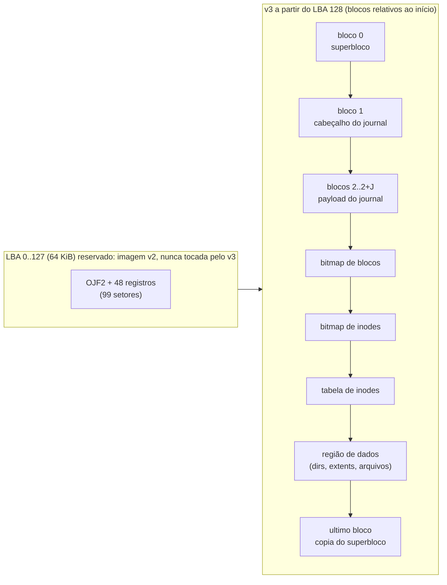
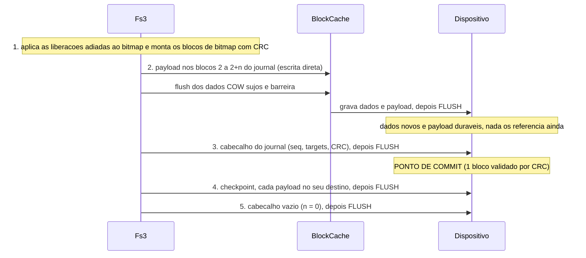
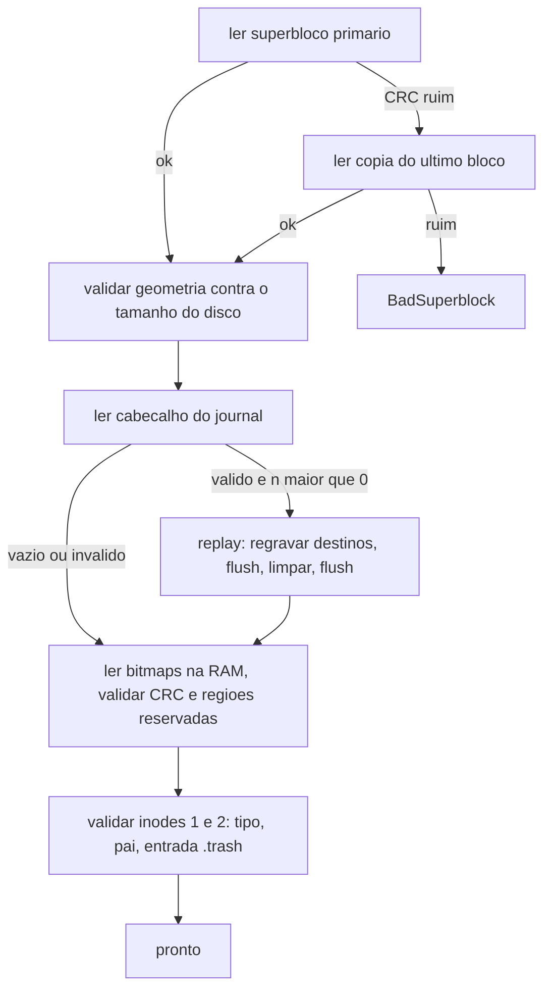
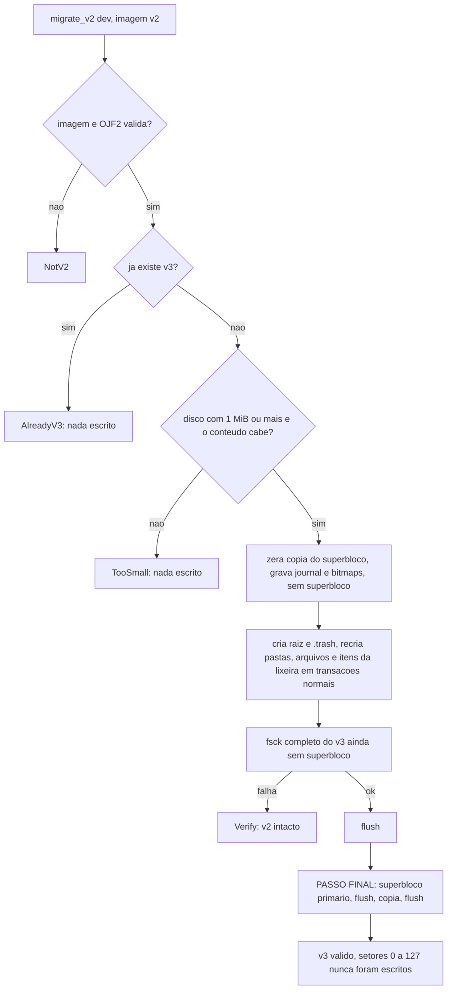

# OJFS v3 — especificação do formato em disco e da API

| | |
|---|---|
| Status | **Implementado em `kitsune_core`** (biblioteca pura); a camada de armazenamento do kernel (`ata.rs` `AtaDisk`, `storage.rs`) monta o v3 no boot e o desktop (gerenciador de arquivos, visualizador, editor, terminal) usa o v3 pela camada VFS (§9.1); o shell v2 e o editor v2 são a onda seguinte |
| Módulos | `kitsune_core::blockdev`, `kitsune_core::blockcache`, `kitsune_core::fs3` |
| Substitui | `kitsune_core::fs` (OJFS v2, `OJF2`), que continua intacto e é lido na migração |
| Restrições | `no_std` + `alloc`, `forbid(unsafe_code)`, sem dependências (CRC32 próprio) |

Este documento é o contrato entre a biblioteca e quem a consome (kernel, ferramentas
de host). Se o código divergir dele, o bug é de um dos dois: corrija na mesma mudança.

> **Nome.** Para o usuário o sistema de arquivos é o *Kitsune FS (OJFS)*. A sigla **OJFS** e os
> identificadores em disco (`OJF2`, `OJF3`, `OJJ3`, `OJD3`, `OJX3`) vêm do tempo em que o projeto se chamava
> OSjeff e **ficam como estão por compatibilidade**: discos criados antes do renomeio montam sem conversão
> (`fs3::tests::golden`). Uma revisão futura do formato pode trocar o nome.

## 1. Por que um formato novo

O v2 (`docs/ARCHITECTURE.md` §8) é uma imagem de ~50 KiB inteira em RAM, regravada
inteira a cada Ctrl+S: 48 registros de 1 KiB, nomes de 16 B, sem timestamps, sem
checksum, sem journal. Uma queda de energia durante `write_image` deixa metade da imagem
nova e metade da velha (setores 0..98 gravados em ordem; nada detecta isso). O v3 resolve:

| Limite do v2 | v3 |
|---|---|
| 48 arquivos, 1 KiB cada, nome de 16 B | bloco de 4 KiB, extents, arquivo até ~16 TiB (limite de `u32` blocos), nome de 255 B, milhares de entradas por pasta |
| imagem inteira em RAM e regravada | acesso por bloco com cache write-back (LRU) |
| sem integridade | CRC32 em todo metadado; `fsck` interno |
| escrita não atômica | **journal de metadados + dados copy-on-write**: cada operação é atômica e durável |
| sem tempo/permissão | `ctime`/`mtime` (segundos Unix dados pelo chamador), `mode`/`uid` reservados |

## 2. Decisão: journal de metadados (redo) + dados COW, e não COW com superbloco duplo

Havia duas rotas aceitáveis. Escolhida: **journal write-ahead de blocos de metadados
(redo log) com checksums e replay no mount, combinado com escrita copy-on-write dos
blocos de dados**.

| Critério | Journal + dados COW (escolhido) | COW completo + superbloco duplo |
|---|---|---|
| Estruturas fixas (bitmap, tabela de inodes) | mantidas, simples de indexar e de verificar com `fsck` | exigem árvore/indireção COW até a raiz para tudo (inode map COW) |
| Ponto de commit | 1 bloco (cabeçalho do journal, com CRC sobre cabeçalho + payload) | 1 setor (superbloco), mas depois de reescrever o caminho até a raiz |
| Recuperação | `replay` idempotente, trivial de testar cortando em cada setor | trocar para o superbloco antigo; vazamento de blocos se o GC falhar |
| Amplificação de escrita em operação pequena | ~2x (payload + home), medida no benchmark (§11) | menor em metadado, maior em estrutura profunda |
| Migração v2 → v3 | compatível: o "marcador de válido" é o superbloco, escrito por último | idem |
| Risco de bug | menor: um único mecanismo (`Tx::commit`) concentra toda a atomicidade | maior: cada estrutura precisa de seu próprio caminho COW |

Os **dados de arquivo nunca são sobrescritos no lugar**: `write_at` aloca blocos novos,
copia a parte preservada (leitura-modificação-escrita), grava, e só então o commit do
journal troca os extents e libera os blocos velhos. Isso dá a garantia forte de que uma
queda no meio de um `write` deixa o arquivo **inteiro como estava** ou **inteiro como
ficou**, sem mistura (um journal "só de metadados" com sobrescrita no lugar rasgaria o
dado antigo). Custo: uma sobrescrita precisa de blocos livres temporários (disco 100%
cheio não aceita reescrever um arquivo; devolve `NoSpace` sem danos).

## 3. Layout em disco

Tudo é little-endian. Unidades: **setor** = 512 B (o do `BlockDevice`), **bloco** =
4096 B = 8 setores. O v3 começa no **LBA 128** (byte 65 536): os setores 0..127 (64 KiB)
são **reservados** e nunca são escritos pelo v3, porque ali mora a imagem v2 (99 setores).



Tamanho mínimo do disco: **1 MiB (2048 setores)**; abaixo disso `format` e `migrate_v2`
devolvem `TooSmall` sem escrever nada. Um disco v2 antigo de 64 KiB **não comporta** o
v3: o arquivo de disco precisa ser aumentado (por exemplo `truncate -s 64M`) antes da
migração; enquanto isso o kernel continua usando o v2 (ver §9).

### 3.1 Superbloco (bloco 0 e cópia no último bloco)

Ocupa só o **primeiro setor** (512 B) do bloco: uma escrita de setor é atômica, então o
superbloco ou está inteiro ou ausente. O resto do bloco é zero e não é lido.

| Offset | Tam. | Campo |
|---:|---:|---|
| 0 | 4 | `crc32` de `[4..512)` |
| 4 | 4 | magic `"OJF3"` |
| 8 | 4 | versão do formato (`1`) |
| 12 | 4 | tamanho de bloco (`4096`) |
| 16 | 16 | UUID (dado pelo chamador em `format`) |
| 32 | 4 | `total_blocks` (blocos de 4 KiB do v3, inclui metadados) |
| 36 | 4 | `journal_blocks` (J, blocos de payload) |
| 40 | 4 | `inode_count` |
| 44 | 4 | `bbitmap_start` |
| 48 | 4 | `bbitmap_blocks` |
| 52 | 4 | `ibitmap_start` |
| 56 | 4 | `ibitmap_blocks` |
| 60 | 4 | `itable_start` |
| 64 | 4 | `itable_blocks` |
| 68 | 4 | `data_start` |
| 72 | 8 | `created` (segundos Unix) |

O superbloco **não muda depois do `format`** (contadores de livres são derivados do
bitmap no mount). O mount recalcula a geometria a partir de `total_blocks`, `J` e
`inode_count` e rejeita o superbloco se qualquer posição gravada divergir. Se o
primário falhar, tenta a cópia do último bloco (posição derivada do tamanho do
dispositivo).

Geometria: `jhdr = 1`, `payload = 2..2+J`, `bbitmap_start = 2+J`,
`bbitmap_blocks = ceil(total/32704)`, depois o bitmap de inodes
(`ceil(inode_count/32704)`), a tabela (`inode_count/8` blocos) e `data_start`. Padrões de
`format`: `J = clamp(total/16, 24, 256)`, `inode_count = max(total/4, 64)` arredondado a
múltiplo de 8 (um inode por 16 KiB), ambos sobrescrevíveis em `FormatOptions`.

### 3.2 Bitmaps

Um bit por bloco (`1` = usado), cobrindo **todo** o v3, inclusive superbloco, journal,
bitmaps, tabela de inodes e a cópia final do superbloco (esses bits ficam sempre `1`).
Cada bloco de bitmap: `[crc32:4][reservado:4][bits:4088]` = 32 704 bits (511 palavras de 64 bits). O bitmap de inodes tem o mesmo
formato (bit `i` = inode `i+1`). No mount os dois são lidos inteiros para RAM; a alocação
trabalha na RAM e só os blocos de bitmap tocados por uma transação entram no journal.
Bits além do fim são tratados como usados.

### 3.3 Inode (512 B; inode `n` na posição `n-1` da tabela, 8 por bloco)

Só inodes com bit `1` no bitmap são lidos; um inode livre pode conter qualquer coisa
(o `format` não zera a tabela; `free_inode` zera a posição).

| Offset | Tam. | Campo |
|---:|---:|---|
| 0 | 4 | `crc32` de `[4..512)` |
| 4 | 1 | tipo: `1` arquivo, `2` diretório |
| 5 | 1 | flags: bit 0 = entrada direta da lixeira |
| 6 | 2 | `mode` (reservado; `0o644` arquivo, `0o755` pasta) |
| 8 | 4 | `uid` (reservado) |
| 12 | 4 | `nlink` (sempre 1: não há hard links; campo para o futuro) |
| 16 | 8 | `size` (bytes; em diretório, `nblocks*4096`) |
| 24 | 8 | `ctime` (**criação**; `rename` não muda) |
| 32 | 8 | `mtime` |
| 40 | 4 | `nblocks` (blocos de dados/diretório; soma dos `len` dos extents) |
| 44 | 4 | `nextents` (total) |
| 48 | 4 | `ext_chain` (primeiro bloco de extents indiretos; 0 = nenhum) |
| 52 | 4 | `parent` (inode do diretório que contém este; raiz aponta para si) |
| 56 | 4 | `nentries` (diretório: nº de entradas) |
| 60 | 4 | `trash_parent` (inode do diretório de origem, se na lixeira) |
| 64 | 8 | `trash_time` (quando foi apagado) |
| 72 | 1 | `trash_name_len` |
| 76 | 4 | `trash_pctime`: 32 bits baixos do `ctime` do diretório de origem (distingue um diretório que só reaproveitou o número de inode) |
| 80 | 144 | 12 extents inline (12 B cada) |
| 224 | 255 | `trash_name`: nome original, para restaurar |
| 479 | 33 | zero |

Inodes fixos: `1` = raiz `/`, `2` = `/.trash`. Inode `0` é inválido.

### 3.4 Extents

Um extent mapeia `len` blocos lógicos a partir de `lblk` para `len` blocos físicos
contíguos a partir de `pblk` (12 B: `lblk:u32, len:u32, pblk:u32`; `pblk` relativo ao início
do v3). Os extents de um arquivo são **ordenados por `lblk` e sem sobreposição**; blocos
lógicos sem extent são **buracos** e leem como zeros (arquivo esparso). Os 12 primeiros
ficam no inode; o resto vai numa **lista encadeada de blocos de extents indiretos**:

| Offset | Tam. | Campo |
|---:|---:|---|
| 0 | 4 | `crc32` de `[4..4096)` |
| 4 | 4 | magic `"OJX3"` |
| 8 | 4 | `next` (próximo bloco da cadeia, 0 = fim) |
| 12 | 4 | `count` (≤ 339) |
| 16 | 4 | `owner` (inode dono) |
| 20 | 4 | reservado |
| 24 | 339×12 | extents |

Invariante dos dados: **todo byte de um bloco alocado em offset ≥ `size` vale zero**
(`truncate` e `write_at` mantêm isso; é o que torna correto estender um arquivo depois
de reduzi-lo).

### 3.5 Diretórios

Um diretório é um arquivo (mesmos extents, sem buracos) cujos blocos guardam entradas
empacotadas de tamanho variável:

| Offset | Tam. | Campo |
|---:|---:|---|
| 0 | 4 | `crc32` de `[4..4096)` |
| 4 | 4 | magic `"OJD3"` |
| 8 | 4 | `owner` |
| 12 | 2 | `used` (bytes de entradas a partir do offset 16) |
| 14 | 2 | `count` |
| 16 | `used` | entradas: `[ino:4][name_len:1][kind:1][name]` |

Capacidade de 4080 B por bloco; uma entrada ocupa `6 + name_len` B. Remover compacta o
bloco; um bloco final vazio é devolvido. Um diretório novo tem 0 blocos. Busca é linear
no diretório (aceitável: milhares de entradas = dezenas de blocos).

### 3.6 Journal

O journal é de **uma transação por vez** (um "slot"): bloco 1 (cabeçalho/commit) e J
blocos de payload.

| Offset | Tam. | Campo (cabeçalho, bloco 1) |
|---:|---:|---|
| 0 | 4 | `crc32` de `[4..4096)` do cabeçalho **seguido dos `n` blocos de payload** |
| 4 | 4 | magic `"OJJ3"` |
| 8 | 8 | `seq` |
| 16 | 4 | `n` (blocos; `0` = vazio/já aplicado) |
| 24 | 4n | `targets[n]`: bloco de destino de cada payload (≤ 1018) |

## 4. Ordem de escrita e consistência em queda de energia

Cada operação pública é **uma transação**: todo metadado alterado vai para uma
sobreposição em RAM (`Tx.meta`, blocos inteiros) e a alocação/liberação mexe só no bitmap
em RAM, com log de desfazer. Blocos de dados novos vão para o cache/disco (COW) mas não
são referenciados por ninguém ainda. `Tx::commit`:



**Quedas, ponto a ponto** (provado com `FaultyDisk`, que corta a energia em **cada setor**
e também no modo "cache volátil", em que os setores não descarregados sobrevivem num
subconjunto pseudoaleatório):

| Corte | Estado no disco | O que o mount faz |
|---|---|---|
| antes do passo 3 (cabeçalho) | cabeçalho antigo (vazio) intacto; dados novos órfãos em blocos livres | nada; estado = antes da operação |
| durante o passo 3 | cabeçalho rasgado: CRC não confere | ignora; estado = antes |
| depois do passo 3, antes/durante 4 | cabeçalho válido, destinos parciais | **replay**: regrava todos os destinos, flush, limpa o cabeçalho; estado = depois |
| durante 5 | cabeçalho rasgado ou limpo | CRC falha (ignora, já aplicado) ou vazio; estado = depois |

Invariantes:

1. Antes do commit nenhum bloco **referenciado** foi alterado (metadados só no payload;
   dados só em blocos livres).
2. O replay é idempotente (regravar o payload no destino produz o mesmo resultado).
3. Um bloco liberado numa transação só volta a ser alocável **depois** do commit dela
   (liberações são aplicadas ao bitmap no passo 1, e a alocação em andamento enxerga o
   bit ainda `1`), logo uma queda nunca deixa dado antigo sobrescrito sem commit.
4. O cabeçalho é limpo (passo 5) antes de a próxima transação reusar a área de payload,
   para que um cabeçalho velho com payload parcialmente sobrescrito nunca valide.
5. Atomicidade: depois de qualquer queda o estado é **exatamente** o de antes ou o de
   depois da operação interrompida; operações já retornadas estão duráveis.

Falha de E/S **antes** do passo 2 (leitura, alocação) desfaz a transação sem efeito
(`Tx::abort`: bitmap em RAM revertido, sobreposição descartada, blocos de dados órfãos
descartados do cache) e o sistema continua usável. Falha de E/S **durante** o commit deixa
o `Fs3` **envenenado** (`FsError::Poisoned` em tudo): o estado em disco é consistente (é
o de antes ou o de depois, o replay decide) mas o estado em RAM não é confiável. Chame
`into_device()` e remonte.

Limites de transação: uma transação cabe em J blocos de metadado distintos. Se estourar
(arquivo extremamente fragmentado sendo reescrito), a operação devolve
`TxTooLarge` e **nada muda**.

## 5. Mount



O mount nunca panica nem entra em laço: todo campo vindo do disco é validado
(`checked_*`, limites, laços limitados) e qualquer inconsistência vira
`FsError::Corrupt`/`BadSuperblock`. O mount valida o que é barato (superbloco, journal,
bitmaps, raiz, lixeira). A varredura completa é o `fsck()` (ou `mount_verified`, que faz
as duas coisas).

## 6. Detecção e migração do v2

`detect(dev)` lê os setores 0..136:

| Resultado | Condição |
|---|---|
| `V3` | superbloco primário (LBA 128) ou a cópia final válidos (magic + CRC + geometria) |
| `Unknown` | magic `OJF3` no LBA 128 mas CRC inválido nos dois (v3 danificado: **não** é reformatado), ou conteúdo desconhecido |
| `V2` | magic `OJF2` no LBA 0 (e nenhum v3 válido) |
| `Blank` | setores 0..136 todos zero |



O superbloco é a **única** coisa que torna o v3 visível; é escrito por último e cabe num
setor (atômico). Qualquer queda antes dele deixa `detect` devolvendo `V2` e a migração
pode ser refeita do zero (ela reformata a área v3, que ninguém lia). Nunca escreve nos
LBAs 0..127. Preserva: nomes (bytes), conteúdo, hierarquia e estado de lixeira.

Mapeamento v2 → v3: registro ativo → arquivo/pasta no mesmo pai; registro na lixeira cujo
pai está ativo (ou é a raiz) → entrada de `/.trash` com `trash_parent` = pai e
`trash_name` = nome original (restaurável); registro na lixeira cujo pai também está na
lixeira → fica dentro do pai (a árvore apagada vai junto). Nomes inválidos no v3
(vazio, `.`/`..`, com `/` ou NUL, `.trash` na raiz) e colisões são renomeados
(`_`, sufixo `~N`) e contados em `MigrationReport`. Registros ativos com pai livre,
fora de faixa, arquivo, lixeira ou em ciclo vão para a raiz.

## 7. Semântica

* **Caminhos** (`&[u8]`/`&str`): absolutos, `/` separa, `"/"` é a raiz. Rejeitados com
  `InvalidPath`: vazio, sem `/` inicial, `//`, barra final, componente `.` ou `..`
  (não há normalização, por segurança), NUL; componente > 255 B → `NameTooLong`.
* **Nomes**: 1..=255 bytes, sem `/` nem NUL, diferente de `.` e `..`; sensíveis a maiúsculas.
* **Lixeira**: `/.trash` é reservado (não pode ser criado, removido, renomeado ou
  receber operações de escrita por caminho: `Reserved`). `trash(path)` **move** a entrada
  para `/.trash` (uma troca de entrada, O(1), também para pastas inteiras), guardando origem
  e nome original no inode; nome repetido na lixeira ganha `~2`, `~3`.
  `trash_restore(nome, now)` devolve ao pai de origem (se ele ainda estiver vivo **e for o mesmo
  diretório**: mesmo inode e mesmo `ctime`, senão à raiz; `Exists` se o nome estiver ocupado). `remove`/`rmdir`/`remove_all`/`trash_purge`/
  `empty_trash` são apagar permanente. `readdir("/")` esconde `.trash`.
* **Rename/move**: destino existente → `Exists` (nada é sobrescrito); mover pasta para
  dentro de si mesma → `InvalidMove`; origem = destino é no-op.
* **Escrita além do fim**: o intervalo vira buraco (zeros, sem blocos). `truncate` maior
  também. `append` = escrita em `size`.
* **Tempo**: o chamador passa `now` (segundos Unix) nas operações que criam ou alteram
  conteúdo; `ctime` é o instante de criação e nunca muda; `mtime` do arquivo muda em
  `write_at`/`append`/`truncate`; o `mtime` do diretório muda quando entradas são
  inseridas (`create`, `mkdir`, `rename`, `trash`, `restore`). `remove`, `rmdir`,
  `remove_all`, `trash_purge` e `empty_trash` não recebem `now` e não alteram `mtime`.
* **Concorrência**: nenhuma; `&mut self`. O kernel serializa o acesso.

## 8. API pública

```rust
// kitsune_core::blockdev
pub const SECTOR_SIZE: usize = 512;
pub enum IoError { OutOfRange, BadLength, Read, Write, Flush, PowerLoss }
pub trait BlockDevice {
    fn sector_count(&self) -> u64;
    fn read_sectors(&mut self, lba: u64, buf: &mut [u8]) -> Result<(), IoError>;
    fn write_sectors(&mut self, lba: u64, buf: &[u8]) -> Result<(), IoError>;
    fn flush(&mut self) -> Result<(), IoError>;
}                               // também implementado para &mut T
pub struct RamDisk;             // new(sectors), from_bytes, as_bytes, counters()
pub struct FaultyDisk<D>;       // crash_after(events), CrashMode, fail_*_nth,
                                // set_fail_{read,write}_at, bad ranges, read_calls()

// kitsune_core::blockcache
pub struct BlockCache<D: BlockDevice>;  // new(dev, base_lba, nblocks, capacity)
//   read/get/write/write_direct/read_many/write_many/flush/discard/stats

// kitsune_core::fs3
pub fn detect<D: BlockDevice>(dev: &mut D) -> Result<Detected, IoError>;
pub enum Detected { V3, V2, Blank, Unknown }
pub fn read_v2_image<D: BlockDevice>(dev: &mut D) -> Result<Vec<u8>, IoError>;
pub fn migrate_v2<D: BlockDevice>(dev: &mut D, v2_image: &[u8], opts: &FormatOptions)
    -> Result<MigrationReport, MigrateError>;
pub enum MigrateError { NotV2, AlreadyV3, TooSmall, Io(IoError), Fs(FsError), Verify }

pub struct FormatOptions { pub uuid: [u8; 16], pub now: u64, pub inode_count: Option<u32>, pub journal_blocks: Option<u32> }
impl<D: BlockDevice> Fs3<D> {
    pub fn format(dev: D, opts: &FormatOptions) -> Result<Self, FsError>;
    pub fn mount(dev: D) -> Result<Self, FsError>;               // cache de 128 blocos
    pub fn mount_with(dev: D, cache_blocks: usize) -> Result<Self, FsError>;
    pub fn mount_verified(dev: D) -> Result<Self, FsError>;       // mount + fsck
    pub fn into_device(self) -> D;
    // namespace
    pub fn lookup(&mut self, path: &P) -> Result<Ino, FsError>;
    pub fn open(&mut self, path: &P) -> Result<Ino, FsError>;      // arquivo
    pub fn stat(&mut self, path: &P) -> Result<Stat, FsError>;
    pub fn stat_ino(&mut self, ino: Ino) -> Result<Stat, FsError>;
    pub fn create(&mut self, path: &P, now: u64) -> Result<Ino, FsError>;
    pub fn mkdir(&mut self, path: &P, now: u64) -> Result<Ino, FsError>;
    pub fn readdir(&mut self, path: &P) -> Result<Vec<DirEntry>, FsError>;
    pub fn rename(&mut self, from: &P, to: &P, now: u64) -> Result<(), FsError>;
    pub fn remove(&mut self, path: &P) -> Result<(), FsError>;     // arquivo, permanente
    pub fn rmdir(&mut self, path: &P) -> Result<(), FsError>;      // pasta vazia
    pub fn remove_all(&mut self, path: &P) -> Result<(), FsError>; // recursivo
    pub fn path_of(&mut self, ino: Ino) -> Result<Vec<u8>, FsError>;
    // conteúdo
    pub fn read_at(&mut self, ino: Ino, off: u64, buf: &mut [u8]) -> Result<usize, FsError>;
    pub fn write_at(&mut self, ino: Ino, off: u64, data: &[u8], now: u64) -> Result<(), FsError>;
    pub fn append(&mut self, ino: Ino, data: &[u8], now: u64) -> Result<(), FsError>;
    pub fn truncate(&mut self, ino: Ino, size: u64, now: u64) -> Result<(), FsError>;
    pub fn read_file(&mut self, path: &P) -> Result<Vec<u8>, FsError>;
    pub fn write_file(&mut self, path: &P, data: &[u8], now: u64) -> Result<(), FsError>; // cria ou substitui, atômico
    // lixeira
    pub fn trash(&mut self, path: &P, now: u64) -> Result<(), FsError>;
    pub fn trash_list(&mut self) -> Result<Vec<TrashEntry>, FsError>;
    pub fn trash_restore(&mut self, trash_name: &[u8], now: u64) -> Result<Vec<u8>, FsError>;
    pub fn trash_purge(&mut self, trash_name: &[u8]) -> Result<(), FsError>;
    pub fn empty_trash(&mut self) -> Result<(), FsError>;
    // sistema
    pub fn statfs(&self) -> StatFs;
    pub fn sync(&mut self) -> Result<(), FsError>;
    pub fn fsck(&mut self) -> Result<FsckReport, FsError>;
    pub fn cache_stats(&self) -> CacheStats;
}
```

`P: AsRef<[u8]> + ?Sized` (aceita `"/a"` e `b"/a"`).

Contrato de durabilidade: **toda operação que retorna `Ok` já está durável** (o commit
inclui as barreiras de flush). `sync()` só força uma barreira extra no dispositivo.

## 9. Integração no kernel

**Feito** (`kernel/src/ata.rs`, `kernel/src/storage.rs`): itens 1 a 3 abaixo, e a migração do
desktop (§9.1). Detalhes de comportamento no kernel: um disco em branco grande recebe só o
v3 (a área v2 fica em branco, nada a lê); `Unknown` nunca é escrito pelo `storage`; se o
v3 foi perdido (os dois superblocos) mas a imagem v2 ainda existe, o boot **refaz a
migração a partir do v2** (o `detect` devolve `V2`), o que descarta o que só existia no v3.

Plano original:

1. Implementar `BlockDevice` sobre `ata.rs` (hoje só lê/escreve a imagem inteira; precisa de
   `read_sectors(lba, ..)`/`write_sectors(lba, ..)` genéricos em LBA28 e do `CMD_FLUSH`
   em `flush`). O comando ATA PIO move no máximo 255 setores: o impl deve **fatiar**
   transferências maiores (o cache pede até 16 blocos = 128 setores ao descarregar e
   leituras sequenciais longas chegam a 256 blocos = 2048 setores de uma vez). `sector_count`
   vem do `IDENTIFY` (`kitsune_core::hw::ata::parse_identify`).
2. No boot: `detect` → `V3`: `Fs3::mount`; `V2`: `read_v2_image` + `migrate_v2` (e depois
   `mount`); `TooSmall`: seguir no v2; `Blank`: `Fs3::format`; `Unknown`: não escrever.
3. O disco de 64 KiB do `run.ps1` precisa crescer para ≥ 1 MiB (recomendado 64 MiB) para
   migrar; com 64 KiB a migração devolve `TooSmall` e o v2 segue funcionando.

### 9.1 Integração do desktop (`desktop/services/vfs.rs`, `kitsune_core::vfs`)

O desktop não toca mais o v2 (`disk()`, `PERSIST`, `flush_disk`, `fs::*` e
`ata::read_image/write_image` foram removidos). Todos os consumidores usam **uma** API de
caminhos absolutos, `desktop::vfs`, cuja lógica vive em `kitsune_core::vfs` (testada sobre
`RamDisk`): o trait object-safe `Backend` (implementado para todo `Fs3<D>`), `VfsError`
(mapeia `FsError`, mensagens em português), `unique_name` (`a (2).txt`), `move_to` (um
`rename`: instantâneo para qualquer tamanho), `CopyJob` (cópia recursiva em passos limitados:
`plan` escolhe os nomes de destino, `step(budget)` copia no máximo `budget` bytes, `abort`
apaga só o arquivo pela metade; o volume está consistente a cada passo, então um `kill -9`
no meio de uma cópia grande deixa um `fsck` limpo e, no máximo, um arquivo parcial) e
`seed_welcome` (a única semente de boas-vindas, chamada pelo `storage` e pelo fallback).

* **Volume:** `storage::state() == V3` → `storage::with_fs`. Qualquer outro estado → um
  `Fs3<RamDisk>` de 4 MiB no primeiro uso, com aviso (log + barra de status): `TooSmall`
  com um v2 legível **importa** o v2 para a RAM (`migrate_v2` sobre o `RamDisk`, o disco não
  é escrito); sem disco/`Unknown`/`Failed` nasce com a semente. `Unknown` nunca é escrito.
* **Erros:** E/S que falha vira `VfsError::Io` mostrado na janela; `Poisoned` também.
* **Gerenciador de arquivos:** `kitsune_core::fileman` (`FileView`, ordenação natural,
  seleção, migalhas, histórico, `Layout` com hit-testing, formatação de data/tamanho,
  `TextInput`, `PathClip`) e o visualizador `kitsune_core::viewer`.
* **Ferramenta de host:** `cargo run -p kitsune_core --example fs3_inject -- <disco.img>
  <arquivo> <destino>` (também `--mkdir`, `--files N dir`, `--ls dir`) formata/abre o v3 de
  uma imagem e copia arquivos para ela (ver `docs/TESTING.md`).

## 10. Limites

| Item | Limite |
|---|---|
| Bloco | 4096 B |
| Tamanho do v3 | até `u32::MAX` blocos (16 TiB); mínimo 1 MiB de disco (2048 setores) |
| Nome | 255 B |
| Arquivo | `lblk` em `u32`: até ~16 TiB; limitado por espaço e por J (fragmentação extrema → `TxTooLarge`); `read_file` recusa mais de 64 MiB (`TooBig`) |
| Entradas por pasta | só espaço (e `inode_count` no total) |
| Inodes | `inode_count` fixo no `format` |
| Extents inline / por bloco indireto | 12 / 339 |
| Blocos de metadado por transação | J (24..256) |

## 10.1 Limitações conhecidas

* **Sobrescrever precisa de espaço livre**: como os dados são COW, reescrever um arquivo
  (ou truncá-lo a um tamanho que não é múltiplo de 4 KiB) num disco 100% cheio devolve
  `NoSpace`; remover arquivos funciona sempre.
* **Uma operação = um commit** (4 barreiras de flush, ~2x a escrita em metadado).
  Operações pequenas e muito frequentes pagam isso; um modo de commit em grupo é trabalho futuro.
* Operações de várias etapas (`remove_all`, `trash_purge` de pasta, `empty_trash`) são
  uma transação por item (folhas primeiro): uma queda no meio deixa uma árvore válida e menor,
  não o estado "antes" nem "depois" do conjunto.
* Busca em diretório é linear; sem hard links; `mode`/`uid` não são verificados.
* Um disco v2 de 64 KiB não comporta o v3 (ver §3).

## 11. Verificação

* `fsck` verifica: superbloco; journal vazio; CRC de cada inode/bloco de diretório/bloco de
  extents/bitmap; bitmap de inodes × tipo do inode; bitmap de blocos × extents (sem
  sobreposição, sem vazamento, sem bloco usado marcado livre); extents ordenados, dentro
  da região de dados e coerentes com `size`/`nblocks`; cadeia de extents sem laço; cada
  inode alcançável referenciado exatamente `nlink` vezes; diretórios sem ciclo e com `parent`
  correto; `nentries`; entradas da lixeira marcadas; bytes ≥ `size` do último bloco zerados.
* Queda de energia: para cada corte em cada setor (e no modo de cache volátil com várias
  sementes) de sequências de criar/escrever/renomear/apagar, o mount seguinte passa no
  `fsck` e o conteúdo é exatamente o modelo antes ou depois da operação interrompida.
* Teste de propriedade determinístico (PRNG próprio, semente fixa) contra um modelo em
  memória, com `fsck` a cada N passos; imagem corrompida bit a bit; fuzz
  (`fuzz/fuzz_targets/ojfs3_parse.rs`, `ojfs3_ops.rs`). Números de desempenho e de
  amplificação de escrita: ver `docs/TESTING.md` e o exemplo `examples/ojfs3_bench.rs`.

## 12. Desempenho medido

`cargo run --release -p kitsune_core --example ojfs3_bench` (RamDisk no host, CPU de uma
máquina de nuvem compartilhada: vale pela proporção e pelas contagens de setores, que
são exatas; a latência de um disco real vem por cima):

| Cenário | Resultado |
|---|---|
| escrever 8 MiB numa chamada | 547 MiB/s; 16 464 setores escritos para 16 384 de dados (x1,005) |
| ler 8 MiB em blocos de 64 KiB | 5,5 GiB/s (16 384 setores lidos, sem releitura) |
| anexar 8 MiB de 4 KiB em 4 KiB | 77 MiB/s; 56 setores escritos por anexo de 8 setores (x7) |
| criar 1000 arquivos vazios numa pasta | 14 mil arquivos/s; 80 setores escritos e 4 flushes por criação |
| gravar 1000 arquivos de 100 B | 9,3 mil arquivos/s; 104 setores por arquivo (100 B de dados) |
| `lookup` numa pasta de 2000 entradas | 9 us |

Setores (lidos / escritos / flushes) por operação num FS novo de 8 MiB:

| Operação | lidos | escritos | flushes |
|---|---:|---:|---:|
| `create` | 8 | 64 | 4 |
| `mkdir` | 0 | 64 | 4 |
| `write_file` 100 B | 0 | 88 | 4 |
| `write_file` 4 KiB | 0 | 88 | 4 |
| `write_file` 64 KiB | 8 | 224 | 4 |
| sobrescrever 1 KiB no meio de 64 KiB | 16 | 64 | 4 |
| `rename` | 0 | 48 | 4 |
| `trash` / `restore` | 0 / 8 | 80 / 64 | 4 / 4 |
| `remove` | 0 | 80 | 4 |
| `read_file` 64 KiB (cache frio) | 112 | 0 | 0 |

Leitura: **escrita grande é quase sem amplificação** (os dados não passam pelo journal,
só o metadado); **operação pequena escreve 6 a 11 blocos de 4 KiB** (payload no journal,
registro de commit, cópia nos destinos, registro de retirada) mais 4 barreiras de flush.
Num ATA PIO sob QEMU isso é aceitável (centenas de operações por segundo), mas o custo
dominante é o número de flushes. Otimizações futuras, se o kernel precisar: commit em grupo
(várias operações por transação, durabilidade só no `sync`) e dispensar o registro de
retirada quando a próxima transação o sobrescreve de qualquer forma.
